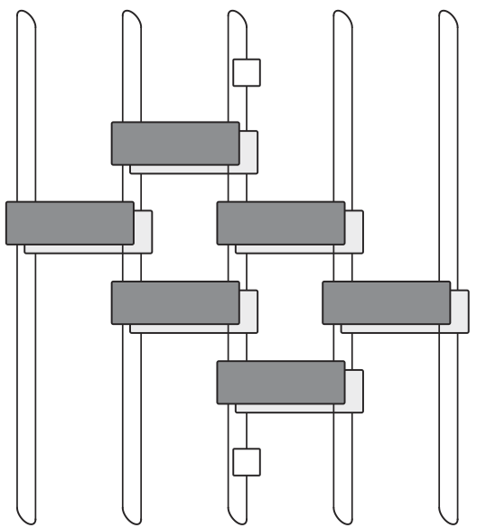
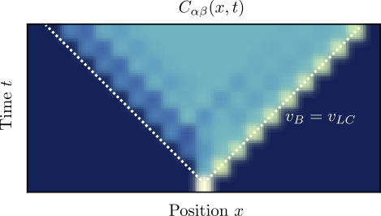

---
slides:
  # Choose a theme from https://github.com/hakimel/reveal.js#theming
  theme: white
  math_renderer: mathjax3
  reveal_options:
    hash: true
scripts: []

---

$$
\nonumber
\newcommand{\br}{\mathbf{r}}
\newcommand{\bR}{\mathbf{R}}
\newcommand{\bp}{\mathbf{p}}
\newcommand{\bk}{\mathbf{k}}
\newcommand{\bq}{\mathbf{q}}
\newcommand{\bv}{\mathbf{v}}
\newcommand{\bx}{\mathbf{x}}
\newcommand{\bz}{\mathbf{z}}
\DeclareMathOperator*{\E}{\mathbb{E}}
$$

# Quantum Circuits of Dual Unitary Gates

Sarang Gopalakrishnan and AL [2019](https://journals.aps.org/prb/abstract/10.1103/PhysRevB.100.064309)

Pieter Claeys and AL [2020](https://journals.aps.org/prresearch/abstract/10.1103/PhysRevResearch.2.033032), and [arXiv:2009.03791](https://arxiv.org/abs/2009.03791)

Slides at [austen.uk/slides/dual-unitaries-pcts](https://austen.uk/slides/dual-unitaries-pcts)

---

### Circuits

<!-- <object data="circuit.svg" type="image/svg+xml"></object> -->

---

### Gates

<!-- 

 -->

<object data="matrix_elements.svg" type="image/svg+xml"></object>

---

### Unitarity and dual unitarity

- For qubits dual unitary gate has 14 parameters (c.f. 16 for $U(4)$!)

---

## Outline

- Origins of dual unitarity: entanglement
- Correlation functions
- OTOCs

---

## Origins of dual unitarity

- [Sarang Gopalakrishnan and AL (2019)](https://journals.aps.org/prb/abstract/10.1103/PhysRevB.100.064309) interpreted earlier results of [Bertini, Kos, Prosen PRX (2019)](https://journals.aps.org/prx/abstract/10.1103/PhysRevX.9.021033) on the kicked Ising model in terms of dual unitarity

- Simultaneously, [Bertini, Kos, Prosen PRL (2019)](https://journals.aps.org/prl/abstract/10.1103/PhysRevLett.123.210601) showed how to compute correlations for general dual unitarities

---

### Kicked Ising Model

- Time dependent Hamiltonian with kicks at $t=0,1,2,\ldots$.

`$$
\begin{aligned}
H_{\text{KIM}}(t) = H_\text{I}[\mathbf{h}] + \sum_{m}\delta(t-n)H_\text{K}\\
H_\text{I}[\mathbf{h}]=\sum_{j=1}^L\left[J Z_j Z_{j+1} + h_j Z_j\right],\qquad H_\text{K} &= b\sum_{j=1}^L X_j,
\end{aligned}
$$`

- "Stroboscopic" form of $U(t)=\mathcal{T}\exp\left[-i\int^t H_{\text{KIM}}(t') dt'\right]$

`$$
\begin{aligned}
  U(n_+) = \left[U(1_+)\right]^n,\qquad U(1_-) = K I_\mathbf{h}\\
  I_\mathbf{h} = e^{-iH_\text{I}[\mathbf{h}]}, \qquad K &= e^{-iH_\text{K}},
\end{aligned}
$$`

---

### Entanglement Growth for Self-Dual KIM

- [Bertini, Kos, Prosen (2019)](https://journals.aps.org/prx/abstract/10.1103/PhysRevX.9.021033)

$$
\lim_{L\to\infty} S^{(n)}_A(t) =\min(2t-2,N)\log 2,
$$

- __Any $h_j$__; initial $Z_j$ product state

---

### Entanglement Spectrum

- Rényi entropies depend on eigenvalues of reduced density matrix

`$$
  S^{(n)}_A = \frac{1}{1-n}\log \text{tr}\left[\rho^n\right]=\frac{1}{1-n}\sum_\alpha \lambda_\alpha^n
$$`

- For SDKIM have $2^{\min(2t-2,N)}$ non-zero eigenvalues all equal

$$
\lambda_\alpha = \left(\frac{1}{2}\right)^{\min(2t-2,N)}
$$

---

### KIM as a circuit

`$$
\begin{aligned}
  \mathcal{K} &= \exp\left[-i b X\right]\\
  \mathcal{I} &= \exp\left[-iJ Z_1 Z_2 -i \left(h_1 Z_1 + h_2 Z_2\right)/2\right].
\end{aligned}
$$`

---

### Properties of KIM gate

- When $|J|=|b|=\pi/4$ KIM gate is dual unitary

- This allows for simple proof of entanglement dynamics!

<a href='https://journals.aps.org/prb/abstract/10.1103/PhysRevB.100.064309'>
Gopalakrishnan and Lamacraft (2019)
</a>

---

### Graphical representation of density matrix

- $\rho(t) = U\rho_0 U^\dagger$, working from middle out

<object data="unfolded-rho.svg" type="image/svg+xml"></object>

---

### Folded picture

- Reduced density matrix: trace over all but $N$ sites (here $N=6$)
<object data="folded-rho.svg" type="image/svg+xml"></object>

---

### Using unitarity...

<object data="reduced-rho.svg" type="image/svg+xml"></object>

---

### Go further with dual unitarity?

<object data="reduced-rho.svg" type="image/svg+xml"></object>

---

### Initial conditions

- For SDKIM we have in addition

- Just the thing for $\rho_0 = \otimes_j |Z_j\rangle\langle Z_j|$!
<object data="reduced-rho.svg" type="image/svg+xml"></object>

---

### ...Using dual unitary gates

<object data="reduced-rho-dual.svg" type="image/svg+xml"></object>
- A unitary applied to 

$$
\overbrace{\frac{\mathbb{1}}{2}\otimes \frac{\mathbb{1}}{2} \cdots }^{t-1} \otimes\overbrace{|Z_1\rangle\langle Z_1|\otimes |Z_2\rangle\langle Z_2| \cdots }^{N-2t+2 } \otimes \overbrace{\frac{\mathbb{1}}{2}\otimes \frac{\mathbb{1}}{2} \cdots }^{t-1}
$$

---

### Result for RDM

- Spectrum of RDM same as spectrum of

$$
\overbrace{\frac{\mathbb{1}}{2}\otimes \frac{\mathbb{1}}{2} \cdots }^{t-1} \otimes\overbrace{|Z_1\rangle\langle Z_1|\otimes |Z_2\rangle\langle Z_2| \cdots }^{N-2t-2 } \otimes \overbrace{\frac{\mathbb{1}}{2}\otimes \frac{\mathbb{1}}{2} \cdots }^{t-1}
$$

- $2^{\min(2t-2,N)}$ non-zero eigenvalues all equal to $\left(\frac{1}{2}\right)^{\min(2t-2,N)}$

---

### More general initial conditions

- [Piroli, _et al._, (2020)](https://journals.aps.org/prb/abstract/10.1103/PhysRevB.101.094304) considered 2-site MPS initial conditions that allow for solution in similar way

- For $2t>N $ result is the same: $\infty$-temperature RDM

- At earlier times structure of initial state important

---

## Correlation functions ($T=\infty$)

`$$
c(x,y,t)=\mathop{\text{tr}}\left[U(t)^\dagger O(x)U(t) O(y)\right]
$$`

<a href='https://journals.aps.org/prx/abstract/10.1103/PhysRevX.8.041019'>
Chan, De Luca, Chalker (2018)
</a>

---

### Using unitarity

---

### "Folded" picture

- Later operator must be in "future light cone" of earlier

---

### On the light cone

---

### Light cone quantum channel

<!--  -->

`$$
\begin{align}
c_\nu^{\alpha\beta}(\nu t,t) = \frac{1}{q} {\rm tr}\left[\mathcal M_{\nu}^{2t}(a^\beta)a^\alpha\right]\\
\mathcal M_{+}(a) = \frac{1}{q} {\rm tr}_1\left[U^\dagger (a\otimes\mathbb{1}) U\right]
\end{align}
$$`

- Unitarity means map is CPTP and __unital__ (identity fixed)
- See [Bertini, Kos, Prosen (2019)](https://journals.aps.org/prl/abstract/10.1103/PhysRevLett.123.210601) for dual unitary case, but construction is general

---

### 'Typical' correlations

- Generic: decay governed by dominant eigenvalue of channel
- Can evaluate correlations _inside_ light cone, just need a bigger channel (see later)!

---

### Dual unitary case 

- Unitarity implies future and past lightcones _up and down_
- Dual unitarity implies  future and past _left and right_
- __Conclusion:__ correlations _only on light cone_

<a href='https://journals.aps.org/prl/abstract/10.1103/PhysRevLett.123.210601'>
Bertini, Kos, Prosen (2019)
</a>

---

## OTOCs

$$
  C_{\alpha \beta}(x,t) = \langle \sigma_{\alpha}(0,t) \sigma_{\beta}(x,0) \sigma_{\alpha}(0,t) \sigma_{\beta}(x,0) \rangle.
$$
- $C_{\alpha \beta}(|x|>t,t)=1$ since $\left[\sigma_{\alpha}(0,t),\sigma_{\beta}(x,0)\right]=0$ for $|x|>t$

- For smaller $|x|$ OTOC deviates from 1. 

- Limiting value of $|x|/t$ where this occurs defines __butterfly velocity__

- Example: random unitary circuits  with local dimension $q$ have
$$
v_\text{B} = \frac{q^2-1}{q^2+1}
$$
$v_\text{B}\to 1$ as $q\to\infty$

---

### Maximum velocity quantum circuits

- Which circuits have the _largest_ butterfly velocity $v_\text{B}=1$?
- Natural guess: dual-unitary circuits!

---

### OTOC for SDKIM

(and no broadening)

---

### Derivation

---

### Fold it up...

- Light cone coordinates $n_+ = (t+ x)/2$, $n_- = (t- x+2)/2$

`$$
\begin{align}
C^{+}_{\alpha \beta }(x,t) = \left(L(\sigma_{\alpha})\right|\left(T_{n_-}\right)^{n_+}\left|R^{-}(\sigma_{\beta})\right), \nonumber\\
\end{align}
$$`

- This is for $x-t$ _even_, similar expression for $x-t$ odd

---

### Transfer matrix

<!-- - Appears also in operator entanglement ([Bertini, Kos, Prosen 2020](https://www.scipost.org/SciPostPhys.8.4.067/pdf)) -->

- Using _only unitarity_

  - Find eigenstate of transfer matrix with eigenvalue one
  - Show that $\lim_{m\to \infty} \left(L_n(\sigma_{\alpha})\right|\left(T_n\right)^m\left|R^{\pm}(\sigma_{\beta})\right)  = 1$

 - This is the value _outside_ light cone, so $v_\text{B}<1$ generically

- $v_\text{B}=1$ requires additional eigenstates with eigenvalue one

---

### Using dual unitarity...

- Find $n+1$ eigenvectors with eigenvalue 1
- For __even__ $n$, `$C^{+}_{\alpha \beta}(x,t)$` vanishes inside light cone
`$$
\begin{align}
\lim_{(x+t) \to \infty }C^{+}_{\alpha \beta}(x,t) = 
\begin{cases}
-\frac{1}{q^2-1} \qquad &\text{if} \quad x=t,\\
0 \qquad &\text{if} \quad x \neq t.
\end{cases}
\end{align}
$$`
<!-- Interpretation: $\sigma_{\alpha}(0,t) \sigma_{\beta}(x,0)$ random and contains all $q^2-1$ traceless basis operators with equal amplitude $i/\sqrt{q^2-1}$.  -->

---

- For __odd__ $n$, `$C^{-}_{\alpha \beta}(x,t)$` can be found in terms of channel `$\mathcal M_{\pm}(\cdot)$` describing light cone _correlator_

- Range of behaviour moving inside light cone

---

### Further special cases...

- _Integrable_ __SDKIM__: Exponentially many eigenvectors with eigenvalue one. OTOC immediately saturates to constant value inside light cone.

- Are all maximal velocity circuits dual unitary? No! Found a _kicked XY model_ with $v_\text{B}=1$

---

## Conclusion

- Dual unitary circuits are a _big_ solvable family with a diverse phenomenology that includes integrable and chaotic behaviour...

- ... but maybe not _that_ diverse for such a big family! $v_\text{B}=1$ always, for example

- Still more to do: effect of measurements, coding, computational complexity...