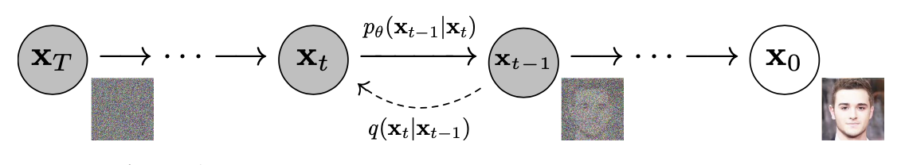
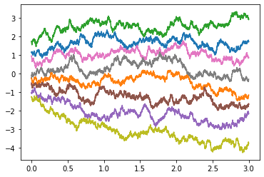
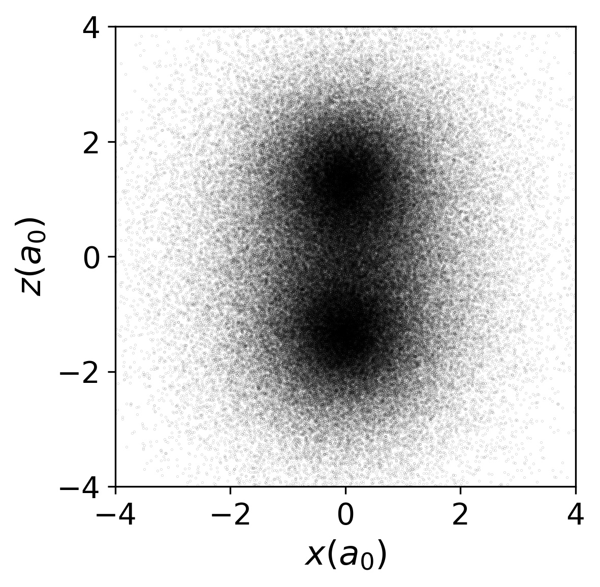
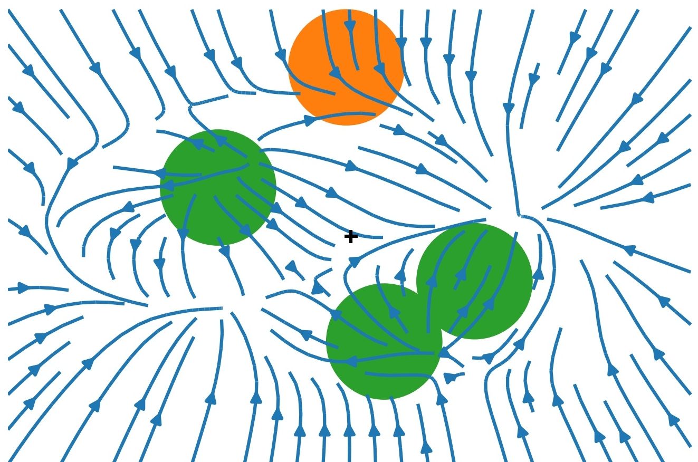

# ML and SM 2

- Slides: [austen.uk/slides/ml-stat-mech-2](https://austen.uk/slides/ml-stat-mech-2)
- Text: [austen.uk/post/ml-stat-mech-2](https://austen.uk/post/ml-stat-mech-2)

---

### Recap

- [Lecture 1]( "Lecture 1") introduced idea of Variational Inference (VI)

- Turns **inference** in latent variable models into **optimization**

- **Today**: how to leverage neural networks & automatic differentiation

- Model of choice: **Variational Autoencoder**

---

$$
\DeclareMathOperator*{\E}{\mathbb{E}}
\newcommand{\cE}{\mathcal{E}}
\newcommand{\R}{\mathbb{R}}
\newcommand{\bx}{\mathbf{x}}
\newcommand{\bz}{\mathbf{z}}
\newcommand{\br}{\mathbf{r}}
\newcommand{\bv}{\mathbf{v}}
\newcommand{\bmu}{\boldsymbol{\mu}}
\newcommand{\bSigma}{\boldsymbol{\Sigma}}
\newcommand{\bzeta}{\boldsymbol{\zeta}}
$$

### VI redux

- Model defined by prior $p(z)$ and generative model $p\_\phi(x|z)$

 - Similar model for posterior $q\_\theta(z|x)$
 
 - Two representatios of $p(x,z)$: **forward** and **backward**
 $$
p_\text{F}(x,z)= p_\theta(x|z)p(z),\qquad p_\text{B}(x,z)= q_\phi(z|x)p_\text{D}(x).
$$
where $p_\text{D}(x)$ is data distribution

---

- KL between these two models
$$
D_\text{KL}(p_\text{B}||p_\text{F})= \E_{x\sim \text{Data}}\left[\E_{z\sim q_\phi(\cdot|x)}\left[\log\left(\frac{q_\phi(z|x)p_\text{D}(x)}{p_\theta(x|z)p(z)}\right)\right]\right]\geq 0.
$$
or
$$
H[p_\text{D}]\leq \E_{x\sim \text{Data}}\left[\E_{z\sim q_\phi(\cdot|x)}\left[\log\left(\frac{q_\phi(z|x)}{p_\theta(x|z)p(z)}\right)\right]\right].
$$

- RHS doesn't involve $p_\text{D}(x)$ explicitly, only expectation. This is implemented as empirical average over (batches of) data

---

- RHS often presented as

$$
\E_{x\sim \text{Data}}\left[D_\text{KL}(q_\phi(\cdot|x)||p)-\E_{z\sim q_\phi(\cdot|x)}\left[\log p_\theta(x|z)\right]\right].
$$

- First term small when posterior matches prior

- Second small when model matches data (**reconstruction error**)

---

### Variational autoencoder

- Above picture fits into [Autoencoder](https://en.wikipedia.org/wiki/Autoencoder) framework

- Autoencoder trained to return outputs close to inputs

- Not trivial if $\text{dim}\\,\textbf{h}<\text{dim}\\,\textbf{x}$!

---

- We have a loss function for VI in autoencoder framework
$$
 \mathcal{L}(\theta,\phi)=\E_{x\sim \text{Data}}\left[D_\text{KL}(q_\phi(\cdot|x)||p)-\E_{z\sim q_\phi(\cdot|x)}\left[\log p_\theta(x|z)\right]\right]
$$
- We need
    - To parameterize $p_\theta(x|z)$ and $q_\phi(z|x)$ using NNs.
    - To take gradients of the loss function
to perform optimization.

- Let's look at these in turn.

---

### Parameterization 

- $\bz\in \R^{H}$, $\bx\in \R^{D}$

- For encoder $q_\phi(\bz|\bx)$, choose $\mathcal{N}(\bmu_\phi(\bx),\bSigma_\phi(\bx))$

- If prior is $\mathcal{N}(0,\mathbb{1})$ the KL term loss can be evaluated explicitly.

- $\bmu_\phi(\bx)$ and $\bSigma_\phi(\bx)$ are parameterized using NNs, with architecture adapted to the data e.g. [Convolutional neural networks](https://en.wikipedia.org/wiki/Convolutional_neural_network) for images

--- 

- Similarly for decoder `$p_\theta(\cdot|\bz)=\mathcal{N}(\bmu'_\theta(\bz),\bSigma'_\theta(\bz))$`

- Second term of loss involves
`$$
-\log p_\theta(\bx|\bz) = \frac{1}{2}(\bx-\bmu'_\theta(\bz))^T\bSigma'^{-1}_\theta(\bz)(\bx-\bmu'_\theta(\bz))+\frac{1}{2}\log\det\bSigma_\theta'(\bz)+\text{const.},
$$`
encourages mean output $\bmu'\_\theta(\bz)$ to be close to $\bx$

- Required expectation over $\bz$ requires Monte Carlo

- **Problem**: expectation depends on parameters $\phi$, and we want derivatives

-  What do we do?

---

### Reparameterization trick

- If you have $\zeta\sim\mathcal{N}(0,1)$ then $\sigma \zeta +\mu\sim \mathcal{N}(\mu,\sigma^2)$

 - Separates parameters from sampling, so that a Monte Carlo estimate of an expectation
$$
\E_{x\sim \mathcal{N}(\mu,\sigma^2)}\left[f(x)\right]\approx \frac{1}{S}\sum_{s=1}^S f(\sigma z_s + \mu)
$$
is explicitly a function of $\sigma$ and $\mu$, so derivatives may be taken

- Generalizes to multivariate Gaussian: $\bz\sim \bSigma_\phi^{1/2}(\bx)\bzeta+\mu_\phi(\bx)$. 

---

### More practicalities

- In practice a single $\bz$ sample is usually found to provide useful gradients for optimization

- Large datasets usually split into **batches** (sometimes called **mini-batches**)

- For batch of size $B$ loss function is estimated using $B$ iid $ \bzeta_b\sim \mathcal{N}(0,\mathbb{1})$
$$
 \mathcal{L}(\theta,\phi)\approx\frac{1}{B}\sum_{b=1}^B\left[D_\text{KL}(q_\phi(\cdot|\bx_b)||p)-\log p_\theta(\bx_b|\bSigma_\phi^{1/2}(\bx_b)\bzeta_b+\mu_\phi(\bx_b))\right]
$$

- Gradients calculated by automatic differentiation, implemented in all modern DL libraries

- There's a great deal of craft to the business of training...

---

### Interpretability

- One promise of latent variable models is an **interpretable** latent space

- Moving in lower dimensional latent space $\R^H$ allows us to explore the manifold in which the data is embedded in $\R^D$

---

- Some issues:

    1. Loss function doesn't require that the latent space is used *at all*. If decoder model $p\_\theta(\bx|\bz)$ is rich enough may have $p\_\theta(\bx|\bz)\approx p\_\text{D}(\bx)$. By Bayes' theorem posterior is
    $$
    \frac{p\_\theta(\bx|\bz)p(\bz)}{p\_\text{D}(\bx)}\approx p(\bz),
    $$
    same as the prior! This is **posterior collapse**

    2. No guarantee that latent space is used *nicely*, e.g. with variables for colour, shape, position, etc. (**disentangled representation**). One problem: prior $\mathcal{N}(0,\mathbb{1})$ is rotationally invariant, so lifting symmetry is necessary.

---

### Compression with VAEs: bits back

- In [Lecture 1]( "Lecture 1") I suggested that good probabilistic models could give better compression

- How does this work for latent variable models like VAE? 

- Problem, as always, is that model doesn't have explicit $p_\text{M}(x)$: marginalizing over latent variables is intractable. 

---

<!-- There is a beautiful idea called **bits back coding** that is particularly well suited to the encoder-decoder formulation of latent variable models, and allows the unavailability of $p_\text{M}(x)$ to be circumvented.  -->

- Recall that loss function of VAE is based 

$$
H[p_\text{D}]\leq \E_{x\sim \text{Data}}\left[\E_{z\sim q_\phi(\cdot|x)}\left[\log\left(\frac{q_\phi(z|x)}{p_\theta(x|z)p(z)}\right)\right]\right].
$$

- Split RHS into three terms 

$$
\E_{x\sim \text{Data}}\left[\E_{z\sim q_\phi(\cdot|x)}\left[\log\left(q_\phi(z|x)\right)-\log\left(p_\theta(x|z)\right)-\log\left(p(z)\right)\right]\right].
$$

- Remember $-\log_2 p(x)$ is length in bits of optimal encoding of $x$. Last two terms could be interpreted as

    1. Given data $x$ we sample $z\sim q_\phi(\cdot|x)$. 
    2. We encode $x$ using the distribution $p_\theta(\cdot|z)$, then
    3. Encode $z$ using the prior $p(\cdot)$. 
 
---

- For decoding, go in reverse
    1. Decode $z$ using the prior $p(z)$. 
    2. Decode $x$ using $p\_\theta(\cdot|z)$
    
- We'll never reach Shannon bound this way, however, because of the negative first term in 

$$
\E_{x\sim \text{Data}}\left[\E_{z\sim q_\phi(\cdot|x)}\left[\log\left(q_\phi(z|x)\right)-\log\left(p_\theta(x|z)\right)-\log\left(p(z)\right)\right]\right].
$$

- We need to make the code *shorter*. How? 

---

- Remember that Shannon bound applies in limit of $N\to\infty$ iid data

- Imagine a semi-infinite bit stream mid-way through encoding

    - We **decode** part of already encoded bitstream using $q\_\phi(\cdot|x)$
    
    - Result is $z\sim q\_\phi(\cdot|x)$: use for encoding $x$ as described above
    
    - These are **bits back**: remove $H(q\_\phi(\cdot|x))$ bits on average
    
    - Allows us to reach the Shannon bound
    
- When decoding data, the last thing we do for each $x$ is encode $z$ back to the bitstream using $q\_\phi(\cdot|x)$

---

### Related Models

The VAE framework is quite general, and in recent years has been elaborated in various ways. 

---

### Markov chain autoencoders (??)

- Up to now our encoder and decoder were just Gaussian models

- Can we produce a model with a richer distribution? 

- Make forward and backward models Markov processes with $T$ steps
$$
p_\text{F}(z_0,\ldots x=z_T) = p_\theta(x=z_T|z_{T-1})p_\theta(z_{T-1}|z_{T-2})\cdots p_\theta(z_1|z_{0})p(z_0)
$$
$$
p_\text{B}(z_0,\ldots \ldots x=z_T) = q_\phi(z_0|z_{1})\cdots q_\phi(z_{T-2}|z_{T-1})q_\phi(z_{T-1}|z_T)p_\text{D}(x=z_T)
$$

- Loss function is

$$
H[p_\text{D}]\leq \E_{z\sim p_\text{B}}\left[\log \left(\frac{q_\phi(z_0|z_1)}{p(z_0)}\right)+\sum_{t=0}^{T-2}\log\left(\frac{q_\phi(z_{t+1}|z_{t+2})}{p_\theta(z_{t+1}|z_t)}\right)\right].
$$

--- 

- Can pass to *continuous time limit*, in which case $z_t$ described by stochastic differential equation (SDE). 
$$
dz_t = \mu_\theta(z_t)dt + dW_t
$$
$W_t$ is $\R^H$ dimensional Brownian motion, $\mu\_\theta(z\_t)$ is a parameterized drift

- One forward and one backward SDE
 
 - Model is separate from implementation of dynamics. Solve SDE by whatever method you like: AD through solution.

 ---

 - Possible applications 

    1. Infer the trajectories that led to measured outcomes in stochastic dynamics. 

        - Forward model describes a simulation of a physical system – e.g. molecular dynamics simulation of a biomolecule
        - Backward model can be used to infer trajectories that led to some measured states $z_T$.

    2. Fix the backward model and just learn the forward  model. Seems strange from point of view of finding posterior

---

### [Denoising Diffusion Probabilistic Models](https://arxiv.org/abs/2006.11239)

---

<!-- Detailed balance. Entropy production -->
<!-- Mermaid diagram?? -->

---

### Normalizing flows

- Autoencoders conceived for $H<D$

- By taking $\R^H=\R^D$ can make contact with: **Normalizing Flows**

- Take $\bSigma_\phi$ and $\bSigma'_\theta\to 0$, so that $q_\phi(\bz|\bx)$ and $p_\theta(\bx|\bz)$ become deterministic

$$
\bz = \mu_\phi(\bx),\qquad \bx = \mu'_\theta(\bz).
$$

- $D_\text{KL}\neq 0$ only if they are inverses

---

- What is KL? 
`$$
q_\phi(\cdot|\bx) = \frac{1}{\sqrt{(2\pi)^{D} \det\bSigma_\phi(\bx)}} \exp\left[-\frac{1}{2}(\bz-\bmu_\phi(\bx))^T\bSigma^{-1}_\phi(\bx)(\bz-\bmu_\phi(\bx))\right],
$$`

- KL involves the ratio
`$$
\frac{q_\phi(\bz|\bx)}{p_\theta(\bx|\bz)}
$$`

- When $\bz$ and $\bx$ are inverses
`$$
\frac{q_\phi(\bz|\bx)}{p_\theta(\bx|\bz)}\longrightarrow \sqrt{\frac{\det\bSigma'_\theta(\bz)}{\det\bSigma_\phi(\bx)}}=\det \left(\frac{\partial\bx}{\partial\bz}\right).
$$`

---

- If $\bz$ described by $p(\bz)$ then $\bx=\mu'\_\theta(\bz)$ has density
$$
\det\left(\frac{\partial\bz}{\partial\bx}\right) p(\mu_\phi(\bx)).
$$
i.e. we map to $\bz$ and evaluate density there, accounting for Jacobian

- In deterministic limit, KL becomes
$$
D_\text{KL}(p_\text{B}||p_\text{F})\longrightarrow -\E_{x\sim \text{Data}}\left[\log\det \left(\frac{\partial\bz}{\partial\bx}\right)+\log p(\mu_\phi(\bx))\right].
$$

- Challenge: construct flexible, invertible models with tractable Jacobians (determinant is $O(D^3)$)

- Stack simpler transformations, each invertible with known Jacobian.

---

### Learning the path integral

[Barr, Gispen, Lamacraft (2020)](http://proceedings.mlr.press/v107/barr20a.html)

---

### Feynman–Kac formula

- For "imaginary time" Schrödinger
$$
\left[-\frac{\nabla^2}{2m}+V(\br_i)\right]\psi(\br,t) = -\partial_t\psi(\br,t)
$$
- __Feynman–Kac__ formula expresses $\psi(\br,t)$ as expectation...
`$$
  \psi(\br_2,t_2) =  \E_{\br_t}\left[\exp\left(-\int_{t_1}^{t_2}V(\br_t)dt\right)\psi(\br_{t_1},t_1)\right]
$$`

...over Brownian paths with $\br_{t_{2}}=\br_{2}$

- For $t\to\infty$: $\psi(\br,t)\to e^{-E_0 t}\varphi_0(\br)$

---

- Path integral Monte Carlo

<a href="https://journals.aps.org/rmp/abstract/10.1103/RevModPhys.67.279">
Ceperley, RMP (1995)
</a>  

---

### Loss function

- FK formula defines __path measure__ $\mathbb{P}_\text{FK}$

- Jamison (1974): process is __Markovian__
$$
d\br_t = d\mathbf{W}_t + \bv(\br_t,t)dt
$$

- Model drift $\bv(\br,t)$ defines measure $\mathbb{P}_\bv$

- $D_\text{KL}(\mathbb{P}_\bv\lvert\rvert \mathbb{P}_\text{FK})=\E_{\mathbb{P}_\bv}\left[\log\left(\frac{d\mathbb{P}_\bv}{d\mathbb{P}_\text{FK}}\right)\right]$ is our loss function

- RL / Optimal Control formulation of QM (Holland, 1977)

---

### Training

- Relative likelihood (Radon–Nikodym derivative; Girsanov theorem)

`$$
  \log\left(\frac{d\mathbb{P}_{\bv}}{d\mathbb{P}_\text{FK}}\right) =\ell_T - E_0 T+\log\left(\frac{\varphi_0(\br_0)}{\varphi_0(\br_T)}\right)
$$`
$$
   \ell_T\equiv \int_0^T \bv(\br_t)
  \cdot d\mathbf{W}_t+\int_0^T dt\left(\frac{1}{2}|\bv(\br_t)|^2+V(\br_t)\right)
$$

- Monte Carlo estimate of $D_\text{KL}(\mathbb{P}_\bv\lvert\rvert \mathbb{P}_\text{FK})=\E_{\mathbb{P}_\bv}\left[\log\left(\frac{d\mathbb{P}_\bv}{d\mathbb{P}_\text{FK}}\right)\right]$

- $\br^{(b)}_{t}$ from SDE discretization. Analogous to reparameterization trick

- $D_\text{KL}(\mathbb{P}_\bv\lvert\rvert \mathbb{P}_\text{FK})\geq 0$ so $\E_{\mathbb{P}_\bv}\left[\ell_T\right]\geq E_0T$

---

- Suggests strategy:

  1. Represent `$\bv_\theta(\br) = \textsf{NN}_\theta(\br)$`
  2. Integrate batch of SDE trajectories
  3. Backprop through the (MC estimated) cost

---

### Hydrogen Molecule

`$$
H = -\frac{\nabla_1^2+\nabla_2^2}{2}+ \frac{1}{|\br_1-\br_2|}- \sum_{i=1,2}\left[\frac{1}{|\br_i-\hat{\mathbf{z}} R/2|} + \frac{1}{|\br_i+\hat{\mathbf{z}}R/2|}\right]
$$`

- Equilibrium proton separation $R=1.401$, $E_0= -1.174476$

---

### 2D Gaussian Bosons

`$$
\begin{align}
H&=\frac{1}{2}\sum_i \left[-\nabla_i^2 +\br_i^2\right]+\sum_{i<j}U(\br_i-\br_j)\\
U(\br) &=\frac{g}{\pi s^2}e^{-\br^2/s^2}
\end{align}
$$`

- [Mujal _et al._, PRA 2017](https://journals.aps.org/pra/abstract/10.1103/PhysRevA.96.043614) model for ultracold atoms

---

- Drift Visualization ($g=15$, `$s=1/2$`)

---

<video data-autoplay class="stretch" data-src="bosons.mp4" width=300></video>

