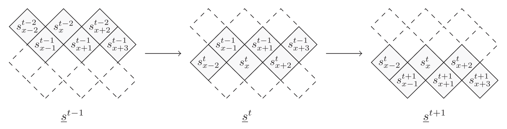
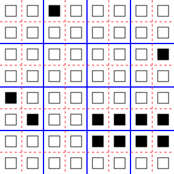
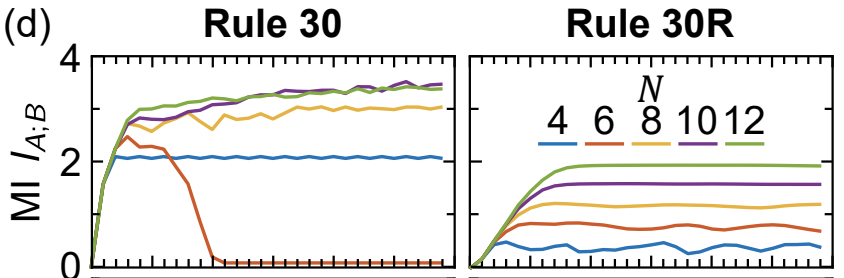
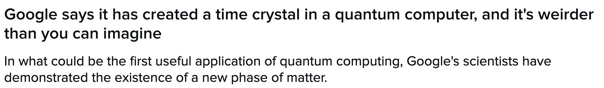
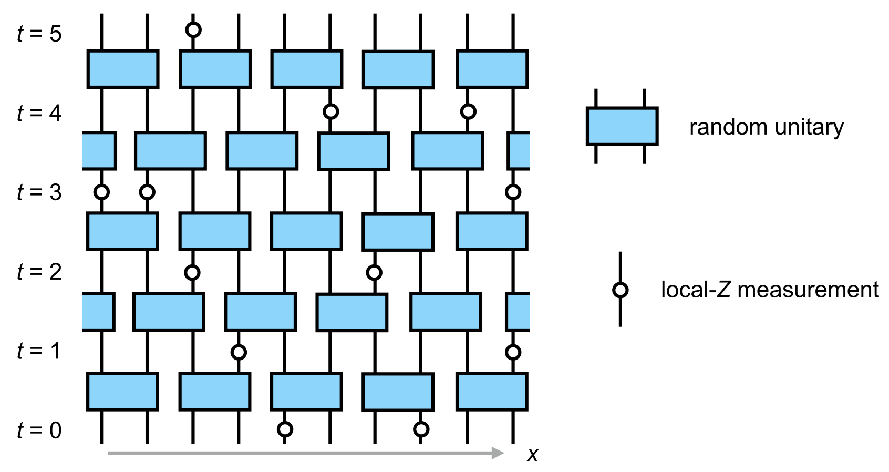

---
slides:
  # Choose a theme from https://github.com/hakimel/reveal.js#theming
  theme: white
  math_renderer: mathjax3
  reveal_options:
    hash: true
    mathjax3:
      loader:
        load: ['[tex]/noerrors', '[tex]/physics']
      tex:
        packages: 
          '[+]': ['noerrors', 'physics']
scripts: ['https://cdn.jsdelivr.net/npm/p5@1.4.1/lib/p5.js']
---

# New Rules:
## Quantum Circuits, Cellular Automata, Complexity and Chaos
[austen.uk/slides/new-rules-tum](https://austen.uk/slides/new-rules-tum)

Austen Lamacraft and Pieter Claeys

---

### Conway's Game of Life

<figure align="center">

</figure>

---

### Rules of Life

- Each site either dead (0) or alive (1)

- Fate of cell determined by eight neighbors

  1. Any live cell with two or three live neighbours survives
  2. Any dead cell with three live neighbours becomes a live cell
  3. All other live cells die in the next generation

- Complex behavior!

---

### Cellular Automata

- Dynamical systems with discrete *space*, *time*, and *degrees of freedom* 

- Interesting for statistical physics:
  - What kinds of dynamics may occur?
  - How does dynamics determine thermodynamic behavior?

---

### Quantum Circuits

- A quantum analog of CAs

- Basis of "quantum supremacy" work by Google and others

<figure align="center">

<figcaption> A schematic view of the Google Sycamore processor.</figcaption>
</figure>

---

### This talk

- What are the similarities and differences? Can we try the same tricks?

- When is quantum dynamics harder?
 
- What about measurements?

---

### Elementary cellular automata

- "Space" is one dimension with cells $x_n=0,1$ $n\in\mathbb{Z}$

- Update cells every time step depending on cells in **neighborhood** 
  - Neighborhood is cell and two neighbors for elementary CA

---

- Update specified by function 

$$
f:\\{0,1\\}^3\longrightarrow \\{0,1\\}.
$$

$$
x^{t+1}_{n} = f(x^{t}\_{n-1},x^{t}\_{n},x^{t}\_{n+1})
$$

- How many possible functions?

---

### Wolfram's rules 

- Domain of $f$ is $2^3=8$ possible values for three cells

- $2^8=256$ possible choices for the function $f$

- List outputs corresponding to inputs: 111, 110, ... 000

|111	| 110 |	101	| 100 |	011 |	010 |	001 |	000	|
|---	| --- |	---	| --- |	--- |	--- |	--- |	---	|
| 0   |	1   | 	1 | 	0 | 	1	|   1 | 	1 | 	0 |	

- Interpret as binary number: this one is [Rule 110](https://en.wikipedia.org/wiki/Rule_110)

---

- Many behaviors, from ordered (Rule 18) to chaotic (Rule 30)

<figure align="center">

</figure>

- Rule 110 is capable of universal computation!

---

<figure align="center">

<figcaption> That's Christmas sorted</figcaption>
</figure>

---

---

<blockquote class="twitter-tweet">
give each pixel a random Pokemon type, and then battle pixels against their neighbors, updating each pixel with the winning type (using the Pokemon type chart)  we quickly see areas of fire &gt; water &gt; grass &gt; fire, electric sweeping over, ground frontiers taking over etc etc <a href="https://t.co/BHgQuKRApR">pic.twitter.com/BHgQuKRApR</a>
&mdash; Matt Henderson (@matthen2) <a href="https://twitter.com/matthen2/status/1543226572592783362?ref_src=twsrc%5Etfw">July 2, 2022</a></blockquote> 

---

### CAs as model physics

- Notion of a causal "light cone" (45 degree lines)

- Variety of possible behaviors: chaos, periodicity, ...

---

### Chaos

- Rapid growth of small differences between two trajectories

<figure align="center">

</figure>

- Smallest change: flip one site and monitor $z^t\equiv x^t\oplus y^t$

---

### Chaos phenomenology 

- No exponential growth (c.f. [Lyapunov exponent](https://en.wikipedia.org/wiki/Lyapunov_exponent) in continuous systems)

- Track number of differences ([Hamming distance](https://en.wikipedia.org/wiki/Hamming_distance)) between trajectories

- Propagating "front" cannot exceed "speed of light": generally slower

---

### Theory?

- No chance of solving the dynamics of any one CA

- Looking for *generic* properties: natural to consider *ensembles*
  
    - of initial conditions
    - of rules

---

### Probabilistic CA

- Choose rules iid for each site and instant

<figure align="center">

</figure>

- Cell values are now white noise, but  $z_t=x_t\oplus y_t$ revealing

- Fluctuations of front are larger and average speed $<$ maximum

---

### Reversibility 

- No elementary CAs are reversible (bijective)! Requires size 4 neighborhood 

- Reversibility is undecidable above one spatial dimension

- $∃$ reversible constructions

---

### Second order cellular automata

- Fredkin construction

`$$
x^{t+1}_{n} = f(x^{t}_{n-1},x^{t}_{n},x^{t}_{n+1}) + x^{t-1}_{n},\, \mod 2
$$`

---

### Example: Integrable Rule 54

`$$
x^{t+1}_{n} = x^{t}_{n-1} x^{t-1}_{n} + x^{t}_{n+1} + x^{t}_{n-1}x^{t}_{n+1}\, \mod 2
$$`

- Interpret as "tiling rules"

<figure align="center">

<figcaption>From <a href="https://iopscience.iop.org/article/10.1088/1742-5468/ac096b/meta">Buca, Klobas, and Prosen (2021)</a>
</figcaption>
</figure>

- Random tilings consistent with constraint have entropy $\propto L$

---

### Maxim Gumin's [wavefunction collapse algorithm](https://github.com/mxgmn/WaveFunctionCollapse)

<figure align="center">

</figure align="center">

---

### Block cellular automaton

<figure align="center">

</figure>

- Partition cells into blocks (Margolus neighborhoods) 
- Apply invertible mapping to block
- Alternate overlapping partitions

---

### Spacetime representation

-  Blue squares: invertible mapping on states of two sites: 00, 01, 10, 11

---

<blockquote class="twitter-tweet" align="center">
given these four jigsaw pieces, there is only one way to fill in the rest of the puzzle. The solution ends up drawing a Sierpinski triangle. Can you see why? <a href="https://t.co/OvxVz2oehy">pic.twitter.com/OvxVz2oehy</a>
&mdash; Matt Henderson (@matthen2) <a href="https://twitter.com/matthen2/status/1529552315337818112?ref_src=twsrc%5Etfw">May 25, 2022</a>

---

## 24 reversible models

- Each block a permutation of 00, 01, 10, 11

- $4!=24$ blocks

- Order:
  1. (1234)
  2. (1243)
  3. (1324), and so on 

- Block 2 is the map $(00, 01, 10, 11) ⟶ (00, 10, 01, 11)$ 

- Exchange, or SWAP gate in quantum information

---

<figure align="center">

</figure>

- Ensemble of block CAs similar to PCA

---

### Dual reversibility 

- Can we find an ensemble where front propagates at maximal speed?

- Yes! **Dual reversible** blocks are bijections in both time *and space*

- There are 12 such blocks (out of 24)

- Ensemble is Markov in time *and space*: must have maximal velocity!

---

### Dynamics of difference?

- For $N=2$ dynamics of $z_t=x_t\oplus y_t$ independent of $x_t$ (or $y_t$)

- Recurrence time always $\propto L$ (instead of double exponential)

- Edge corresponds to the stationary state of a Markov process (c.f. [Claeys and Lamacraft (2020)](https://journals.aps.org/prresearch/abstract/10.1103/PhysRevResearch.2.033032) for quantum case)

---

### Three component models

- [Borsi and Pozsgay (2022)](https://journals.aps.org/prb/abstract/10.1103/PhysRevB.106.014302) find 227 inequivalent dual reversible models 

<figure align="center">

</figure>

---

### The linear block

$$
(c,d) = f(a,b) = (a + b, a - b)\, \mod 3
$$

- Original dual unitary circuit from [Hosur *et al.*](https://link.springer.com/article/10.1007/JHEP02(2016)004)
- Unusual behavior of recurrence time
  - For $L = 2\times 3^m$ have $T_\text{recur}=2L$
  - [Borsi and Pozsgay](https://journals.aps.org/prb/abstract/10.1103/PhysRevB.106.014302) prove using Fourier analysis over finite fields

--- 

### Origin of "fractal" recurrence

<figure align="center">

<figcaption>
$L=54=2\times 3^3$, $T_\text{recur}=2L=108$</a> 
<figcaption>
</figure>

---

### Mutual information 

- Disjoint regions $A$ and $\bar A$: how much does one tell about the other?

- Use [mutual information](https://en.wikipedia.org/wiki/Mutual_information): measure of dependence of random variables 
  
- Suggested in this context by [Pizzi *et al.* (2022)](https://arxiv.org/abs/2204.03016)
  
--- 

- MI defined as
$$
I(X;Y) \equiv S(X) + S(Y) - S(X,Y)
$$
  - $S(X)$ is entropy of $p_X(x)$; marginal distribution of $X$
  - $S(Y)$ is entropy of $p_Y(y)$; marginal distribution of $Y$
  - $S(X,Y)$ is entropy of joint distribution $p_{(X,Y)}(x,y)$

- Vanishes if $p_{(X,Y)}(x,y)=p_X(x)p_Y(y)$
 
---

### MI for CAs: effect of reversibility

<figure align="center">

<figcaption>
From <a href="https://arxiv.org/abs/2204.03016">Pizzi <i>et al.</i> (2022)</a> 
<figcaption>
</figure>

---

### Simple example

- Suppose either $X=Y=1$ or $X=Y=0$, with equal probability

`$$
\begin{align}
p_{(X,Y)}(0,0)&=p_{(X,Y)}(1,1)=1/2\\
 p_{(X,Y)}(1,0)&=p_{(X,Y)}(0,1)=0
\end{align}
$$`
  
$$
I(X;Y)=S(X) + S(Y) - S(X,Y)= 1+1-1=1 \text{ bit}
$$

---

### Toy model

<figure align="center">

</figure>

- Initial distribution factorizes over correlated pairs
- Apply SWAPs
- 1 bit MI for every pair with one member in $A$ and one in $\bar A$

$$
I(A;\bar A) = \min(4\lfloor t/2\rfloor, |A|) \text{ bits}
$$

- $|A|$ is (even) number of sites in $A$

---

### Comments

- Total entropy conserved (c.f Liouville's theorem)

- Entropy of initial distribution is half max, but entropy $S(A)$ saturates at maximal value (thermalization in time $\sim |A|/2$)
   
- This model is *not so special!* Any of the dual reversible blocks CAs behaves *exactly the same!*

---

### Graphical identities

For reversibility and dual reversibility

<object data="assets/reversibility.svg" type="image/svg+xml"></object>

---

### Entropy from dual reversibility

- 8 sites share 4 bits of entropy

<object data="assets/A-entropy.svg" type="image/svg+xml"></object>

- After four steps increases to (maximum) 8 bits!

---

### Shallower...

- 8 sites share 4 bits of entropy

<object data="assets/A-entropy-shallower.svg" type="image/svg+xml"></object>

- After two steps increases to 6 bits!

---

- Entropies of $A$ and $\bar A$ subsystems behave just as in the toy model

$$
I(A;\bar A) = \min(4\lfloor t/2\rfloor, |A|) \text{ bits}
$$

- ... for all dual reversible models!

---

### Classical dual reversible model

`$$
\begin{equation}
\begin{aligned}
\Phi_{\tau}\left(\mathbf{S}_{1}, \mathbf{S}_{2}\right) &=\frac{1}{\sigma^{2}+\tau^{2}}\left(\sigma^{2} \mathbf{S}_{1}+\tau^{2} \mathbf{S}_{2}+\tau \mathbf{S}_{1} \times \mathbf{S}_{2}, \sigma^{2} \mathbf{S}_{2}+\tau^{2} \mathbf{S}_{1}+\tau \mathbf{S}_{2} \times \mathbf{S}_{1}\right) \\
\sigma^{2} &:=\frac{1}{2}\left(1+\mathbf{S}_{1} \cdot \mathbf{S}_{2}\right)
\end{aligned}
\end{equation}
$$`
<figure align="center">

<figcaption>
From <a href="https://link.springer.com/article/10.1007/s10955-020-02523-1">Krajnik and Prosen (2020)</a> 
<figcaption>
</figure>

- MI has exactly the same behavior!

---

## Summary so far

- CAs as dynamical systems: chaotic fronts and information dynamics

- Dynamical ensembles as a theoretical tool

<strong>How can we extend these ideas to quantum systems?</strong>

---

### Bits to qubits

|   |Block CA	| Quantum Circuit |
|--- |---	| --- |
|**Basic unit** | Invertible map   | Unitary operator (**gate**) |
|**Local variable** | $z_n \in \\{0, 1\\}$   | $\ket{\psi_n}\in \mathbb{C}^2$ |
|**Global state** | $z \in \\{0,1\\}^N $   | $\ket{\Psi(t)}\in \mathbb{C}^{2^N}$ |
|**Simulation**| Easy | Hard |
  

---

### Why consider circuits?

- Model of universal quantum computation 

- Example of discrete time, many body quantum dynamics

<strong>Everyone's doing it!</strong>

--- 

### Unitaries

- $n$-qubit unitary has matrix elements $U_{x_1\ldots x_n,x'_1,\ldots, x'_n}$ in *computational basis* $\ket{0}$, $\ket{1}$

- Unitarity means

$$
\sum\_{x_1'\ldots x_N'}U_{x_1\ldots x_n,x'_1,\ldots, x'_n} U^\dagger\_{x'_1\ldots x'_n,x''_1,\ldots, x''_n}=\delta\_{x_1,x_1''}\ldots \delta\_{x_N,x_N''},
$$

- But we'd like to avoid such awful looking expressions

---

### Everything's a tensor!!

- General state of $N$ qubits is
  
`$$
\ket{\Psi} = \sum_{x_{1:N}\in \{0,1\}^N} \Psi_{x_1\ldots x_N}\ket{x_1}_1\ket{x_2}_2\cdots \ket{x_N}_N
$$`

- Write $\ket{x_1}\_1\ket{x_2}\_2\cdots \ket{x_N}\_N =\ket{x_1\cdots x_N}=\ket{x_{1:N}}$ for brevity
  
- Operator on $N$ qubits has matrix elements

`$$
\mathcal{O}_{x_{1:N},x'_{1:N}} = \bra{x_{1:N}}\mathcal{O}\ket{x'_{1:N}}
$$`

---

### [Penrose graphical notation](https://en.wikipedia.org/wiki/Penrose_graphical_notation)

<figure align="center">

<figcaption>See <a href="https://github.com/ey3lock3r/MPS-Tutorial">Pan Zhang's tutorial</a> </figcaption>
</figure>

---

### Brickwork unitary circuits

- Have __causality__ built in
- Quantum analog of (block) CAs

---

### Some gates

- Work in the basis $\ket{00}$, $\ket{01}$, $\ket{10}$, $\ket{11}$

- Simplest example: [SWAP gate](https://en.wikipedia.org/wiki/Quantum_logic_gate#Swap_gate)

$$
\operatorname{SWAP}=\begin{pmatrix}
1 & 0 & 0 & 0 \\\
0 & 0 & 1 & 0 \\\
0 & 1 & 0 & 0 \\\
0 & 0 & 0 & 1
\end{pmatrix}
$$

- Switches states. Takes product state to product state

$$
\operatorname{SWAP}\ket{10} = \ket{01}
$$

---

### Square root of SWAP

$$
\sqrt{\operatorname{SWAP}}=\begin{pmatrix}
1 & 0 & 0 & 0 \\\
0 & \frac{1}{2}(1+i) & \frac{1}{2}(1-i) & 0 \\\
0 & \frac{1}{2}(1-i) & \frac{1}{2}(1+i) & 0 \\\
0 & 0 & 0 & 1
\end{pmatrix}.
$$

- Generates _entanglement_ (non product state)

$$
\sqrt{\operatorname{SWAP}}\ket{10} = \frac{1}{2}\left[(1+i)\ket{10}+(1-i)\ket{01}\right]
$$

- $\sqrt{\operatorname{SWAP}}$ and single qubit unitaries are __universal gate set__

---

### Gate notation

- We need both $U$s and $U^\dagger$s (e.g. for $\mathcal{O}(t)=U^\dagger(t)\mathcal{O}U(t)$)

<object data="assets/matrix_elements.svg" type="image/svg+xml"></object>

---

### Unitary condition

<figure align="center">

</figure>

- Much better!

---

### Locality as a feature of real circuits

<figure align="center">

<figcaption> (left) Schematic view of the Google Sycamore processor (right)</figcaption>
</figure>

---

### Hype

- Sampling from circuits basis of [Google's "quantum supremacy"](https://www.nature.com/articles/s41586-019-1666-5)
 

---

### Computational complexity

- Normally matrix-vector multiplication is $O(\operatorname{dim}^2)=2^{2N}$

- Gates are _sparse_ so $O(\operatorname{dim})=2^{N}$, but _still exponentially hard_

- For low depth $T<N$ move _horizontally_ instead

---

### Expectation values

- Evaluate $\bra{\Psi}\mathcal{O}\ket{\Psi}=\bra{\Psi_0}\mathcal{U}^\dagger\mathcal{O}\mathcal{U}\ket{\Psi_0}$ for local $\mathcal{O}$

 

 
<object data="assets/expectation.svg" type="image/svg+xml" width='600'></object>

---

### Folded picture

<figure align="center">

</figure>

- After folding, lines correspond to two indices / 4 dimensions 

---

### Unitarity in folded picture

- Circle denotes $\delta_{ab}$

<figure align="center">

</figure>

---

### $\bra{\Psi}\mathcal{O}\ket{\Psi}$ in folded picture

- Emergence of "light cone"

<object data="assets/folded-expectation.svg" type="image/svg+xml"></object>

---

### Reduced density matrix

- Expectation values in region $A$ evaluated using *reduced density matrix*

$$
\rho_A = \operatorname{tr}\_{\bar A}\left[\ket{\Psi}\bra{\Psi}\right]=\operatorname{tr}_{\bar A}\left[\mathcal{U}\ket{\Psi_0}\bra{\Psi_0}\mathcal{U}^\dagger\right]
$$

<object data="assets/reduced-density-matrix.svg" type="image/svg+xml"></object>

---

### Entanglement entropy

- $\rho_A$ very useful for quantifying *entanglement*

- If `$\ket{\Psi} = \ket{\psi}_A \otimes \ket{\phi}_{\bar A}$` then $\rho_A = \ket{\psi}_A\bra{\psi}_A$`

- Any deviation from product state leads to *mixed* density matrix

-  Quantify by entropy of $\rho_A$ (the **entanglement entropy**)

$$
S_A \equiv -\operatorname{tr}\left[\rho_A\log \rho_A\right].
$$

---

### Toy model revisted 

<figure align="center">

</figure>

- Each pair in [Bell state](https://en.wikipedia.org/wiki/Bell_state) `$
\ket{\Phi^+}_{2n, 2n+1} = \frac{1}{\sqrt{2}}\left[\ket{0}_{2n}\ket{0}_{2n+1}+ \ket{1}_{2n}\ket{1}_{2n+1}\right]
$`

- Reduced density matrix for one member: `$\operatorname{tr}_{2}\left[\ket{\Phi^+}_{12}\bra{\Phi^+}_{12}\right] = \frac{1}{2}\mathbb{1}_1$`

- Entanglement entropy of 1 bit

---

<figure align="center">

</figure>

- For a Bell pair consisting of qubits at sites $m$ and $n$:

  - If $n\in A$, $m\in\bar A$, $\rho_A$ has factor $\mathbb{1}_n$. 

  - If $m, n\in A$ they contribute a factor $\ket{\Phi^+}\_{nm}\bra{\Phi^+}\_{nm}$ (pure)

- Only first case contributes to `$
 S_A = \min(4\lfloor t/2\rfloor, |A|) \text{ bits}
$`

- Just like mutual information in classical version!

---

### Dual unitary gates

- Exactly the same behavior for all unitaries satisfying 

<figure align="center">

</figure>

- c.f. dual reversible CAs

---

### The dual unitary family

- $4\times 4$ unitaries are 16-dimensional

- Family of dual unitaries is 14-dimensional
 
- Includes *kicked Ising model* at particular values of couplings
  
- Dual unitaries not "integrable" but have enough structure to allow many calculations

---

## $\rho_A$ via dual unitarity

- 8 sites; 4 layers

<object data="assets/A-entropy-quantum.svg" type="image/svg+xml"></object>

- $\rho_A$ is unitary transformation of
  
$$
  \mathbb{1}\otimes\mathbb{1}\otimes\mathbb{1}\otimes\mathbb{1}\otimes\mathbb{1}\otimes\mathbb{1}\otimes\mathbb{1}\otimes\mathbb{1}
$$

---

## Shallower...

<object data="assets/A-entropy-quantum-shallower.svg" type="image/svg+xml"></object>

- $\rho_A$ is unitary transformation of 
  
$$
\mathbb{1}\otimes\mathbb{1}\ket{\Phi^+}\bra{\Phi^+}\otimes\ket{\Phi^+}\bra{\Phi^+}\otimes\mathbb{1}\otimes\mathbb{1}
$$

---

### General case

- RDM is unitary transformation of 

$$
\rho_0=\overbrace{\frac{\mathbb{1}}{2}\otimes \frac{\mathbb{1}}{2} \cdots }^{t-1} \otimes\overbrace{\ket{\Phi^+}\bra{\Phi^+} \cdots }^{N_A/2-t+1 } \otimes \overbrace{\frac{\mathbb{1}}{2}\otimes \frac{\mathbb{1}}{2} \cdots }^{t-1}
$$

- RDM has $2^{\min(2t-2,N_A)}$ non-zero eigenvalues all equal to $\left(\frac{1}{2}\right)^{\min(2t-2,N_A)}$

- Converse – maximal entanglement growth implies dual unitary gates – recently proved by [Zhou and Harrow (2022)](https://arxiv.org/abs/2204.10341)

---

## Thermalization

- After $N_A/2 + 1$ steps, reduced density matrix is $\propto \mathbb{1}$

- All expectations (with $A$) take on infinite temperature value

---

## Floquet theory: kicked Ising model

- Time dependent Hamiltonian with kicks at $t=0,1,2,\ldots$.

`$$
\begin{aligned}
H_{\text{KIM}}(t) = H_\text{I}[\mathbf{h}] + \sum_{m}\delta(t-n)H_\text{K}\\
H_\text{I}[\mathbf{h}]=\sum_{j=1}^L\left[J Z_j Z_{j+1} + h_j Z_j\right],\qquad H_\text{K} &= b\sum_{j=1}^L X_j,
\end{aligned}
$$`

- "Stroboscopic" form of $U(t)=\mathcal{T}\exp\left[-i\int^t H_{\text{KIM}}(t') dt'\right]$

`$$
\begin{aligned}
  U(n_+) &= \left[U(1_+)\right]^n,\qquad U(1_-) = K I_\mathbf{h}\\
  I_\mathbf{h} &= e^{-iH_\text{I}[\mathbf{h}]}, \qquad K = e^{-iH_\text{K}}
\end{aligned}
$$`

---

## KIM as a circuit

`$$
\begin{aligned}
  \mathcal{K} &= \exp\left[-i b X\right]\\
  \mathcal{I} &= \exp\left[-iJ Z_1 Z_2 -i \left(h_1 Z_1 + h_2 Z_2\right)/2\right].
\end{aligned}
$$`

---

### Entanglement Growth for Self-Dual KIM

- [Bertini, Kos, Prosen (2019)](https://journals.aps.org/prx/abstract/10.1103/PhysRevX.9.021033) found that when $|J|=|b|=\pi/4$

$$
\lim_{L\to\infty} S_A =\min(2t-2,N_A)\log 2,
$$

- __Any $h_j$__; initial $Z_j$ product state

---

## Dual unitarity

- Recall KIM has circuit representation

`$$
\begin{aligned}
  \mathcal{K} &= \exp\left[-i b X\right]\\
  \mathcal{I} &= \exp\left[-iJ Z_1 Z_2 -i \left(h_1 Z_1 + h_2 Z_2\right)/2\right].
\end{aligned}
$$`

- At $|J|=|b|=\pi/4$ model is dual unitary

---

## 'KIM' property

- ($q=2$ here) Not satisfied by e.g. $\operatorname{SWAP}$

- Maps product states to maximally entangled (Bell) states

- Product initial states also work for KIM!

---

### Operator spreading

- Heisenberg picture: $Z_n(t)=\mathcal{U}^\dagger(t)Z_n \mathcal{U}(t)$

- Might use $Z_n(t)$ to evaluate correlation $\langle Z_n(t)Z_m(0) \rangle$

- How does $Z_n(t)$ *look*?

---

### Expansion in operator basis

- Expand $Z_n(t)$ in products of local operators $X_m$, $Y_m$, $Z_m$, $\mathbb{1}_m$

- Typical term `$\sim \mathbb{1}_1\otimes \cdots X_{8}\otimes Y_{9} \otimes Z_{10}\cdots \otimes\mathbb{1}_N$`

$$
Z_n(t)= \sum_{\mu_{1:N}=\\{0,1,2,3\\}^N} \mathcal{C}\_{\mu_{1:N}}(t) \sigma_1^{\mu_1}\otimes\cdots\otimes \sigma_N^{\mu_N},\qquad \sigma^\mu = (\mathbb{1},X,Y,Z)
$$

As time progresses two things (tend to) increase:

  1.  The number of sites $\neq\mathbb{1}$ (known as __operator spreading__)
  2.  The number of different contributions  (or __operator entanglement__)

---

- Operator spreading closely analogous to chaotic fronts in CAs

- Introduce ensemble of random circuits. $\mathcal{C}\_{\mu_{1:N}}(t)$ become random

- Fluctuating signs mean $\langle Z_n(t)Z_m(0) \rangle$ will tend to average to zero

- c.f. a single PCA trajectory appears as white noise

---

### Out of time order correlator

$$
\operatorname{OTOC}_{nm}(t) \equiv \langle Z_n(t)Z_m(0)Z_n(t)Z_m(0)\rangle.
$$

- In terms of operator expansion

`$$
\operatorname{OTOC}_{nm}(t)\propto \sum_{\mu_{1:N}}\mathcal{C}_{\mu_{1:N}}^2(t)\left[\delta_{\mu_m,0}+\delta_{\mu_m,3}-\delta_{\mu_m,1}-\delta_{\mu_m,2}\right].
$$`

- $\operatorname{OTOC}\_{nm}(t)\neq 1$ when operator $Z_n(t)$ spreads from site $n$ to $m$

- Characteristic speed of propagation is "butterfly velocity" $v_\text{B}$

- OTOC quantum analog of bitstring differences $z_t=x_t\oplus y_t$ in CAs. 

---

### Google's OTOC experiment

<figure align="center">

<figcaption> The measured OTOC for $i\operatorname{SWAP}$ gates (top) and $\sqrt{i\operatorname{SWAP}}$ (bottom) after averaging over single qubit gates.</figcaption>
</figure>

---

### Quantum advantage?

- $\overline{\operatorname{OTOC}}$ can be expressed as a Markov process
 
- Efficiently calculate using Monte Carlo simulations

<strong>Aren't quantum computers supposed to do things that classical computers find hard?</strong>

---

- *Averaging* is what enables efficient classical algorithms

- For a *given* circuit (no averaging), **no probabilistic interpretation**

---

### Frontier: measurements

- Unitary evolution not the only game in town!

- We can also *measure*, which we expect to *reduce entanglement*

- Consider measurements with certain rate and density in space

<figure align="center">

</figure>

---

- $∃$ phase transition where entanglement vanishes at finite measurement rate  ([Y Li, X Chen, MPA Fisher (2019)](https://journals.aps.org/prb/abstract/10.1103/PhysRevB.100.134306), [B Skinner, J Ruhman, A Nahum (2019)](https://journals.aps.org/prx/abstract/10.1103/PhysRevX.9.031009))

- Alternative viewpoint: an initially mixed state is *purified* by (strong enough) measurements ([MJ Gullans, DA Huse (2020)](https://journals.aps.org/prx/abstract/10.1103/PhysRevX.10.041020))

<figure align="center">

</figure>

- All states purify, but on exponentially long times below transition

---

### Classical analogy?

- Interesting variation on PCA: choose output $1$ with probability $p$

- $p\neq 1/2$ makes dynamics less *one-to-one*. What happens?

<figure align="center">

</figure>

---

### Phase transition 

- For $0.25\lesssim p\lesssim 0.75$ front propagates to infinity

- Outside this region, front dies out

- In finite system two copies *always* merge after exponentially long time ("bad luck")

---

### Markov chain on $z^t\equiv x^t\oplus y^t$

- If inputs differ, $z^{t+1}_n=1$ with probability $2p(1-p)$ ([Derrida and Stauffer (1986)](https://iopscience.iop.org/article/10.1209/0295-5075/2/10/001/meta))

<figure align="center">

</figure>

- $z^{t+1}\_{n}=1$ only if at least one of $z^t\_{n\pm 1}=1$

---

- Seek connected cluster of sites occupied with probability $x=2p(1-p)$

- This is (site) [directed percolation](https://en.wikipedia.org/wiki/Directed_percolation)

- $x\leq 1/2< x_\text{crit}\sim 0.706$ on square lattice: require NN neighbors

- Similar phenomenon in coupled map lattices: ["synchronization of extended chaotic systems"
](http://www.scholarpedia.org/article/Synchronization_of_extended_chaotic_systems)

---

### Classical version of MIPT?

- Measurements purify state; analogous to non-injective rules in CA

- It was a surprise that a mixed state survives finite measurement rate

- But... a chaotic front survives non-injective rules (up to a point)

---

### [Willsher *et al.* (2022)](https://journals.aps.org/prb/abstract/10.1103/PhysRevB.106.024305)

<figure align="center">

</figure>

- c.f. [Iaconia, Lucas, Chen (2020)](https://journals.aps.org/prb/abstract/10.1103/PhysRevB.102.224311)

- Analogous to  *forced* version of transition ([Nahum *et al.* (2021)](https://journals.aps.org/prxquantum/abstract/10.1103/PRXQuantum.2.010352))

---

## Summary of analogies

|   |Cellular Automata	| Quantum Circuits |
|--- |---	| --- |
|**Chaos diagonistic** | Difference $z^t=x^t\oplus y^t$   | OTOC $\langle Z_n(t)Z_m(0)Z_n(t)Z_m(0)\rangle$ |
|**Spread of** | Mutual information  | Entanglement entropy |
|**Transition via** | Non-injectivity   | Measurements |
|**Ensemble** | Random maps   | Random unitaries |
  
---

### Further reading

[Links at [austen.uk/slides/new-rules-tum](https://austen.uk/slides/new-rules-tum)]
- Review on random circuits [Andrew Potter, Romain Vasseur (2021)](https://arxiv.org/abs/2111.08018)

- Transition to chaos in CA closely linked to [synchronization of extended chaotic systems
](http://www.scholarpedia.org/article/Synchronization_of_extended_chaotic_systems)
