---
# See all reveal options
# https://quarto.org/docs/reference/formats/presentations/revealjs.html
# E to toggle to PDF mode
title: |  
    Space-time dual

    Hadamard lattices
subtitle: |
  Operator dynamics and entanglement

  [J. Phys. A 57 405301 (2024)](https://iopscience.iop.org/article/10.1088/1751-8121/ad776a)
author:
  - name: Pieter Claeys
    affiliation: MPI-PKS
  - name: __Austen Lamacraft__
    affiliation: University of Cambridge
date: 10/04/2024
date-format: long
title-slide-attributes:
    data-background-image: assets/fig_hadamard-circuit.png
    data-background-size: "80%"
    data-background-opacity: "0.2"
format:
  revealjs:
    theme: [default, reveal_custom.scss]
    slide-number: true
    hash: true
    center: true
    auto-stretch: false
    html-math-method: mathjax
    preview-links: true
---

$$
\newcommand{\abs}[1]{\left|#1\right|}
\newcommand{\tr}{\operatorname{tr}}
\newcommand{\sgn}{\operatorname{sgn}}
$$

# Model

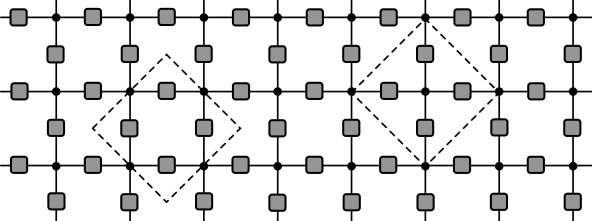{width=60% fig-align="center"}

$$
U = \mathcal{N}\sum_{z_i\in \mathbb{Z}_q}\prod_{\braket{i,j}} u_{ij}(z_i, z_j)
$$

$$
u_{ij}(z_i, z_j): \mathbb{Z}_q\times \mathbb{Z}_q\longrightarrow U(1)
$$

- Space(time)-like bonds described $u_\text{H}$ ($u_\text{V}$) 

---

## Tensor network

{width=60% fig-align="center"}

- Rank 2 tensors $u_{ij}$ on bonds

- Rank 4 tensors $\delta_{z_1,z_2,z_3,z_4}$ at the vertices

$$
\delta_{z_1,z_2,\ldots ,z_p} = 
  \begin{cases}
    1  & z_1=z_2=\cdots =z_p \\
    0  & \text{otherwise}
  \end{cases}
$$

---

## QM interpretation

{width=60% fig-align="center"}

- Fix values of $z_{x,t}$ on bottom and top $z_{x,0}$ and $z_{x,T}$ for $x=1,\ldots N$

- When does partition function $U(z_{1:N,0},z_{1:N,T})$ give matrix elements of unitary operator on a system of $N$ qudits?

- Gives rise to conditions on  $u_{ij}$...

----

## Unitary condition

- Row corresponds to diagonal operator $U_{\text{row}}$

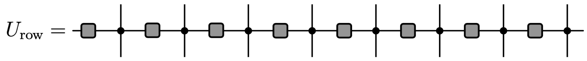{width=80% fig-align="center"}

$$
  \braket{z_{1:N}|U_{\text{row}}|z_{1:N,t}} = \prod_{x=1}^N u_\text{H}(z_{x,t},z_{x+1,t})
$$

- Unitary operator since $u_\text{H}$ are phases

---

## Unitary condition

- Vertical bonds: single qudit operator $u_\text{V}$, giving rise $U_\text{vert}$ on $N$ qudits

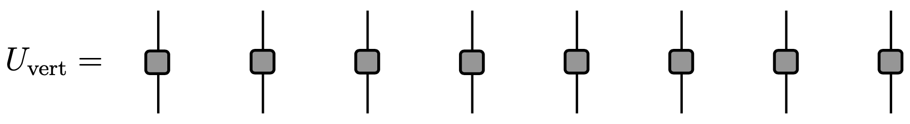{width=80% fig-align="center"}

- Require that $u_\text{V}$ is unitary too, up to multiplicative factor

-  $u_\text{V}^\dagger u^{\vphantom{\dagger}}_\text{V}=q\mathbb{1}$ with $|u_{\text{V}ij}|=1$ is  _complex Hadamard matrix_

- Simple and important example is __Fourier matrix__

$$
\left(F_q\right)_{jk} = \exp\left(2\pi ijk/q\right)\qquad j,k=0,\ldots, q-1.
$$

---

## Unitary condition

- Complete tensor network corresponds to composition 

$$
U(z_{1:N,0},z_{1:N,T})\propto\braket{z_{1:N,T}|\left(U_\text{vert}U_\text{row}\right)^T|z_{1:N,0}}
$$

- Matrix elements of unitary operator if $u_V$ is Hadamard matrix with normalization $\mathcal{N}=q^{-N(T-1)}$

---

## Space time duality^[[Hosur _et al._ (2016)](https://link.springer.com/article/10.1007/jhep02(2016)004), [Gutkin and Osipov (2016)](https://iopscience.iop.org/article/10.1088/0951-7715/29/2/325/meta), [Akila _et al._ (2016)](https://iopscience.iop.org/article/10.1088/1751-8113/49/37/375101/meta), [Bertini, Kos, Prosen (2018)](https://journals.aps.org/prl/abstract/10.1103/PhysRevLett.121.264101), [Bertini, Kos, Prosen (2019)](https://journals.aps.org/prx/abstract/10.1103/PhysRevX.9.021033), [Gopalakrishnan and A.L. (2019)](https://journals.aps.org/prb/abstract/10.1103/PhysRevB.100.064309), [Bertini, Kos, Prosen (2019)](https://journals.aps.org/prl/abstract/10.1103/PhysRevLett.123.210601)]

- Evaluate TN from left to right instead of from top to bottom

- Space-like evolution is unitary if $u_\text{H}$ is Hadamard

- If both $u_\text{V}$ and $u_\text{H}$ are Hadamard model describes unitary evolution in both space and time: __space-time duality__

---

## Interpretation as stroboscopic dynamics

- Write $U_\text{row}$ and $U_\text{ver}$ as exponentials of two Hamiltonians

$$
  U_{\text{row}} = e^{-i H_1 T_1}, \qquad  U_{\text{vert}} = e^{-i H_2 T_2}
$$

- $H_1$ a sum of diagonal terms acting on two neighbouring qudits: classical Ising-like interaction

-  $H_2$ a sum of single qudit terms: a "kick" creating quantum superposition

- $H_{1,2}$ must be chosen so that matrix elements of corresponding unitaries have unit modulus

- Examples include self-dual kicked Ising model and kicked Potts model (later)

---

## Brickwork circuit

{width=60% fig-align="center"}

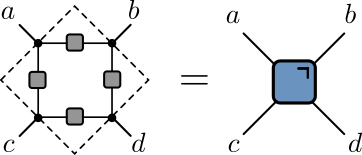{width=30% fig-align="center"}

- Vertices now rank 3 delta tensors

- Brickwork dual unitary circuit from Hadamard condition

---

## (Boundary conditions slightly different...)

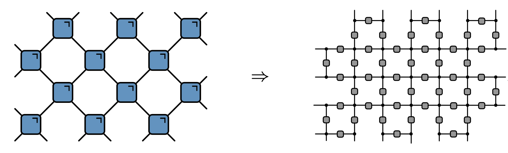{width=80% fig-align="center"}

---

## Round-a-face form^[[Prosen (2021)](https://pubs.aip.org/aip/cha/article-abstract/31/9/093101/974675/Many-body-quantum-chaos-and-dual-unitarity-round-a?redirectedFrom=fulltext)]

{width=50% fig-align="center"}

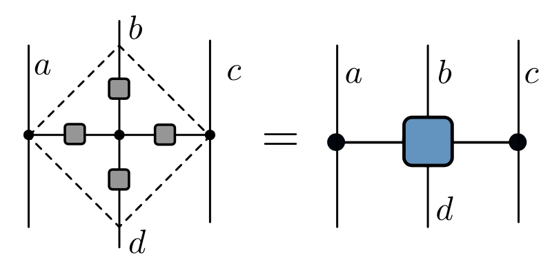{width=30% fig-align="center"}

- Hadamard construction shows that exchanging control indices $a,c$ and  unitary indices $b,d$ preserves unitarity $\longrightarrow$ space-time duality

---

## (Boundary conditions again slightly different...)

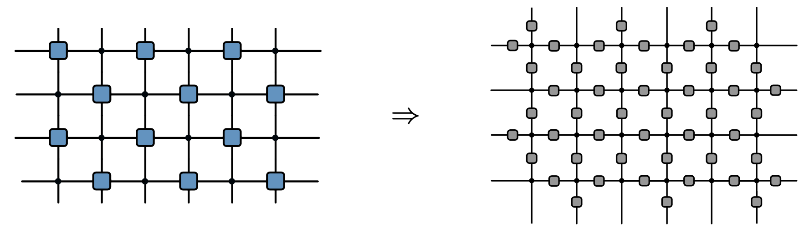{width=80% fig-align="center"}

---

## Cellular automata for $u_\text{H}=F^\dagger$ and $u_\text{V}=F$

{width=30% fig-align="center"}

$$
\sum_{e=0}^{q-1} (F^{\dagger}_d)_{ae} \left(F_d\right)_{be}(F_d^{\dagger})_{ce}\left(F_d\right)_{de} = q\, \delta_{-a+b-c+d \mod q},
$$

$$
\begin{align*}
  s_{x-1,t} = a \qquad s_{x,t+1} = b \nonumber\\
  s_{x+1,t} = c \qquad s_{x,t-1} = d
\end{align*}
$$

$$
s_{x,t+1} = - s_{x-1,t} - s_{x+1, t} + s_{x,t-1} \qquad \mod q
$$

- For $q=2$ this is reversible version of Wolfram's Rule 150 (Rule 150R) \cite{wolfram2002new}

# Outline

- Operator dynamics in Clifford cat maps

- Entanglement growth

- Long-range entanglement generation

# Outline

- __Operator dynamics in Clifford cat maps__

- Entanglement growth

- Long-range entanglement generation

---

## Generalized Pauli matrices

$$
Z_q = \begin{pmatrix}
1 & 0 & 0 & \cdots & 0\\
0 & \omega_q & 0 & \cdots & 0\\
\cdots & \cdots & \cdots & \cdots & \cdots \\
0 & 0 & 0 & \cdots & \omega_q^{q-1}
\end{pmatrix},\qquad X_q = \begin{pmatrix}
  0 & 1 & 0 & \cdots & 0\\
  0 & 0 & 1 & \cdots & 0\\
  \cdots & \cdots & \cdots & \cdots & \cdots \\
  1 & 0 & 0 & \cdots & 0
  \end{pmatrix}
$$
($\omega_q = \exp(2\pi i/q)$)

- Satisfy $Z_q^q=X_q^q=\mathbb{1}$ and the Weyl relation

$$
X_q Z_q = \omega_q Z_q X_q
$$

---

- Eigenvectors 

$$
  Z\ket{z}_Z=\omega^z\ket{z}_Z\qquad X\ket{x}_X=\omega^x\ket{x}_X,\qquad z,x\in \mathbb{Z}_q
$$

- $z$ and $x$ are position and momentum respectively: QM analogue of canonical coordinates on toroidal phase space

$$
  \ket{x}_X = \frac{1}{\sqrt{q}}\sum_{z=0}^{q-1} \omega^{zx}\ket{z}_Z,
  \qquad 
  \ket{z}_Z = \frac{1}{\sqrt{q}}\sum_{x=0}^{q-1} \omega^{-zx}\ket{x}_X
$$

- Unitary transformation with the Fourier matrix $F$

$$
FZF^\dagger =X ,\qquad FXF^\dagger = Z^{-1}
$$

---

- Products $Z^a X^b$ with $a,b=0,\ldots q-1$ form a basis

$$
\left(Z^a X^b\right)_{jk} = \omega^{aj}\delta_{j+b=k\mod q}
$$

- Conjugating by $F$ gives

$$
F Z^a X^b F^\dagger = X^{a}Z^{-b}
$$

- $-\pi/2$ rotation of phase space: $(z,x)\longrightarrow (z',x')=(x,-z)$

---

## Some simple unitaries I

- A power of $Z$ is a simple diagonal unitary

$$
Z^k Z^a X^b Z^{\dagger k} = Z^a X^b \omega^{-bk}
$$

- Corresponds to a `kick' to momentum $x\to x'=x-k$

---

## Some simple unitaries II
$$
S_{jj} = \exp(-i\pi j^2/q)\qquad j\in\mathbb{Z}_q
$$

$$
S^\alpha Z^a X^b (S^\dagger)^\alpha = \omega^{\alpha b^2/2} Z^{a+\alpha b}X^b
$$

- Momentum receives kick $x'=x+\alpha z+\alpha /2$, corresponding to shear

$$
\begin{pmatrix}
    z \\
    x
  \end{pmatrix}\longrightarrow
  \begin{pmatrix}
    z' \\
    x'
  \end{pmatrix} = \begin{pmatrix}
    z \\
    x + \alpha z
  \end{pmatrix}=
  \begin{pmatrix}
  1 & 0 \\
  \alpha & 1
  \end{pmatrix}
  \begin{pmatrix}
    z \\
    x
  \end{pmatrix}\qquad \mod q
$$

 - Semiclassical interpretation: multiplying by $e^{i\theta(z)}$ shifts momentum by $\theta'(z)$
 
 - Shift linear in $z$ $\longrightarrow$ $\theta(z)\propto z^2$

---

## Some simple unitaries III

- Combine $S$ with $F$ to give family of Hadamards

$$
C_{jk}(\alpha,\delta)\equiv\left(S^\alpha F S^\delta\right)_{jk} = \exp\left(-\frac{2\pi i}{q}\left[\frac{\alpha j^2}{2} - jk + \frac{\delta k^2}{2}\right]\right)\qquad \alpha,\delta\in \mathbb{Z}
$$

- Effect on operator basis

$$
Z^a X^b \longrightarrow C(\alpha,\delta)Z^a X^b C^\dagger(\alpha,\delta)\sim Z^{a'}X^{b'}
$$

$$
\begin{pmatrix}
a' \\
b'
\end{pmatrix}
=\overbrace{\begin{pmatrix}
\alpha & \alpha\delta - 1\\
1 & \delta
\end{pmatrix}}^{\equiv T^T}
\begin{pmatrix}
  a \\
  b
  \end{pmatrix}.
$$

- Subfamily of linear area preserving maps of torus

---

## [Cat maps](https://en.wikipedia.org/wiki/Arnold%27s_cat_map)

$$
\begin{pmatrix}
  z \\
  x
\end{pmatrix}\longrightarrow
\begin{pmatrix}
  z' \\
  x'
\end{pmatrix} = T
\begin{pmatrix}
  z \\
  x
\end{pmatrix}\qquad \mod 1
$$

$$
T = \begin{pmatrix}
\alpha & \beta \\
\gamma & \delta
\end{pmatrix}\qquad \alpha,\beta,\gamma,\delta\in\mathbb{Z},\qquad \alpha\delta-\beta\gamma=1
$$

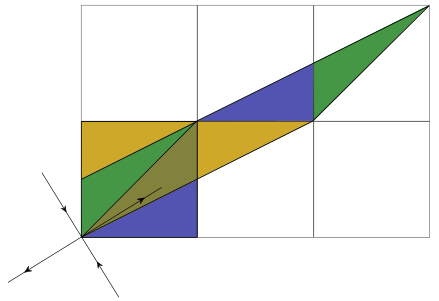{width=35% fig-align="center"}

- Case $\beta=1$ gives  _Clifford_ unitaries: $Z^a X^b\longrightarrow Z^{a'} X^{b'}$

---

- [Moudgalya _et al._ (2019)](https://journals.aps.org/prb/abstract/10.1103/PhysRevB.99.094312) studied operator dynamics for _perturbed_ cat maps

$$
\left(U_q\right)_{jk}= \frac{1}{\sqrt{q}} \exp \left[\frac{2 \pi i}{q \beta}\left(\frac{\alpha j^{2}}{2}+j k+\frac{\delta k^2}{2}\right)+\frac{i \kappa q}{2 \pi} \sin \left(\frac{2 \pi j}{q}\right)\right]
$$

- Still Hadamard for $\beta=1$, but $\kappa\neq 0$ is non-Clifford

---

## Coupling between sites

- Coupling via diagonal two qudit matrix with cat matrix elements 

$$
C_2(\alpha,\delta) = \operatorname{diag}(C_{j_1j_2}(\alpha,\delta)) \qquad j_{1,2}\in\mathbb{Z}_q
$$

$$
  C_2(\alpha,\delta)Z_1^{a_1} X_1^{b_1} Z_2^{a_2} X_2^{b_2} C^\dagger_2(\alpha,\delta) \sim Z_1^{a_1-\alpha b_1-b_2}X_1^{b_1}Z_2^{a_2-\delta b_2-b_1}X_2^{b_2}
$$

- Momenta on two sites receive a kick:

$$
\begin{align*}
z_1&\longrightarrow z_1 \nonumber\\
x_1&\longrightarrow x_1 - z_2 - \alpha z_1\nonumber\\
z_2&\longrightarrow z_2 \nonumber\\
x_2&\longrightarrow x_2 - z_1 - \delta z_2
\end{align*}
$$

---

## Operator dynamics in coupled Clifford cats

- Find dynamics of general Pauli operator

$$
\mathcal{O}_{AB}\equiv\prod_{x=1}^N Z_x^{a_{x}}X_x^{b_{x}}\qquad a_{x}, b_{x}\in \mathbb{Z}_q
$$

- $U_t \mathcal{O}_{A_0B_0}U^\dagger_t \equiv \mathcal{O}_{A_t B_t}$ defines evolution of $A_t=(a_{0,t}, \ldots, a_{N,t})$ and $B_t=(b_{0,t}, \ldots, b_{N,t})$

---

- Dynamics is $u_\text{H}=F=C(0,0)$ and $u_\text{V}=C(\alpha,\delta)$
$$
\begin{align*}
a_{x,t+1} &= \alpha(a_{x,t}-b_{x-1,t}-b_{x+1,t}) + (\alpha\delta -1)b_{x,t}\\
b_{x,t+1} &= a_{x,t} - b_{x-1,t} - b_{x+1,t}+\delta b_{x,t}
\end{align*} \mod q
$$

- "Hamiltonian" form: first order difference equations

- Eliminate $a_{x,t}$ to obtain second difference "Lagrangian" form

$$
\begin{aligned}
\left[\Delta b\right]_{x,t} &= (\alpha + \delta - 4)b_{x,t}\\
\left[\Delta b\right]_{x,t} &\equiv  b_{x,t+1} + b_{x+1,t-1} + b_{x+1,t} + b_{x-1,t} - 4b_{x,t}
\end{aligned}\mod q
$$

---

- If instead $u_\text{H}=F^\dagger$, get lattice d'Alembertian

$$
  \begin{align*}
  a_{x,t+1} &= \alpha(a_{x,t}+b_{x-1,t}+b_{x+1,t}) + (\alpha\delta -1)b_{x,t}\\
  b_{x,t+1} &= a_{x,t} + b_{x-1,t} + b_{x+1,t}+\delta b_{x,t}\\
  \left[\square b\right]_{x,t} &= (\alpha + \delta)b_{x,t}\\
  \left[\square b\right]_{x,t} &\equiv b_{x,t+1} + b_{x+1,t-1} - b_{x+1,t} - b_{x-1,t}
  \end{align*}\mod q
$$
  
- Dynamics related by $a_{x,t}\rightarrow (-1)^x a_{x,t}$, and $b_{x,t}\rightarrow (-1)^x b_{x,t}$

- Linear equations $\longrightarrow$ suffices to understand dynamics of single $Z$ and $X$

---

- These are _Clifford cellular automata_^[[Schlingemann, Vogts, Werner (2008)](https://pubs.aip.org/aip/jmp/article-abstract/49/11/112104/954171/On-the-structure-of-Clifford-quantum-cellular?redirectedFrom=fulltext)]

- Classical version is _coupled cat model_^[[Gutkin and Osipov (2016)](https://iopscience.iop.org/article/10.1088/0951-7715/29/2/325/meta)]

---

## Fractal dynamics: $\alpha+\delta\neq 0 \mod q$ 

 - Linearity $\longrightarrow$ dynamics of $a_t(u)\equiv\sum_x a_{x,t}u^x$ and $b_t(u)\equiv\sum_x b_{x,t}u^x$

$$
\begin{pmatrix}
a_{t+1}(u) \\
b_{t+1}(u)
\end{pmatrix}
= M(u,u^{-1})
\begin{pmatrix}
  a_{t}(u) \\
  b_{t}(u)
  \end{pmatrix}
$$

$$
 M(u, u^{-1}) = \begin{pmatrix}
 \alpha & (\alpha\delta - 1) + \alpha(u + u^{-1}) \\
 1 & \delta + u + u^{-1}
 \end{pmatrix}
$$

---

- $\operatorname{tr}M = \alpha + \delta + u + u^{-1}$

- For $\alpha+\delta=0$ we have a _glider_ automaton^[[Gütschow _et al._ (2010)](https://pubs.aip.org/aip/jmp/article-abstract/51/1/015203/231697/Time-asymptotics-and-entanglement-generation-of?redirectedFrom=fulltext)]

- $\alpha+\delta\neq 0$ gives _fractal_ operator dynamics

---

## Self-dual kicked Ising model at $h=\pi/4$

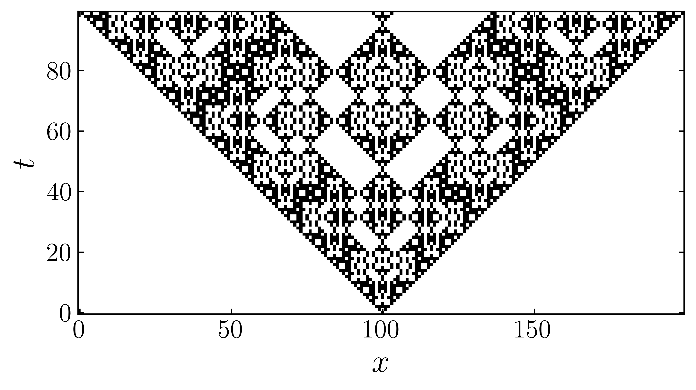{width=60% fig-align="center"}

---

## $q=3$^[[Lotkov _et al._ (2022)](https://journals.aps.org/prb/abstract/10.1103/PhysRevB.105.144306)]

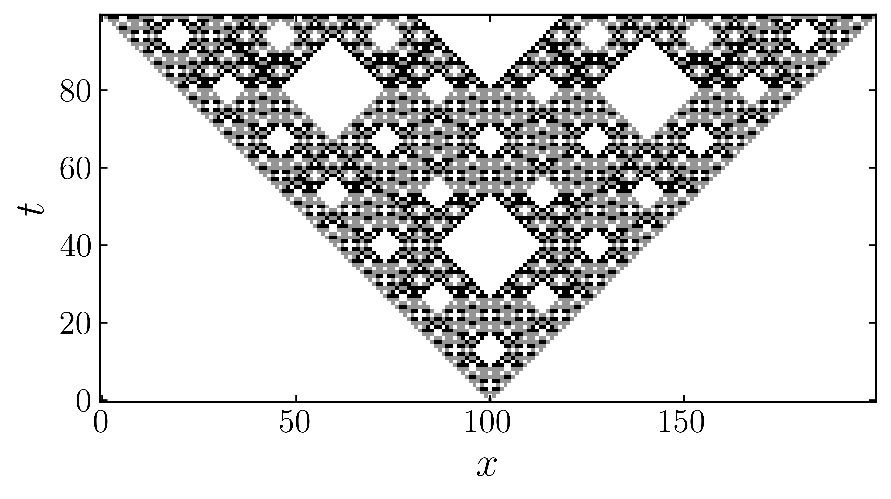{width=60% fig-align="center"}

---

## Glider dynamics for $\alpha=\delta = 0\mod q$

- For $u_\text{H}=F^\dagger$

$$
\begin{aligned}
  a_{x,t+1} &=  -b_{x,t}\nonumber\\
  b_{x,t+1} &= a_{x,t} + b_{x-1,t} + b_{x+1,t}
\end{aligned} \mod q
$$

- Right and left moving configurations

$$
\begin{aligned}
a^R_{x,t} &= r_{x-t}, \qquad b^R_{x,t} = -r_{x-t-1}\,,\nonumber\\
a^L_{x,t} &= l_{x+t}, \qquad b^L_{x,t} = -l_{x+t+1}
\end{aligned}
$$

---

- Simplest propagating solutions

$$
\begin{aligned}
&\text{right moving: } Z_j X^{-1}_{j+1}\nonumber\\
&\text{left moving: } X^{-1}_{j}Z_{j+1}
\end{aligned}
$$

- $Z_j^n X^{-n}_{j+1}$ and $X^{-n}_{j}Z^n_{j+1}$ are also right and left propagating solutions 

 - $2$ sets of $q$ independent gliders per site: complete operator basis
 
- Implies a recurrence time of $N$, system size

---

"Vacuum" states $a_{x,t}=-b_{x,t}=a\in\mathbb{Z}_q$ preserved, giving

$$
\begin{aligned}
\Psi_X(j)&\equiv\left(\prod_{k<j} Z_k X^{-1}_k\right) X^{-1}_j\qquad \text{to the right}\nonumber\\
\Psi_Z(j)&\equiv\left(\prod_{k<j} Z_k X^{-1}_k\right) Z_j\qquad \text{to the left}
\end{aligned}
$$

- Elementary glider solutions are

$$
\begin{align*}
Z_jX^{-1}_{j+1}=\Psi^{-1}_X(j)\Psi_X(j+1)\nonumber\\
Z_j^{-1}Z_{j+1}=\Psi^{-1}_Z(j)\Psi_Z(j+1)
\end{align*}
$$
moving to the right and left respectively

---

- These operators obey $\Psi_X^q(j) = \Psi_Z^q(j) = 1$ 

\begin{aligned}
  \Psi_X(j)\Psi_{X}(k) &= \omega^{\operatorname{sign}(j-k)}\Psi_{X}(k)\Psi_X(j)\nonumber\\
  \Psi_Z(j)\Psi_{Z}(k) &= \omega^{\operatorname{sign}(k-j)}\Psi_{Z}(k)\Psi_Z(j)\nonumber\\
  \Psi_X(j)\Psi_{Z}(k) &= \omega^{\operatorname{sign}(j-k)}\Psi_{Z}(k)\Psi_X(j)\qquad j\neq k\nonumber\\
\Psi_Z(j)\Psi_{X}(j) &= \omega\Psi_{X}(j)\Psi_Z(j)
\end{aligned}

- $\mathbb{Z}_q$ _parafermions_ (generalizing Jordan—Wigner fermions for $q=2$)

# Outline

- Operator dynamics in Clifford cat maps

- __Entanglement growth__

- Long-range entanglement generation

---

- Product state of alternating $Z$ and $X$ eigenstates

$$
\ket{z_1}_Z\ket{x_2}_X\cdots \ket{z_{N-1}}_Z\ket{x_{N}}_X \,,\quad\qquad z_{2j-1}, x_{2j} \in\mathbb{Z}_q 
$$

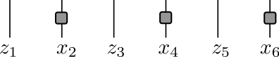{width=40% fig-align="center"}

- Taking $u_\text{V}=u_\text{H}=F$ and applying $U_\text{vert}U_\text{row}$ gives 

$$
  \ket{z_1}_X\ket{-x_2-z_1-z_3}_Z\cdots \ket{z_{N-1}}_X\ket{-x_N-z_{N-1}-z_1}_Z
$$

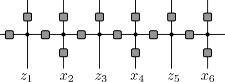{width=40% fig-align="center"}

- c.f. Rule 150R

---

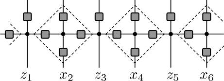{width=40% fig-align="center"}

- Applying $U_\text{vert}U_\text{row}$ a second time

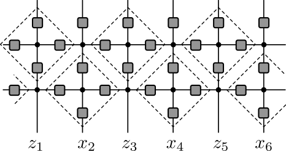{width=40% fig-align="center"}

- Reproduces original $ZXZX\cdots$ pattern (no entanglement)

---

- For $ZZZZ\cdots$ or $XXXX\cdots$ [Bertini _et al._ (2019)](https://journals.aps.org/prx/abstract/10.1103/PhysRevX.9.021033) found _maximal entanglement growth_

- After $T\geq 1$ time steps, RDM of semi-infinite $\rho_A$ has $q^{T-1}$ eigenvalues equal to $q^{-T+1}$, with remainder zero

- Rényi entanglement entropies obey

$$
S_A^{(\alpha)}(T) \equiv \frac{1}{1-\alpha} \log\operatorname{tr}\left[\rho_A^\alpha\right] = (T-1) \log q
$$

---

- Express $ZZZZ\cdots$ as

$$
\begin{aligned}
  &\ket{z_1}_Z\ket{z_2}_Z\cdots \ket{z_{N-1}}_Z\ket{z_{N}}_Z \nonumber\\
  &\qquad= \frac{1}{q^{N/2}}\sum_{x_2,x_4,\ldots x_N}\omega^{-z_2x_2-z_4x_4-\cdots z_N x_N}\ket{z_1}_Z\ket{x_2}_X\cdots \ket{z_{N-1}}_Z\ket{x_{N}}_X
\end{aligned}
$$

- Rule 150R dynamics acts on $ZXZX\cdots$. $x_{2j}$ appears in sites in forward light cone of site $2j$: $[2j-T+1,2j+T-1]$

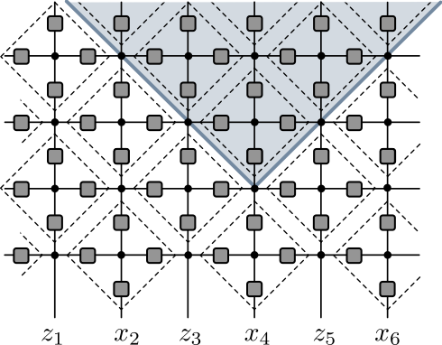{width=35% fig-align="center"}

---

{width=35% fig-align="center"}

- Sum over $x_{2j}$ contributes entanglement between two regions intersecting light cone

- For semi-infinite, $T-1$ indices appear in both halves

- Rule 150R dynamics is bijective, so every term gives rise to a distinct state

- All coefficients have same magnitude, so entanglement entropies are maximal and equal to $(T-1)\log q$

---

- More generally: weight each state $\ket{x}_X$ with $c_x$ satisfying $\sum_{x=0}^{q-1} |c_x|^2=1$ 

- Same argument gives von Neumann entanglement entropy

$$
  S_A^{(\alpha)}(T)= -T \sum_{x=0}^{q-1} |c_x|^2\log |c_x|^2
$$

- Allows rate of entanglement growth (entanglement velocity) to be tuned from zero to the maximal value $(T-1)\log q$

- c.f. maximal entanglement growth for _almost all_ dual unitary circuits^[[Foligno and Bertini (2023)](https://journals.aps.org/prb/abstract/10.1103/PhysRevB.107.174311)]

- Presumably a member of a set of exceptions of measure zero

# Outline

- Operator dynamics in Clifford cat maps

- Entanglement growth

- __Long-range entanglement generation__

---

## $q=3$ Floquet dynamics^[[Lotkov _et al._ (2022)](https://journals.aps.org/prb/abstract/10.1103/PhysRevB.105.144306)]

$$
H_1 = \sum_{j=1}^{2N-1} Z_j^2 Z_{j+1} + Z_{j}Z_{j+1}^2, \qquad H_{2} = \sum_{j=1}^{2N} \left(X_j+X_j^2\right)
$$

- With periods $T_1$ and $T_2$ get 

$$
U_{\text{row}} = e^{-i H_1 T_1}, \qquad  U_{\text{vert}} = e^{-i H_2 T_2}
$$

- Integrable for $T_1 = T_2 =\frac{2\pi}{9}(3l-m)$ with $m =1,2$ and $l\in \mathbb{Z}$

---

- For $m=1$

$$
\begin{aligned}
u_{\text{H}}(z_i,z_j) = e^{i\frac{4\pi}{9}} K_3^{\dagger}(z_i,z_j), \qquad u_{\text{V}}(z_i,z_j) = -i\frac{e^{i\frac{4\pi}{9}}}{\sqrt{3}}K_3(z_i,z_j)
\end{aligned}
$$

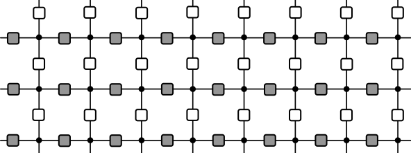{width=40% fig-align="center"}

- Gray and white squares represent symmetric complex Hadamard matrices that are each others' inverse (only structure required) 

---

## Long-range entanglement generation 

- Prepare initial product state 
$$
\ket{\psi(t=0)} = \otimes_{j=1}^{2N} \ket{+}_j
$$
where $\ket{+} = \frac{1}{\sqrt{q}}\sum_{a=1}^q \ket{a}$

- Evolve for $N$ steps with no $u_\text{H}$ between sites $N$ and $N+1$

$$
[U_{\text{vert}}\tilde{U}_{\text{row}}]^N\ket{\psi(t=0)}, 
$$

$$
\braket{z_{1:2N}|\tilde{U}_{\text{row}}|z_{1:2N,t}} = \prod_{j=1}^{N-1} u_\text{H}(z_{j,t},z_{j+1,t})\prod_{j=N+1}^{2N-1} u_\text{H}(z_{j,t},z_{j+1,t})
$$

---

- Evolve for $N$ steps with the inverse of _full_ unitary evolution

$$
\begin{aligned}
\ket{\psi_{\text{final}}} = [U_{\text{vert}}U_{\text{row}}]^{\dagger N}[U_{\text{vert}}\tilde{U}_{\text{row}}]^N\ket{\psi(t=0)}
\end{aligned}
$$

- Results in rainbow state, in which the sites $N-j+1$ and $N+j$ are connected by a maximally entangled Bell-like state

$$
\begin{align*}
\ket{\psi_{\text{final}}} = \bigotimes_{j=1}^N \ket{\psi_K}_{N-j-1,N+j}, \qquad \ket{\psi_K} = \frac{1}{\sqrt{q}}\sum_{a,b=1}^q u_{\text{H}}(a,b)\ket{a}\otimes\ket{b}
\end{align*}
$$

- Unitarity of $u_{\text{H}}$ $\longrightarrow$ two sites are maximally entangled

---

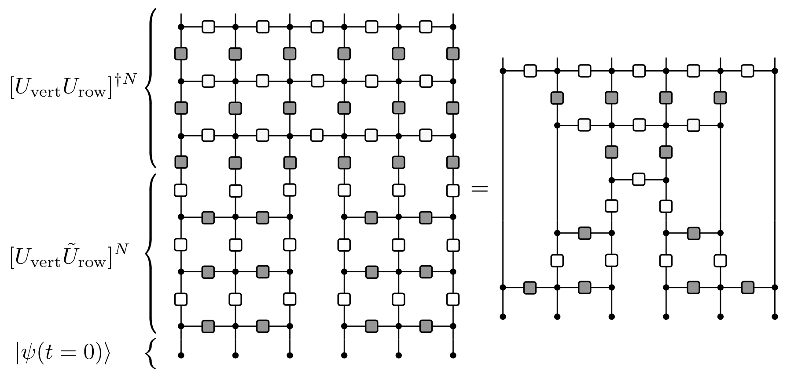{width=80% fig-align="center"}

- Simplified using unitarity, introducing a light cone from sites $N,N+1$

---

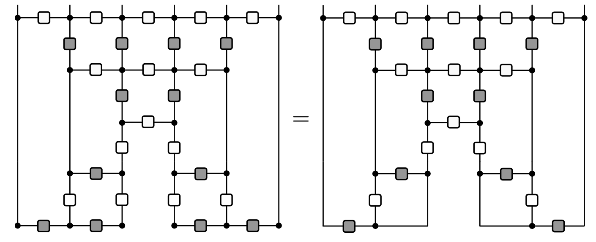{width=80% fig-align="center"}

- Using $u_{\textrm{H}}^{\vphantom{\dagger}}= u_{\textrm{V}}^\dagger$

- Then use $u_{\textrm{H}}(a,b)u_{\textrm{V}}(a,b)=|u_\textrm{H}(a,b)|^2=1$

---

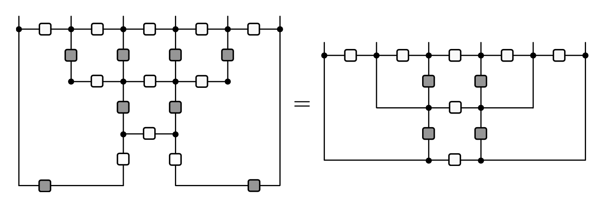{width=80% fig-align="center"}

---

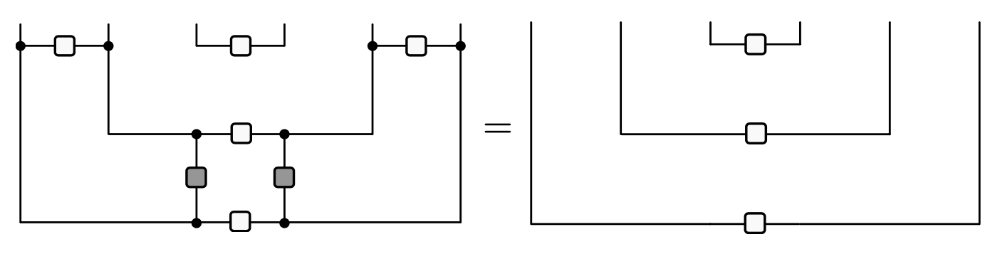{width=80% fig-align="center"}

$$
\ket{\psi_{\text{final}}} =\bigotimes_{j=1}^N \left(\frac{1}{\sqrt{q}}\sum_{a,b=1}^q u_{\text{H}}(a,b)\ket{a}_{N-j-1}\ket{b}_{N+j}\right)
$$

# Other stuff...

- Solitons / gliders for general circuit of form^[not complete in general]

{width=40% fig-align="center"}

- Set theoretical Yang—Baxter satisfied for symmetric complex Hadamard matrix for $q<6$ but not necessearily for $q \geq 6$

:::{.r-stack}
THANK YOU!
:::

---

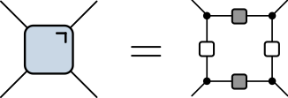{width=80% fig-align="center"}

---

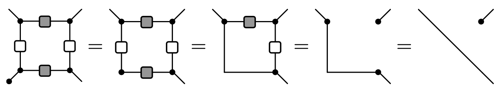{width=80% fig-align="center"}

---

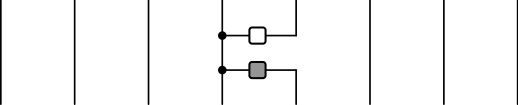{width=80% fig-align="center"}

---

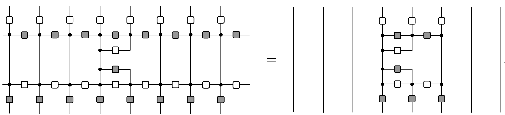{width=80% fig-align="center"}

---

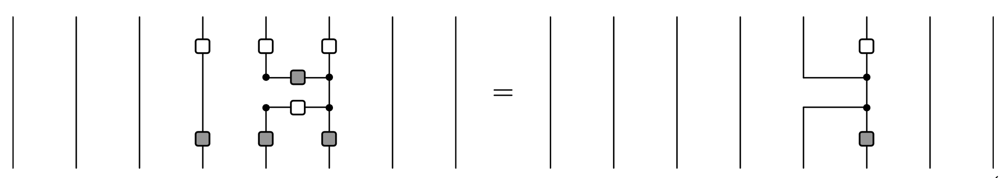{width=80% fig-align="center"}

---

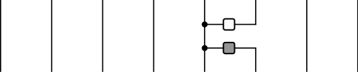{width=80% fig-align="center"}

---

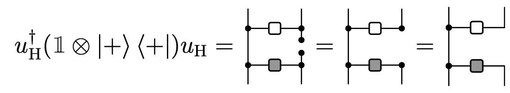{width=80% fig-align="center"}