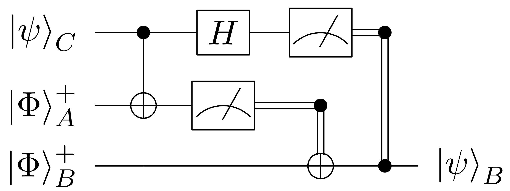
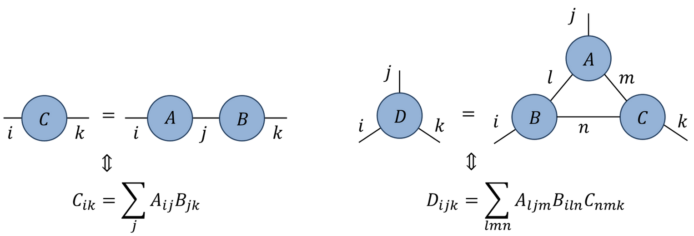
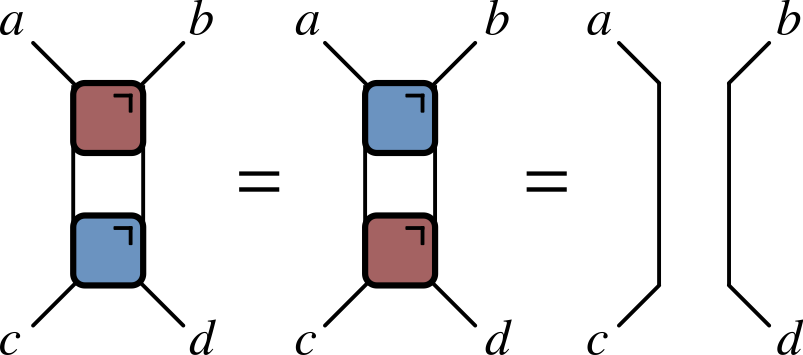
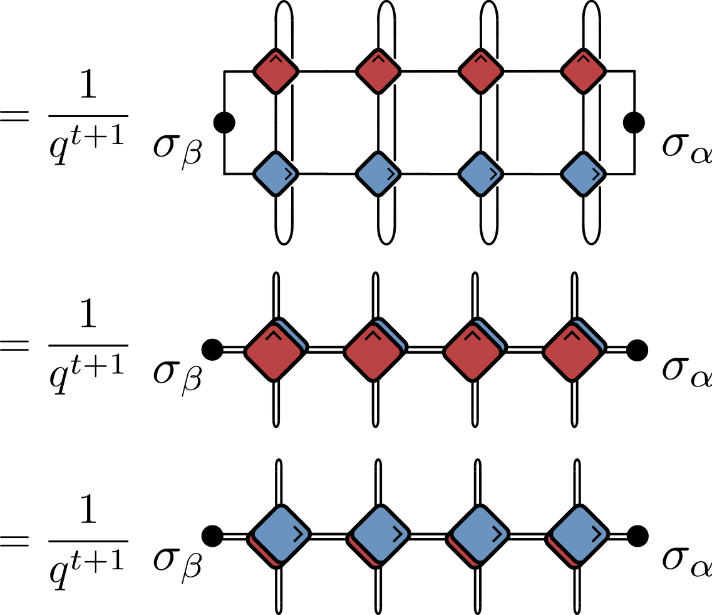

---
slides:
  # Choose a theme from https://github.com/hakimel/reveal.js#theming
  theme: white
  reveal_options: {
    hash: true,
    katex: {
      macros: {
        "\\abs" : "\\left|#1\\right|",
        "\\tr" : "\\operatorname{tr}",
        "\\sgn" : "\\operatorname{sgn}",
      },
      throwOnError: false,
    }
  }
---

# Quantum Circuits I
## Circuits as many-body dynamics

[austen.uk/slides/quantum-circuits-1-icts](https://austen.uk/slides/quantum-circuits-1-icts) for slides

---

## Outline

- This lecture

  - What is a quantum circuit?
  - What are the quantities of interest?

- Next lecture

  - Some special kinds of circuits

---

## What is a quantum circuit?

- A way to describe operations on quantum state, usually consisting of several __qubits__ (spin 1/2 subsystems with Hilbert space $\mathbb{C}^2$)

- Two quantum states $\ket{0}$ and $\ket{1}$  define the **computational basis**.

- $f$ acts on top five qubits, then $g$ acts on lower seven

---

## [Possible operations](https://en.wikipedia.org/wiki/Quantum_logic_gate)

<figure align="center">

<figcaption>Source: <a href="https://en.wikipedia.org/wiki/Quantum_circuit">Wikipedia</a> </figcaption>
</figure>

1. $H$ (a [Hadamard gate](https://en.wikipedia.org/wiki/Quantum_logic_gate#Hadamard_gate)) is a __single qubit unitary__ 

2. Also __two qubit unitary gates__ (CNOT here)

3. Measurements 

---

## Why consider circuits?

- __For this program:__ example of discrete time, many body dynamics

- Model of universal quantum computation 
  - How to generate an arbitrary quantum state
  - One of several options e.g. measurement-based

- _They exist!_ Companies (Google, IBM, etc.) have built platforms for gate-based QC

--- 

## Unitary circuits

- (Mostly) concerned with __unitary circuits__ made from __unitary gates__

- Gate is $n$-qubit unitary $U_{s_1\ldots s_n,s'_1,\ldots, s'_n}$

`$$
\sum_{s_1'\ldots s_N'}U_{s_1\ldots s_n,s'_1,\ldots, s'_n} U^\dagger_{s'_1\ldots s'_n,s''_1,\ldots, s''_n}=\delta_{s_1,s_1''}\ldots \delta_{s_N,s_N''}
$$`

---

## Everything is a tensor

- State of $N$ qubits expressed in product basis
  
`$$
\ket{\Psi} = \sum_{s_{1:N}\in \{0,1\}^N} \Psi_{s_1\ldots s_N}\ket{s_1}_1\ket{s_2}_2\cdots \ket{s_N}_N
$$`

- Write `$\ket{s_1}_1\ket{s_2}_2\cdots \ket{s_N}_N =\ket{s_1\cdots s_N}=\ket{s_{1:N}}$` for brevity 

- Operator on $N$ qubits has matrix elements

`$$
\mathcal{O}_{s_{1:N},s'_{1:N}} = \bra{s_{1:N}}\mathcal{O}\ket{s'_{1:N}}
$$`

---

## Graphical notation

- A tensor is denoted by a blob with one leg for each index

- Connecting legs denotes contraction: summing over a shared index

<figure align="center">

<figcaption>See <a href="https://www.tensors.net/tutorial-1">Glen Evenbly's tensor contraction tutorial</a> </figcaption>
</figure>

---

## Unitary gates: one qubit

- Multiplication by a Pauli matrix: $X$, $Y$, or $Z$.

- General case $U = a_0\mathbb{1} + \mathbf{a}\cdot(X,Y,Z)$ with $|a_0|^2+|\mathbf{a}|^2=1$

- Other special cases used in quantum information e.g. [Hadamard gate](https://en.wikipedia.org/wiki/Quantum_logic_gate#Hadamard_gate)

$$
H = \frac{1}{\sqrt{2}}\begin{pmatrix}
1 & 1 \\\\
1 & -1
\end{pmatrix}
$$

---

## Two qubits

- Work in  basis $\ket{00}$, $\ket{01}$, $\ket{10}$, $\ket{11}$

- Simplest example is [SWAP gate](https://en.wikipedia.org/wiki/Quantum_logic_gate#Swap_gate)

$$
\operatorname{SWAP}=\begin{pmatrix}
1 & 0 & 0 & 0 \\\
0 & 0 & 1 & 0 \\\
0 & 1 & 0 & 0 \\\
0 & 0 & 0 & 1
\end{pmatrix}
$$.

$$
\operatorname{SWAP}\ket{10} = \ket{01}
$$

- SWAP takes product states to product states

---

- Slightly more complicated: square root of SWAP

$$
\sqrt{\operatorname{SWAP}}=\begin{pmatrix}
1 & 0 & 0 & 0 \\\
0 & \frac{1}{2}(1+i) & \frac{1}{2}(1-i) & 0 \\\
0 & \frac{1}{2}(1-i) & \frac{1}{2}(1+i) & 0 \\\
0 & 0 & 0 & 1
\end{pmatrix}
$$

- This generates _entanglement_: takes product state to non-product state

$$
\sqrt{\operatorname{SWAP}}\ket{10} = \frac{1}{2}\left[(1+i)\ket{10}+(1-i)\ket{01}\right]
$$

- $\sqrt{\operatorname{SWAP}}$ conserves number of 1s and 0s

- $\sqrt{\operatorname{SWAP}}$ together with arbitrary single qubit unitary operators form __universal gate set__ that allows for universal quantum computation

---

## General two qubit unitary

- Any two-qubit unitary $U\in \mathcal{U(4)}$ can be written

$$
U = e^{i \phi} (u_+ \otimes u_-) V[J_x, J_y, J_z] (v_- \otimes v_+)
$$

- $u_{\pm}, v_{\pm} \in SU(2)$

$$
\begin{align*}
 V[J_x, J_y, J_z] &= \exp \left[-i\left(J_x \sigma^x \otimes \sigma^x + J_y \sigma^y \otimes \sigma^y+ J_z \sigma^z \otimes \sigma^z\right)\right]\\\\
 &= \begin{bmatrix}
e^{-i J_z} \cos(J_-) & 0 & 0 & -i e^{-i J_z \sin(J_-)} \\\\
0 & e^{iJ_z} \cos(J_+) & -ie^{i J_z} \sin(J_+) & 0 \\\\
0 & -ie^{i J_z} \sin(J_+) & e^{iJ_z} \cos(J_+) & 0 \\\\
-i e^{-i J_z \sin(J_-)} & 0 & 0 & e^{-i J_z} \cos(J_-) \\\\
\end{bmatrix}
\end{align*}
$$

- 16 parameters!

---

## Time evolution

#### Single qubit gates

- Time evolution operator $U=\exp(-iHt)$

- If $H=\sum_j h_j$ a sum of single qubit terms

$$
\mathcal{U} = \exp(-iHt) = \prod_j \exp(-ih_j) = \prod_j U_j
$$
$$
U_j=\mathbb{1}\otimes \ldots \otimes\mathbb{1} \otimes \overbrace{u_j}^{j\text{th factor}} \ldots \otimes\mathbb{1}
$$

---

#### Two qubit gates

- Simplest example of two qubit interaction is __exchange Hamiltonian__

$$
\begin{align*}
h_{12} &= J\left[X\otimes X+Y\otimes Y+Z\otimes Z\right] =J\left[X_1X_2+Y_1Y_2 + Z_1Z_2\right]\\\
&=2\operatorname{SWAP} - 1
\end{align*}
$$
$$
U(J) = \exp(-ih_{12}) = e^{iJ}\left[\cos (2J) \mathbb{1} - i\sin (2J) \operatorname{SWAP}\right]
$$

- Special cases 

$$
U(\pi/4)=\operatorname{SWAP}
$$
$$
U(\pi/8)=\sqrt{\operatorname{SWAP}}
$$

- Fully rotationally invariant

---

- $H=\sum_{i,j} h_{i,j}$ a sum of two qubit terms with $[h_{i,j},h_{j,k}]\neq 0$

<figure align="center">

<figcaption>Source: <a href="https://www.tensors.net/exact-diagonalization">Glen Evenbly</a> </figcaption>
</figure>

- $\mathcal{U}\neq \prod_{i,j} \exp(-ih_{i,j})$. More complicated!

- __Suzuki–Trotter__ expansion: decompose $H=H_A + H_B$

$$
\mathcal{U} = \exp(-iH) = \left[\exp\left(-\frac{iH}{n}\right)\right]^n \sim \left[e^{-iH_A/n} e^{-iH_B/n}\right]^n 
$$

---

$$
H = \sum_j h_{j,j+1}
$$
$$
H_A = \sum_j h_{2j, 2j+1}\qquad H_B = \sum_j h_{2j-1, 2j}
$$
$$
e^{-iH_A/n}=\prod_j U_{2j,2j+1}\qquad e^{-iH_B/n} = \prod_j U_{2j-1,2j}
$$

---

## Floquet theory: kicked Ising model

- Time dependent Hamiltonian with kicks at $t=0,1,2,\ldots$.

$$
\begin{align*}
H_{\text{KIM}}(t) = H_\text{I}[\mathbf{h}] + \sum_{n}\delta(t-n)H_\text{K}\\\
H_\text{I}[\mathbf{h}]=\sum_{j=1}^L\left[J Z_j Z_{j+1} + h_j Z_j\right],\qquad H_\text{K} &= b\sum_{j=1}^L X_j,
\end{align*}
$$

- "Stroboscopic" form of $\mathcal{U}(t)=\mathcal{T}\exp\left[-i\int^t H_{\text{KIM}}(t') dt'\right]$

$$
\begin{aligned}
  \mathcal{U}(n_+) &= \left[\mathcal{U}(1_+)\right]^n,\qquad U(1_-) = K I_\mathbf{h}\\\
  I_\mathbf{h} &= e^{-iH_\text{I}[\mathbf{h}]}, \qquad K = e^{-iH_\text{K}}
\end{aligned}
$$

---

## KIM as a circuit

$$
\begin{aligned}
  \mathcal{K} &= \exp\left[-i b X\right]\\\
  \mathcal{I} &= \exp\left[-iJ Z_1 Z_2 -i \left(h_1 Z_1 + h_2 Z_2\right)/2\right]
\end{aligned}
$$

---

## Locality 

- Locality a feature of real quantum computing architectures

<figure align="center">

<figcaption> (top) a schematic view of the Google Sycamore processor and (bottom) the real thing</figcaption>
</figure>

---

## Computational complexity

- State is vector in $2^N$ dimensional space

- Updating involves acting with a unitary matrix

- Naive matrix-vector multiplication $O(\operatorname{dim}^2)=2^{2N}$

- Since gates gives *sparse* matrices update is $O(\operatorname{dim})=2^{N}$

-  Still _exponentially hard in the number of qubits_

---

## Quantum supremacy

- Difficulty on classical computer basis of ["quantum supremacy"](https://en.wikipedia.org/wiki/Quantum_supremacy) based on circuit sampling

- Measure empirical distribution of bit strings with fixed initial state

- Total number of (time) steps $T$ taken is  *depth* of the circuit. For low depth $T<N$ it pays to move  _horizontally_ instead

- Problem of finding optimal contraction strategy in general is NP-hard

- [Google's initial claim](https://www.nature.com/articles/s41586-019-1666-5) of supremacy disputed by supercomputer optimizations, followed by improved tensor network methods: [Huang _et al._ (2020)](https://arxiv.org/abs/2005.06787), [Gray and Kourtis (2021)](https://quantum-journal.org/papers/q-2021-03-15-410/), [Pan and Zhang (2021)](https://arxiv.org/abs/2103.03074), [Napp _et al._ (2022)](https://journals.aps.org/prx/abstract/10.1103/PhysRevX.12.021021)

---

## What are the quantities of interest?

---

## Expectation values

- Evaluate $\bra{\Psi}\mathcal{O}\ket{\Psi}=\bra{\Psi_0}\mathcal{U}^\dagger\mathcal{O}\mathcal{U}\ket{\Psi_0}$ for local operator $\mathcal{O}$

  - Simplest example: $X$, $Y$, or $Z$ for one qubit

  - $\mathcal{U}$ is *overall* unitary operator describing whole circuit

---

## Unitarity in graphical notation

- Have to consider both unitaries and conjugates

- Introduce color-coded notation 

<figure align="center">

</figure>

---

- Condition of unitarity $U^\dagger U = U U^\dagger = \mathsf{1}$

$$
\sum\_{\alpha,\beta}U^{\vphantom{\dagger}}_{a,b,\alpha,\beta} U^\dagger\_{\alpha,\beta,c,d}=\delta\_{ac}\delta\_{bd}
$$

- Unitarity of two qubit gate expressed as

<figure align="center">

</figure>

- Much better!

---

## Using unitarity

- $\bra{\Psi}\mathcal{O}\ket{\Psi}=\bra{\Psi_0}\mathcal{U}^\dagger\mathcal{O}\mathcal{U}\ket{\Psi_0}$ has diagrammatic representation

 
<object data="assets/expectation.svg" type="image/svg+xml" width='600'></object>

- (leave initial state $\ket{\Psi}$ unspecified for the moment)

---

## "Folded" representations

- Since every $U$ accompanied by $U^\dagger$, include both in single unit by "folding" one on top of the other

- Lines correspond to two indices, and therefore $2^2=4$ dimensions

- Unitarity condition takes form:

---

- In folded picture expectation value $\bra{\Psi}\mathcal{O}\ket{\Psi}$ looks like this

<figure align="center">
<object data="assets/folded-expectation.svg" type="image/svg+xml"></object>
<figcaption>
Click to apply unitary condition!
</figcaption>
</figure>

- "Light cone" emerges, reflecting region of circuit that affects expectation value

---

## Reduced density matrix

- Expectation value of operator in region $A$ can be computed from *reduced density matrix* $\rho_A$ for region $A$
$$
\rho_A = \operatorname{tr}\_{B}\left[\ket{\Psi}\bra{\Psi}\right]=\operatorname{tr}_{B}\left[\mathcal{U}\ket{\Psi_0}\bra{\Psi_0}\mathcal{U}^\dagger\right]
$$
($B$ is complement of $A$)

---

<object data="assets/reduced-density-matrix.svg" type="image/svg+xml"></object>

- Initial RDM of bottom part of wedge is all that matters!

---

## Quantifying entanglement

- RDM quantifies entanglement present in a quantum state describing a system composed of two subsystems A and B

- General state is vector $\in\mathcal{H}=\mathcal{H}\_A\otimes\mathcal{H}\_B$  

- Write in terms of basis vectors $\ket{a}\_A$ and $\ket{b}\_B$ for A and B subsystems
$$
\ket{\Psi}\_{AB} = \sum\_{a=1}^{n\_A}\sum\_{b=1}^{n\_B} \Psi\_{ab}\ket{a}\_A\ket{b}\_B 
$$
$n\_{A/B}=\operatorname{dim} \mathcal{H}\_{A/B}$

- Now regard $\psi_{ab}$ as matrix and perform a singular value decomposition

---

- In new bases our state is

$$
\ket{\Psi}\_{AB} = \sum\_{n=1}^{\min(n_A, n_B)} \sigma\_n \ket{u\_n}\_A\otimes\ket{v\_n}\_B
$$

- Note _single sum_, c.f. double sum earlier. This is [Schmidt decomposition](https://en.wikipedia.org/wiki/Schmidt_decomposition) 

- $\sigma_n$ are Schmidt coefficients (singular values of SVD)

- If only one nonzero singular value state we have _product state_,  indicating no correlations between subsystems

---

- Simplest example displaying nontrivial entanglement is [Bell state](https://en.wikipedia.org/wiki/Bell_state) 

$$
\left|\Psi^{+}\right\rangle=\frac{1}{\sqrt{2}}\left(|0\rangle_A \otimes|1\rangle_B+|1\rangle_A \otimes|0\rangle_B\right)
$$

- Schmidt coefficients both $\frac{1}{\sqrt{2}}$, indicating maximal entanglement

- Schmidt decomposition closely related to RDM
$$
\rho_A = \operatorname{tr}\_B\left[\ket{\Psi}\bra{\Psi}\right] 
= \sum\_n \sigma_n^2 \ket{u\_n}\bra{u\_n}
$$

- Eigenvalues of RDM are $p_n=\sigma_n^2$

---

- One measure of entanglement is von Neumann entropy of $\rho_A$ (aka **entanglement entropy**)

$$
S^{(\text{vN})}_A \equiv -\operatorname{tr}\left[\rho_A\log \rho_A\right]
$$

- $S_A$ vanishes for product state, and is otherwise positive

---

- [Rényi entropies](https://en.wikipedia.org/wiki/R%C3%A9nyi_entropy) provide more complete information
$$
  S^{(\alpha)}\_A = \frac{1}{1-\alpha}\log \text{tr}\left[\rho^n\right]=\frac{1}{1-\alpha}\sum\_n p\_n^\alpha
$$
$S^{(\text{vN})}\_A=\lim\_{\alpha\to 1} S^{(\alpha)}\_A$. $S^{(0)}\_A$ is number of nonzero Schmidt coefficients (aka [Schmidt rank](https://en.wikipedia.org/wiki/Schmidt_decomposition#Schmidt_rank_and_entanglement))
$$
S^{(2)}\_A = -\log \sum_n p_n^2 = -\log \gamma\tr \rho_A^2
$$
where $\gamma\equiv \tr \rho_A^2$ is [purity](https://en.wikipedia.org/wiki/Purity_(quantum_mechanics))

---

## Toy model

- Circuit of SWAP gates
<figure align="center">

</figure>

- Initial state is product of Bell states
$$
\ket{\Phi^+}\_{2n, 2n+1} = \frac{1}{\sqrt{2}}\left[\ket{0}\_{2n}\ket{0}\_{2n+1}+ \ket{1}\_{2n}\ket{1}\_{2n+1}\right]
$$
$$
\operatorname{tr}\_{2}\left[\ket{\Phi^+}\_{12}\bra{\Phi^+}\_{12}\right] = \frac{1}{2}\mathbb{1}_1
$$
with entanglement entropy of one bit

---

- $\rho_A$ therefore has factor $\mathbb{1}_n$ for each site $n\in A$ with "partner" in $B$

- If _both_ qubits of a Bell pair are at sites  $n,m\in A$ they give a factor $\ket{\Phi^+}\_{nm}\bra{\Phi^+}\_{nm}$: a pure state

- Entanglement entropy has contributions from first case only

$$
 S_A = \min(4\lfloor t/2\rfloor, |A|) \text{ bits}
$$

---

$$
 S_A = \min(4\lfloor t/2\rfloor, |A|) \text{ bits}
$$

- After time $\sim |A|/2$ subsystem has thermalized. 

<figure align="center">

<figcaption> 
Source:  <a href="https://journals.aps.org/prx/abstract/10.1103/PhysRevX.9.021033">Bertini et al. (2019)</a>
</figcaption>
</figure>

--- 

- Ramp behaviour in many systems

- In noninteracting systems or integrable systems, often explained in terms of the causal propagation of (quasi-)particles:

<figure align="center">

<figcaption> 
Source:  <a href="https://iopscience.iop.org/article/10.1088/1742-5468/2005/04/P04010/meta">Calabrese and Cardy (2005)</a>
</figcaption>
</figure>

---

- Toy model with SWAP gates is rather similar, with qubits playing the role of "noninteracting particles"

- This picture remains true in circuits where there is no quasiparticle interpretation (next lecture) 

---

## Correlation functions

- Natural correlation function to consider is

$$
c_{\alpha \beta}(x,t) = \frac{1}{2^N}\tr\left[\sigma_{\alpha}(x,t) \sigma_{\beta}(0,0) \right],\qquad \sigma_\alpha(x,t)=\mathcal{U}^\dagger(t)\sigma_\alpha(x)\mathcal{U}(t)
$$

- Average overall all initial states uniformly

- This is "infinite temperature", although temperature is not defined

---

## Graphical representation

$$
c_{\alpha \beta}(x,t) = \frac{1}{2^N}\tr\left[\sigma_{\alpha}(x,t) \sigma_{\beta}(0,0) \right],\qquad \sigma_\alpha(x,t)=\mathcal{U}^\dagger(t)\sigma_\alpha(x)\mathcal{U}(t)
$$

<figure align="center">

</figure>

---

- When $|x|>t$ unitarity condition leads to removal of _all_ $U$s and $U^\dagger$s 
$$
c_{\alpha \beta}(x,t) = \frac{1}{4}\tr\left[\sigma_{\alpha}\right]\tr\left[\sigma_{\beta}\right]=0,
$$
and correlations vanish (if operators are traceless)

- Correlations only nonzero inside "light cone"

---

- When $|x|=t$ remaining tensor network is particularly simple:

<figure align="center">

</figure>

---

- Rewrite in several ways, including in folded representation:

<figure align="center">

</figure>

- $q$ is local Hilbert space dimension ($q=2$ up to now)

- Normalization factor by comparing with $\sigma_\alpha=\sigma_\beta=\mathsf{1}$ (here $t=4$)

---

- Evaluate by iteratively applying operator map $\mathcal{M}\_+$ or $\mathcal{M}\_-$

<figure align="center">

</figure>

$$
\begin{align*}
\langle \sigma\_{\alpha}(t,t) \sigma\_{\beta}(0,0) \rangle &= \tr \left[\sigma\_{\beta}\mathcal{M}\_{-}^t(\sigma\_{\alpha})\right] / q \\\
&=  \tr \left[ \sigma\_{\alpha}\mathcal{M}\_{+}^{t}(\sigma\_{\beta})\right] / q
\end{align*}
$$

- $\mathcal{M}\_\pm$ are examples of [quantum channels](https://en.wikipedia.org/wiki/Quantum_channel): completely positive trace preserving maps between spaces of operators

- $\mathcal{M}\_\pm$ have the additional property of being _unital_: $\mathcal{M}\_\pm(\mathsf{1})=\mathsf{1}$

---

## Typical behaviour of correlations

<figure align="center">

<figcaption>
Source: <a href="https://journals.aps.org/prresearch/abstract/10.1103/PhysRevResearch.2.033032">Claeys and Lamacraft (2020)</a>
</figcaption>
</figure>

---

- Can evaluate correlation inside light cone

<figure align="center">

</figure>

- "One step inside" involves quantum channel acting on two-site operators: a space of dimension $q^4$. 

- Taking $s$ steps inside channel acting on $q^{2s}$-dimensional space

- General situation is really exponentially hard, as we'd expect

---

## Operator spreading

- How does a local operator "look" as it evolves in Heisenberg picture?

- $Z_n(t)=\mathcal{U}^\dagger(t)Z_n \mathcal{U}(t)$ appears in $\langle Z_n(t)Z_m(0) \rangle$, but this is only one "component" of $Z_n(t)$

- Any observable such as $Z_n(t)$ can be expressed as expansion
$$
Z_n(t)= \sum_{\mu_{1:N}=\\{1,x,y,z\\}^N} \mathcal{C}\_{\mu_{1:N}}(t) \sigma_1^{\mu_1}\otimes\cdots \sigma_N^{\mu_N}
$$
$$
\mathcal{C}\_{\mu_{1:N}}(0)=\begin{cases}
1 & \mu_j=z, \mu_k=1,\forall k\neq j \\\\
0 & \text{otherwise}
\end{cases}
$$

---

$$
Z_n(t)= \sum_{\mu_{1:N}=\\{1,x,y,z\\}^N} \mathcal{C}\_{\mu_{1:N}}(t) \sigma_1^{\mu_1}\otimes\cdots \sigma_N^{\mu_N}
$$

- Since $\tr\left[\sigma_\alpha\sigma_\beta\right]=2\delta_{\alpha\beta}$, can extract spin correlations from $\langle Z_j(t)Z_k(0)\rangle=C_{jk}(t) \equiv \mathcal{C}_{1\cdots \mu_k=z \cdots 1}(t)$

<figure align="center">

</figure>

- This represents only one component of operator expansion

---

- Operator norm $\tr\left[Z\_n^2(t)\right]=2$ is conserved under time evolution

- This implies the normalization

$$
\sum_{\mu_{1:N}=\\{1,x,y,z\\}^N} \mathcal{C}^2\_{\mu_{1:N}}(t) = \frac{1}{2^{N-1}}.
$$

---

## Example: $SU(2)$ preserving gate

- Consider gate generated by exchange Hamiltonian:
$$
U\_{j,j+1} = \cos\theta \mathbb{1}\_{j,j+1} + i\sin\theta \operatorname{\mathsf{S}}\_{j.j+1}
$$
$\operatorname{\mathsf{S}}_{j,j+1}$ denotes $\operatorname{\mathsf{SWAP}}$ gate on sites $j$ and $j+1$

- Action of this gate on an operator is

$$
\mathcal{O} \longrightarrow U^\dagger\_{j,j+1}\mathcal{O}U\_{j,j+1} = \cos^2\theta \mathcal{O} + \sin^2\theta \operatorname{\mathsf{S}}\_{j.j+1}\mathcal{O} \operatorname{\mathsf{S}}\_{j.j+1} \\\
-i\sin\theta\cos\theta \left[\operatorname{\mathsf{S}}\_{j.j+1}, \mathcal{O}\right]
$$

---

## Ensemble of circuits

- Consider ensemble averaged quantities

- Take $\theta=\pm \theta_0$ with $p(\theta_0)-p(-\theta_0)\equiv \delta > 0$.

- Averaging the evolved operator gives

$$
\overline{U^\dagger_{j,j+1}\mathcal{O}U_{j,j+1}} = \cos^2\theta_0 \\, \mathcal{O} + \sin^2\theta_0 \\, \mathsf{S}\_{j.j+1}\mathcal{O} \mathsf{S}\_{j.j+1} \\\\
+i\delta \sin\theta_0\cos\theta_0 \left[\mathsf{S}\_{j.j+1}, \mathcal{O}\right]
$$

- Interpretation

  1. Operators on sites $j$ and $j+1$ switch with probability $\sin^2\theta_0$.
  2. The asymmetry $\delta$ governs strength of "quantum" dynamics

---

- Continuous time limit ([Claeys, Lamacraft & Herzog-Arbeitman (2022)](https://journals.aps.org/prl/abstract/10.1103/PhysRevLett.128.246603)
$$
\frac{d\bar{\mathcal{O}}}{dt} = \sum_j \left[iJ \left[\mathsf{S}\_{j,j+1},\bar{\mathcal{O}}\right]+\left(\mathsf{S}\_{j,j+1}\bar{\mathcal{O}}\mathsf{S}\_{j,j+1}-\bar{\mathcal{O}}\right)\right]
$$
where $J\propto \delta$. Computing commutator:

$$
\begin{align*}
i[\mathsf{S},\sigma^a\otimes 1]&=-\epsilon^{abc}\sigma^b\otimes\sigma^c\nonumber\\\\
i[\mathsf{S},1\otimes \sigma^a]&=\epsilon^{abc}\sigma^b\otimes\sigma^c\nonumber\\\\
i[\mathsf{S},\sigma^a\otimes \sigma^b]&=\epsilon^{abc}\left(\sigma^c\otimes 1- 1\otimes \sigma^c\right).
\end{align*}
$$

- Describes operator "splitting" ($1\to 2$) and "merging" ($2\to 1$) 

---

## $J=0$ limit

$$
\frac{d\bar{\mathcal{O}}}{dt} = \sum_j \left[iJ \left[\mathsf{S}\_{j,j+1},\bar{\mathcal{O}}\right]+\left(\mathsf{S}_{j,j+1}\bar{\mathcal{O}}\mathsf{S}\_{j,j+1}-\bar{\mathcal{O}}\right)\right]
$$

- No splitting and merging and terms

- In single operator sector define $\mathcal{C}^a_{0\cdots \mu_k=a\cdots 0}\equiv C^a_k$
$$
\partial_t C^a_k = C^a_{k+1} + C^a_{k-1} - 2 C^a_k\equiv \Delta_k C^a_k,
$$
diffusion of single $\sigma^a$ ($\Delta_k$ is 1D discrete Laplacian)

---

## $J\neq 0$ 

$$
\partial_t \mathcal{C}\_{\mu_{1:N}} = \sum_j \left[J\epsilon_{\alpha\beta \mu_j \mu_{j+1}} \mathcal{C}\_{\mu_1\cdots \alpha\beta \cdots \mu_N} + \mathcal{C}\_{\mu_1\cdots \mu_{j+1}\mu_j \cdots \mu_N} - \mathcal{C}\_{\mu_1\cdots \mu_{j}\mu_{j+1} \cdots \mu_N}\right]
$$

- First term leads to single site operator spreading over many sites

- Qualitative behaviour is known as __operator spreading__ and is a generic feature of operator dynamics

---

- Spreading suppressed at $J=0$ because we considered _average_

- In any sample from our random circuit, single-site operator spreads to many sites

- Random signs of coeffcients $\mathcal{C}\_{\mu_{1:N}}$ means most average to zero: only the single site contributions remain

- When $J\neq 0$ some contribution survives and this allows for a controlled expansion

- We'd like a measure that is insensitive to these random signs

