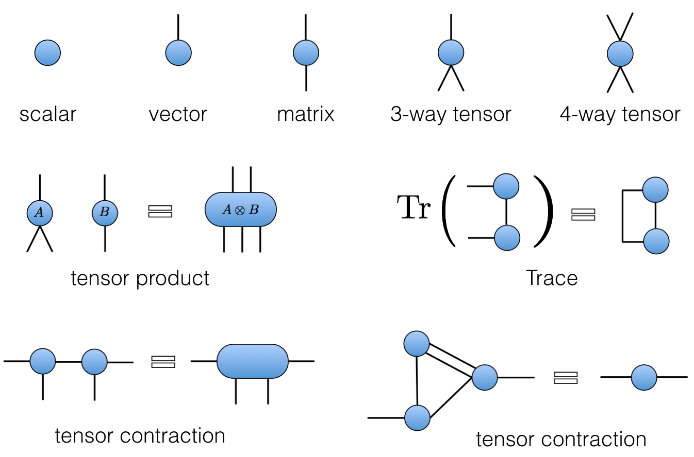

---
slides:
  # Choose a theme from https://github.com/hakimel/reveal.js#theming
  theme: white
  math_renderer: mathjax3
  reveal_options:
    hash: true
    mathjax3:
      loader:
        load: ['[tex]/noerrors', '[tex]/physics']
      tex:
        packages: 
          '[+]': ['noerrors', 'physics']
scripts: []
---

# Quantum Circuits

- [austen.uk/slides/quantum-circuits-1](https://austen.uk/slides/quantum-circuits-1)

---

## What is a quantum circuit?

- A way to describe operations on quantum state, usually consisting of several __qubits__ (spin 1/2 subsystems)

- $f$ acts on top five qubits, then $g$ acts on lower seven

---

## [Possible operations](https://en.wikipedia.org/wiki/Quantum_logic_gate)

<figure align="center">

<figcaption>Source: <a href="https://en.wikipedia.org/wiki/Quantum_circuit">Wikipedia</a> </figcaption>
</figure>

1. $H$ (a [Hadamard gate](https://en.wikipedia.org/wiki/Quantum_logic_gate#Hadamard_gate)) is a __single qubit unitary__ 

2. Also __two qubit unitary gates__ (CNOT here)

3. Measurements 

---

## Why consider circuits?

- Model of universal quantum computation 
  - How to generate an arbitrary quantum state
  - One of several options e.g. measurement-based

- Example of discrete time, many body dynamics

--- 

## Unitary circuits

- (Mostly) concerned with __unitary circuits__ made from __unitary gates__

- Gate is $n$-qubit unitary $U_{s_1\ldots s_n,s'_1,\ldots, s'_n}$

`$$
\sum_{s_1'\ldots s_N'}U_{s_1\ldots s_n,s'_1,\ldots, s'_n} U^\dagger_{s'_1\ldots s'_n,s''_1,\ldots, s''_n}=\delta_{s_1,s_1''}\ldots \delta_{s_N,s_N''}
$$`

---

## Everything is a tensor

- State of $N$ qubits expressed in product basis
  
`$$
\ket{\Psi} = \sum_{s_{1:N}\in \{0,1\}^N} \Psi_{s_1\ldots s_N}\ket{s_1}_1\ket{s_2}_2\cdots \ket{s_N}_N
$$`

- Write `$\ket{s_1}_1\ket{s_2}_2\cdots \ket{s_N}_N =\ket{s_1\cdots s_N}=\ket{s_{1:N}}$` for brevity 

- Operator on $N$ qubits has matrix elements

`$$
\mathcal{O}_{s_{1:N},s'_{1:N}} = \bra{s_{1:N}}\mathcal{O}\ket{s'_{1:N}}
$$`

---

## Graphical notation

<figure align="center">

<figcaption>See <a href="https://github.com/ey3lock3r/MPS-Tutorial">Pan Zhang's tutorial</a> </figcaption>
</figure>

---

## Unitary gates: one qubit

- Multiplication by a Pauli matrix: $X$, $Y$, or $Z$.

- General case $U = a_0\mathbb{1} + \vectorbold{a}\cdot(X,Y,Z)$ with $|a_0|^2+|\vectorbold{a}|^2=1$

- Other special cases used in quantum information e.g. [Hadamard gate](https://en.wikipedia.org/wiki/Quantum_logic_gate#Hadamard_gate)
`$$
H = \frac{1}{\sqrt{2}}\begin{pmatrix}
1 & 1 \\
1 & -1
\end{pmatrix}
$$`

---

## Two qubits

- Usually write in basis $\ket{00}$, $\ket{01}$, $\ket{10}$, $\ket{11}$

- Simplest example: [SWAP gate](https://en.wikipedia.org/wiki/Quantum_logic_gate#Swap_gate)
`$$
\operatorname{SWAP}=\left[\begin{array}{llll}
1 & 0 & 0 & 0 \\
0 & 0 & 1 & 0 \\
0 & 1 & 0 & 0 \\
0 & 0 & 0 & 1
\end{array}\right]
$$`

- Takes product state to product state in computational basis 

$$
\operatorname{SWAP}\ket{10} = \ket{01}
$$

---

## Square root of SWAP

`$$
\sqrt{\operatorname{SWAP}}=\left[\begin{array}{cccc}
1 & 0 & 0 & 0 \\
0 & \frac{1}{2}(1+i) & \frac{1}{2}(1-i) & 0 \\
0 & \frac{1}{2}(1-i) & \frac{1}{2}(1+i) & 0 \\
0 & 0 & 0 & 1
\end{array}\right]
$$`

- Generates _entanglement_

$$
\sqrt{\operatorname{SWAP}}\ket{10} = \frac{1}{2}\left[(1+i)\ket{10}+(1-i)\ket{01}\right]
$$

- Conserves number of 1s and 0s (in fact fully rotationally invariant)

- $\sqrt{\operatorname{SWAP}}$ and single qubit unitaries are __universal gate set__

---

## General two qubit unitary

- Any two-qubit unitary $U\in \mathcal{U(4)}$ can be written

\begin{equation}
U = e^{i \phi} (u_+ \otimes u_-) V[J_x, J_y, J_z] (v_- \otimes v_+),
\end{equation} 

- $u_{\pm}, v_{\pm} \in SU(2)$

`\begin{align}
 V[J_x, J_y, J_z] &= \exp \left[-i\left(J_x \sigma^x \otimes \sigma^x + J_y \sigma^y \otimes \sigma^y+ J_z \sigma^z \otimes \sigma^z\right)\right]\\
 &= \begin{bmatrix}
e^{-i J_z} \cos(J_-) & 0 & 0 & -i e^{-i J_z \sin(J_-)} \\
0 & e^{iJ_z} \cos(J_+) & -ie^{i J_z} \sin(J_+) & 0 \\
0 & -ie^{i J_z} \sin(J_+) & e^{iJ_z} \cos(J_+) & 0 \\
-i e^{-i J_z \sin(J_-)} & 0 & 0 & e^{-i J_z} \cos(J_-) \\
\end{bmatrix}
\end{align}`

- 16 parameters!

---

## Gate notation

<object data="assets/matrix_elements.svg" type="image/svg+xml"></object>

---

## Unitary condition

<figure align="center">

</figure>

---

## Time evolution: single qubit gates

- Time evolution operator $U=\exp(-iHt)$

- If $H=\sum_j h_j$ a sum of single qubit terms

$$
U = \exp(-iHt) = \prod_j \exp(-ih_j) = \prod_j U_j
$$
$$
U_j=\mathbb{1}\otimes \ldots \otimes\mathbb{1} \otimes \overbrace{u_j}^{j\text{th factor}} \ldots \otimes\mathbb{1}
$$

---

## Two qubit gates

- Simplest example of two qubit interaction is __exchange Hamiltonian__

`$$
\begin{align}
h_{12} &= J\left[X\otimes X+Y\otimes Y+Z\otimes Z\right] =J\left[X_1X_2+Y_1Y_2 + Z_1Z_2\right]\\
&=2\operatorname{SWAP} - 1
\end{align}
$$
$$
U(J) = \exp(-ih_{12}) = e^{iJ}\left[\cos (2J) \mathbb{1} - i\sin (2J) \operatorname{SWAP}\right]
$$`

- Special cases 

$$
U(\pi/4)=\operatorname{SWAP}
$$
$$
U(\pi/8)=\sqrt{\operatorname{SWAP}}
$$

---

- $H=\sum_{i,j} h_{i,j}$ a sum of two qubit terms with $[h_{i,j},h_{j,k}]\neq 0$

- $U\neq \prod_{i,j} \exp(-ih_{i,j})$. More complicated!

- __Suzuki–Trotter__ expansion: decompose $H=H_A + H_B$

$$
U = \exp(-iH) = \left[\exp\left(-\frac{iH}{n}\right)\right]^n \sim \left[e^{-iH_A/n} e^{-iH_B/n}\right]^n 
$$

---

## Time evolution of chain

$$
H = \sum_j h_{j,j+1}
$$
$$
H_A = \sum_j h_{2j, 2j+1}\qquad H_B = \sum_j h_{2j-1, 2j}
$$
$$
e^{-iH_A/n}=\prod_j U_{2j,2j+1}\qquad e^{-iH_B/n} = \prod_j U_{2j-1,2j}
$$

---

## Floquet theory: kicked Ising model

- Time dependent Hamiltonian with kicks at $t=0,1,2,\ldots$.

`$$
\begin{aligned}
H_{\text{KIM}}(t) = H_\text{I}[\mathbf{h}] + \sum_{m}\delta(t-n)H_\text{K}\\
H_\text{I}[\mathbf{h}]=\sum_{j=1}^L\left[J Z_j Z_{j+1} + h_j Z_j\right],\qquad H_\text{K} &= b\sum_{j=1}^L X_j,
\end{aligned}
$$`

- "Stroboscopic" form of $U(t)=\mathcal{T}\exp\left[-i\int^t H_{\text{KIM}}(t') dt'\right]$

`$$
\begin{aligned}
  U(n_+) &= \left[U(1_+)\right]^n,\qquad U(1_-) = K I_\mathbf{h}\\
  I_\mathbf{h} &= e^{-iH_\text{I}[\mathbf{h}]}, \qquad K = e^{-iH_\text{K}}
\end{aligned}
$$`

---

## KIM as a circuit

`$$
\begin{aligned}
  \mathcal{K} &= \exp\left[-i b X\right]\\
  \mathcal{I} &= \exp\left[-iJ Z_1 Z_2 -i \left(h_1 Z_1 + h_2 Z_2\right)/2\right].
\end{aligned}
$$`

---

## Locality as a feature of real circuits

- [Google Sycamore processor](https://en.wikipedia.org/wiki/Sycamore_processor)

---

## Hype

- Sampling from circuits basis of [Google's "quantum supremacy"](https://www.nature.com/articles/s41586-019-1666-5)
 

---

## Brickwork unitary circuits

- Have __causality__ built in

---

- More complicated tensor networks &rarr; more complicated spacetimes (black holes, AdS, etc.)

<figure align="center">

<figcaption> Source: <a href="https://quantumfrontiers.com/2015/06/26/holography-and-the-mera/">Quantum Frontiers</a> </figcaption>
</figure>

---

## Computational complexity

- Normally matrix-vector multiplication is $O(\operatorname{dim}^2)=2^{2N}$

- Gates are _sparse_ so $O(\operatorname{dim})=2^{N}$, but _still exponentially hard_

- For low depth $T<N$ move _horizontally_ instead

---

## Expectation values

- Evaluate $\bra{\Psi}\mathcal{O}\ket{\Psi}=\bra{\Psi_0}U^\dagger\mathcal{O}U\ket{\Psi_0}$ for local $\mathcal{O}$

- If $\Psi_0$ is product state top and bottom indices match
<object data="assets/expectation.svg" type="image/svg+xml" width='600'></object>

---

## Folded picture

- Recall unitary condtion

<figure align="center">

</figure>

---

- After folding lines correspond to two indices / 4 dimensions 

- Semicircle denotes $\delta_{ab}$

<object data="assets/folded.svg" type="image/svg+xml" width='2000'></object>

---

## $\bra{\Psi}\mathcal{O}\ket{\Psi}$ in folded picture

- Emergence of "light cone"

<object data="assets/folded-expectation.svg" type="image/svg+xml"></object>

---

## Reduced density matrix

$$
\rho_A = \operatorname{tr}_B\left[\ket{\Psi}\bra{\Psi}\right]=\operatorname{tr}_B\left[U\ket{\Psi_0}\bra{\Psi_0}U^\dagger\right]
$$

<object data="assets/reduced-density-matrix.svg" type="image/svg+xml"></object>

---

## [Schmidt decomposition](https://en.wikipedia.org/wiki/Schmidt_decomposition)

- In `$\mathcal{H}=\mathcal{H}_A\otimes\mathcal{H}_B$` any state `$\Psi_{AB}$` can be written

`$$
\ket{\Psi_{AB}} = \sum_{\alpha=1}^{\min(\operatorname{dim} \mathcal{H}_A, \operatorname{dim} \mathcal{H}_B)} \lambda_\alpha \ket{u_\alpha}_A\otimes\ket{v_\alpha}_B
$$`

- $\ket{u_\alpha}$ and $\ket{v_\alpha}$ orthonormal; $\lambda_\alpha\geq 0$

- $\lambda_\alpha$ quantify _entanglement_ between A and B

---

## Apply to reduced density matrix

`$$
\begin{align}
\rho_A &= \operatorname{tr}_B\left[\ket{\Psi}\bra{\Psi}\right] \\
&= \sum_\alpha \lambda_\alpha^2 \ket{u_\alpha}\bra{u_\alpha}
\end{align}
$$`

- $p_\alpha\equiv \lambda_\alpha^2$ are the eigenvalues of $\rho_A$

---

## Schmidt rank

- $\operatorname{rank}=\min(\operatorname{dim} \mathcal{H}_A, \operatorname{dim} \mathcal{H}_B)=2^{\min(2t-2, N_A)}$

- Here $t=4$, $N_A=4$
<object data="assets/contracted-density-matrix.svg" type="image/svg+xml"></object>

---

## Entanglement entropy

- von Neumann entropy of $\rho_A$

`$$
\begin{align}
S_A &= -\operatorname{tr}\left[\rho_A\log \rho_A\right]\\
&=-\sum_\alpha p_\alpha \log p_\alpha
\end{align}
$$`

- Maximum value for equal probabilities $p_\alpha = \frac{1}{2^{\min(2t-2, N_A)}}$

$$
S_A \leq \min(2t-2, N_A)\log 2
$$

---

### Entanglement Growth for Self-Dual KIM

- [Bertini, Kos, Prosen (2019)](https://journals.aps.org/prx/abstract/10.1103/PhysRevX.9.021033) found that when $|J|=|b|=\pi/4$

$$
\lim_{L\to\infty} S_A =\min(2t-2,N_A)\log 2,
$$

- __Any $h_j$__; initial $Z_j$ product state

---

## Entanglement Spectrum

- Rényi entropies depend on eigenvalues of reduced density matrix

`$$
  S^{(n)}_A = \frac{1}{1-n}\log \text{tr}\left[\rho^n\right]=\frac{1}{1-n}\sum_\alpha p_\alpha^n
$$`

- For SDKIM have $2^{\min(2t-2,N_A)}$ non-zero eigenvalues all equal

$$
p_\alpha = \left(\frac{1}{2}\right)^{\min(2t-2,N_A)}
$$

---

## Thermalization

- After $N_A/2 + 1$ steps, reduced density matrix is $\propto \mathbb{1}$

- All expectations (with $A$) take on infinite temperature value

---

## Dual unitarity

- Recall KIM has circuit representation

`$$
\begin{aligned}
  \mathcal{K} &= \exp\left[-i b X\right]\\
  \mathcal{I} &= \exp\left[-iJ Z_1 Z_2 -i \left(h_1 Z_1 + h_2 Z_2\right)/2\right].
\end{aligned}
$$`

---

- At $|J|=|b|=\pi/4$ has additional property of __dual unitarity__

---

## Dual unitarity in folded picture

<object data="assets/folded-dual.svg" type="image/svg+xml" width='2000'></object>

---

## 'KIM' property

- ($q=2$ here) Not satisfied by e.g. $\operatorname{SWAP}$

---

## 'KIM' property: folded

<object data="assets/folded-kim.svg" type="image/svg+xml" width='2000'></object>

---

## $\rho_A$ via dual unitarity + KIM

<object data="assets/density-matrix-dual-unitary.svg" type="image/svg+xml"></object>

---

- RDM is unitary transformation of 

$$
\rho_0=\overbrace{\frac{\mathbb{1}}{2}\otimes \frac{\mathbb{1}}{2} \cdots }^{t-1} \otimes\overbrace{|Z_1\rangle\langle Z_1|\otimes |Z_2\rangle\langle Z_2| \cdots }^{N_A-2t+2 } \otimes \overbrace{\frac{\mathbb{1}}{2}\otimes \frac{\mathbb{1}}{2} \cdots }^{t-1}
$$

- RDM has $2^{\min(2t-2,N_A)}$ non-zero eigenvalues all equal to $\left(\frac{1}{2}\right)^{\min(2t-2,N_A)}$

---

## Further reading

- Dual unitary circuits were introduced in 
  - [Gopalakrishnan and Lamacraft](https://journals.aps.org/prb/abstract/10.1103/PhysRevB.100.064309) for kicked Ising
  - [Bertini, Kos, and Prosen](https://journals.aps.org/prl/abstract/10.1103/PhysRevLett.123.210601) in general
  - [Piroli _et al_](https://journals.aps.org/prb/abstract/10.1103/PhysRevB.101.094304) discuss more general initial conditions