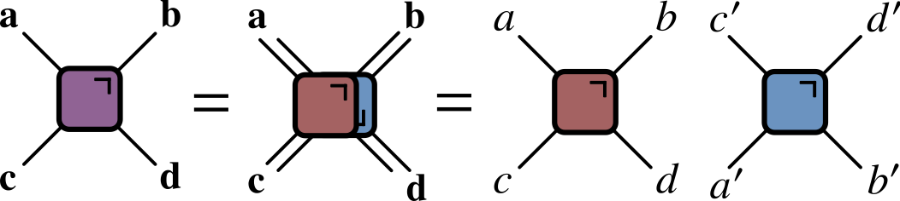

# Quantum Circuits II
## Some special kinds of circuits

[austen.uk/slides/quantum-circuits-2-icts](https://austen.uk/slides/quantum-circuits-2-icts) for slides

---

## Outline

- Circuits with special structure $\longrightarrow$ theoretical progress / new insights

    - Random circuits

    - Dual unitary circuits

    - Other possibilities: Clifford (Arijeet's talk), free fermions, ...

---

## Reminder: operator spreading

$$
Z_n(t)= \sum_{\mu_{1:N}=\\{1,x,y,z\\}^N} \mathcal{C}\_{\mu_{1:N}}(t) \sigma_1^{\mu_1}\otimes\cdots \sigma_N^{\mu_N}
$$

- Operator norm $\tr\left[Z\_n^2(t)\right]=2$ is conserved under time evolution

$$
\sum_{\mu_{1:N}=\\{1,x,y,z\\}^N} \mathcal{C}^2\_{\mu_{1:N}}(t) = \frac{1}{2^{N-1}}
$$

---

## Describing operator spreading

- Correlation function $\langle Z_j(t)Z_k(0)\rangle$ captures only a single coefficient 

$$
\langle Z_j(t)Z_k(0)\rangle=C_{jk}(t) \equiv \mathcal{C}_{1\cdots \mu_k=z \cdots 1}(t)
$$

<figure align="center">

</figure>

- What about the rest?

---

## Out of time order correlator

$$
\operatorname{OTOC}_{jk}(t) \equiv \langle Z_j(t)Z_k(0)Z_j(t)Z_k(0)\rangle
$$

- OTOC sometimes written as squared commutator

$$
\langle \left[Z_k(0),Z_j(t)\right]^2 \rangle
$$

- Relation between two expressions is (using $Z^2=1$)

$$
\operatorname{OTOC}_{jk}(t) = \frac{1}{2}\langle \left[Z_k(0),Z_j(t)\right]^2 \rangle + 1
$$

---

$$
\operatorname{OTOC}_{jk}(t) = \frac{1}{2}\langle \left[Z_k(0),Z_j(t)\right]^2 \rangle + 1
$$

 - At short times commutator vanishes so $\operatorname{OTOC}_{jk}(t\to 0)=1$
 
$$
\operatorname{OTOC}\_{jk}(t)= 2^{N-1} \sum_{\mu_{1:N}}\mathcal{C}\_{\mu_{1:N}}^2(t)\left[\delta_{\mu_k,0}+\delta_{\mu_k,3}-\delta_{\mu_k,1}-\delta_{\mu_k,2}\right]
$$

- $\operatorname{OTOC}\_{jk}(t)\neq 1$ after operator $Z_j(t)$ spreads from site $j$ to site $k$ 

- Characteristic speed of propagation of OTOC is "butterfly velocity" $v_\text{B}$

- Since OTOC depends on *square* of the coefficients, a nonzero value survives after averaging over random circuits

---

## Google's OTOC experiment

- OTOC measured in 2021 by [Google](https://www.science.org/doi/full/10.1126/science.abg5029?casa_token=TkmMj95XIYoAAAAA:NP67A_aYhL8lSDWtuG99i8oFfx1c79-Lz-UGKYsW1-bee3hQ7weJSxLLQwpPzfSEPvEqt6SPbB4UYA) 

<figure align="center">

<figcaption> The measured OTOC for $i\operatorname{\operatorname{\mathsf{SWAP}}}$ gates (top) and $\sqrt{i\operatorname{\mathsf{SWAP}}}$ (bottom) after averaging over single qubit gates.</figcaption>
</figure>

---

## Remark: operator entanglement

- OTOC provides one measure of operator spreading

- Another question: how many nonzero coefficients  $\mathcal{C}\_{\mu_{1:N}}$?

- Introduce Schmidt decomposition _for operators_ 
$$
\mathcal{O}\_{AB} = \sum\_{n=1}^{\min(n^2_A, n^2_B)} \Sigma\_n A_n\otimes B_n
$$

- $\Sigma_n\geq 0$ are operator Schmidt coefficients

- $A_n$ and $B_n$ are orthonormal operators on $\mathcal{H}\_A$ and $\mathcal{H}\_B$ i.e. $\tr\left[A^\dagger_m A_n\right]=\tr\left[B^\dagger_m B_n\right]=\delta_{mn}$

---

- Same entanglement measures as before be applied to evaluate the operator entanglement

- Simplest example, analogous to Bell state, is SWAP operator

$$
\operatorname{\mathsf{SWAP}}=\frac{1}{2}\left[X\otimes X+Y\otimes Y+Z\otimes Z + \mathsf{1}\otimes\mathsf{1}\right]
$$

- All Schmidt coefficients are equal (maximum operator entanglement)

---

## Random circuits

- Met this idea last time: average over $\theta$ in

$$
U\_{j,j+1} = \cos\theta \mathbb{1}\_{j,j+1} + i\sin\theta \operatorname{\mathsf{S}}\_{j.j+1}
$$

- Now consider _even more random_ gates: average uniformly over single site unitaries 

<figure align="center">

</figure>

---

## Why?

1. No symmetries so results should be _generic_ ("in some sense")

2. (real reason) Averaging over circuits simplifies things considerably, sometimes allowing tractable classical description

- Choose gates iid. Other options: randomness in space but not time 

- Recent review: [Fisher _et al_ (2023)](https://www.annualreviews.org/doi/abs/10.1146/annurev-conmatphys-031720-030658)

---

### OTOC in random circuits

$$
\operatorname{OTOC}_{jk}(t) \equiv \langle Z_j(t)Z_k(0)Z_j(t)Z_k(0)\rangle
$$

- OTOC can be extracted by appropriately contracting indices in $Z_j(t)\otimes Z_j(t)$ (two copies)

-  When we average over random unitaries, only certain components survive

- Single qubit unitaries identified with rotations, so look for _scalar_ operators made from two copies on each site

$$
\mathsf{1}\otimes\mathsf{1},\qquad \frac{1}{3}\left[X\otimes X+Y\otimes Y + Z\otimes Z\right]
$$

---

- Different papers prefer different bases. The most popular choice is
$$
\mathsf{1}\otimes\mathsf{1},\qquad \operatorname{SWAP}
$$
(recall that $\operatorname{\mathsf{SWAP}}=\frac{1}{2}\left[X\otimes X+Y\otimes Y+Z\otimes Z + \mathsf{1}\otimes\mathsf{1}\right]$) 

- Advantage: generalizes to multiple copies

- General set of invariants are generalized SWAP operators corresponding to permutations of copies (for two copies only two permutations)

---

- Now use invariant local basis to expand  average of two copies

$$
\mathcal{O}^{(2)}(t)=\overline{O(t) \otimes O(t)} \equiv \overline{O(t)^{\otimes 2}}
$$

$$
\begin{align*}
 \mathsf{O} &\equiv\mathsf{1}\otimes\mathsf{1} \\\
 \mathsf{1}&\equiv\frac{1}{3}\left[X\otimes X + Y\otimes Y+ Z\otimes Z\right]
 \end{align*}
 $$ 

 - Introduce basis $\mathsf{S}_{1:N}\equiv\mathsf{S}_1\otimes \mathsf{S}_2\otimes\cdots \mathsf{S}_N$, with $\mathsf{S}_j=\mathsf{0},\mathsf{1}$ 

$$
\mathcal{O}^{(2)}(t) = \sum\_{\mathsf{S}\_{1:N}\in\\{\mathsf{0},\mathsf{1}\\}^N} P\_{\mathsf{S}\_{1:N}}(t)\mathsf{S}\_{1:N}
$$

- Coefficients $P\_{\mathsf{S}\_{1:N}}(t)$ describe averaged OTOC

---

- Next find how $P\_{\mathsf{S}\_{1:N}}(t)$ are updated by a single gate (after averaging)

- Gate acting on sites $j$ and $j+1$ yields  

$$
U^\dagger_{j,j+1}\otimes U^\dagger_{j,j+1} \mathcal{O}^{(2)}(t)U_{j,j+1}\otimes U_{j,j+1}
$$

- Take $U_{j,j+1}$ of form
$$
U_{j,j+1} = V_{j,j+1} u_j \otimes u_{j+1}
$$
where $u_j$ and $u_{j+1}$ are single quibit unitaries chosen uniformly

- After averaging all non-invariant components vanish and invariant components don't depend on $u_j$ and $u_{j+1}$

- Extract $P\_{\mathsf{S}\_{1:N}}(t+1)$ using orthgonality $\tr\left[\mathsf{O}\mathsf{1}\right]=0$

---

$$
P\_{\mathsf{S}\_{1:N}}(t+1) = \sum\_{\mathsf{S}'\_j, \mathsf{S}'\_{j+1}}  P\_{\mathsf{S}\_1\cdots \mathsf{S}'\_j  \mathsf{S}'\_{j+1}\cdots \mathsf{S}\_N}(t)\Omega\_{\mathsf{S}'\_j \mathsf{S}'\_{j+1},\mathsf{S}\_j \mathsf{S}\_k}
$$

- Precise form of matrix $\Omega$ depends on $V_{j,j+1}$ "core"

- Use conservation of operator norm $\tr\left[O(t)^\dagger O(t)\right]$

$$
\overline{\tr\left[O(t)^\dagger O(t)\right]} = 2\sum\_{\mathsf{S}\_{1:N}\in\{\mathsf{0},\mathsf{1}\}^N} P\_{\mathsf{S}\_{1:N}}
$$

$$
\sum_{S_j, S_{j+1}}\Omega\_{\mathsf{S}'\_j \mathsf{S}'\_{j+1},\mathsf{S}\_j \mathsf{S}\_k} = 1
$$

- If matrix elements additionally nonnegative we have a Markov process, with transition matrix $\Omega$ 

---

- For Sycamore gate ([Google's OTOC experiment](https://www.science.org/doi/full/10.1126/science.abg5029?casa_token=TkmMj95XIYoAAAAA:NP67A_aYhL8lSDWtuG99i8oFfx1c79-Lz-UGKYsW1-bee3hQ7weJSxLLQwpPzfSEPvEqt6SPbB4UYA), supplementary material)

$$
\begin{align*}
\Omega&=\left(\begin{array}{cccc}
1 & 0 & 0 & 0 \\\
0 & 1-a-b & a & b \\\
0 & a & 1-a-b & b \\\
0 & \frac{b}{3} & \frac{b}{3} & \left(1-\frac{2}{3} b\right)
\end{array}\right) \\\
a&=\frac{1}{3}\left(2 \sin ^{2} \theta+\sin ^{4} \theta\right) \qquad b=\frac{1}{3}\left(\frac{1}{2} \sin ^{2} 2 \theta+2\left(\sin ^{2} \theta+\cos ^{2} \theta\right)\right)
\end{align*}
$$

- $\theta=\pi/2$ for $i\operatorname{SWAP}$ gate and $\theta=\pi/4$ for $\sqrt{i\operatorname{SWAP}}$

---

## Remarks 

- Idea that unitary averages over two copies yields a Markov process on the invariant space goes back to [Oliveria, Dahlsten, and Plenio (2007)](https://journals.aps.org/prl/abstract/10.1103/PhysRevLett.98.130502), which was concerned with dynamics of average purity $\gamma\equiv \tr \rho_A^2$

- $\bar \gamma$ can be extracted from average of two copies of density matrix $\rho(t)\otimes\rho(t)$. See e.g. [Rowlands and Lamacraft (2018)](https://journals.aps.org/prb/abstract/10.1103/PhysRevB.98.195125) for noisy unitary evolution in continuous time

---

## The Markov process

$$
\begin{align*}
\Omega&=\left(\begin{array}{cccc}
1 & 0 & 0 & 0 \\\
0 & 1-a-b & a & b \\\
0 & a & 1-a-b & b \\\
0 & \frac{b}{3} & \frac{b}{3} & \left(1-\frac{2}{3} b\right)
\end{array}\right) 
\end{align*}
$$

- Describes transitions

$$
\mathsf{10} \xleftrightharpoons[a]{a}  \mathsf{01} \qquad \mathsf{11} \xleftrightharpoons[b/3]{b} \mathsf{10},\mathsf{01}
$$

- Note that $\mathsf{0}=\mathsf{1}\otimes\mathsf{1}$ is "inert": there no transitions from or to $\mathsf{00}$

---

## Fredrickson–Andersen model

$$
\mathsf{10} \xleftrightharpoons[a]{a}  \mathsf{01} \qquad \mathsf{11} \xleftrightharpoons[b/3]{b} \mathsf{10},\mathsf{01}
$$

<figure align="center">

</figure>

- Stationary state: independent sites with $p_1=3/4$, $p_0=1/4$

---

## Butterfly velocity

- Front propagation characterised by finite velocity $v_\text{B}$

---

## Front broadening

- Front broadens unless $v_\text{B}$ maximal as for $i\operatorname{SWAP}$

<figure align="center">

<figcaption> $i\operatorname{SWAP}$ (left) vs. $\sqrt{i\operatorname{SWAP}}$ (right) </figcaption>
</figure>

---

-  _Diffusive_ in 1D $\propto \sqrt{t}$

-   KPZ dynamics in 2D

 - See [Nahum, Vijay, and Haah (2018)](https://journals.aps.org/prx/abstract/10.1103/PhysRevX.8.021014) for much more

---

## Classical simulation?

- Efficient simulation of averaged OTOC dynamics via Monte Carlo

- Appearance of Markov process a little surprising

---

## OTOC fluctuations

- Circuit-to-circuit fluctuations of OTOC from 

$$
\mathcal{O}^{(4)}(t)=\overline{O(t) \otimes O(t) \otimes O(t) \otimes O(t)} \equiv \overline{O(t)^{\otimes 4}}
$$

- Go through same procedure of identifying invariant states

- Evolution of average now involves _negative_ matrix elements

- Leads to [sign problem](https://en.wikipedia.org/wiki/Numerical_sign_problem) in Monte Carlo simulation

- Same problem for $\overline{\operatorname{OTOC}}$ in models with number conservation ([Rowlands and Lamacraft](https://journals.aps.org/prb/abstract/10.1103/PhysRevB.98.195125))

---

## Dual unitary circuits

---

## Recall: kicked Ising model

- Time dependent Hamiltonian with kicks at $t=0,1,2,\ldots$.

$$
\begin{align*}
H_{\text{KIM}}(t) = H_\text{I}[\mathbf{h}] + \sum_{n}\delta(t-n)H_\text{K}\\\
H_\text{I}[\mathbf{h}]=\sum_{j=1}^L\left[J Z_j Z_{j+1} + h_j Z_j\right],\qquad H_\text{K} &= b\sum_{j=1}^L X_j
\end{align*}
$$

---

## Entanglement Growth for KIM

- [Bertini, Kos, Prosen (2019)](https://journals.aps.org/prx/abstract/10.1103/PhysRevX.9.021033) found that when $|J|=|b|=\pi/4$

$$
\lim_{L\to\infty} S_A =\min(2t-2,N_A)\log 2,
$$

- __Any $h_j$__; initial $Z_j$ product state

---

## Entanglement Spectrum

- Rényi entropies depend on eigenvalues of reduced density matrix

`$$
  S^{(\alpha)}_A = \frac{1}{1-\alpha}\log \text{tr}\left[\rho^\alpha\right]=\frac{1}{1-\alpha}\sum_n p_n^\alpha
$$`

- For SDKIM have $2^{\min(2t-2,N_A)}$ non-zero eigenvalues all equal

$$
p_n = \left(\frac{1}{2}\right)^{\min(2t-2,N_A)}
$$

---

## Thermalization

- After $N_A/2 + 1$ steps, reduced density matrix is $\propto \mathbb{1}$

- All expectations (with $A$) take on infinite temperature value

---

## Dual unitarity

- Recall KIM has circuit representation

`$$
\begin{aligned}
  \mathcal{K} &= \exp\left[-i b X\right]\\
  \mathcal{I} &= \exp\left[-iJ Z_1 Z_2 -i \left(h_1 Z_1 + h_2 Z_2\right)/2\right]
\end{aligned}
$$`

- At $|J|=|b|=\pi/4$ has additional property of __dual unitarity__

---

## Reminder from last lecture

<figure align="center">

</figure>

<figure align="center">

</figure>

---

## "Folded" representations

- Unitarity:

---

## Dual unitary gates

- Impose additional restriction

<figure align="center">

</figure>

- [Gopalakrishnan and Lamacraft (2019)](https://journals.aps.org/prb/abstract/10.1103/PhysRevB.100.064309), [Bertini, Kos, and Prosen (2019)](https://journals.aps.org/prl/abstract/10.1103/PhysRevLett.123.210601)

---

## $\rho_A$ via dual unitarity

- Initial state of NN Bell pairs

- 8 sites; 4 layers

<object data="../new-rules-tum/assets/A-entropy-quantum.svg" type="image/svg+xml"></object>

- $\rho_A$ is unitary transformation of
  
$$
  \mathbb{1}\otimes\mathbb{1}\otimes\mathbb{1}\otimes\mathbb{1}\otimes\mathbb{1}\otimes\mathbb{1}\otimes\mathbb{1}\otimes\mathbb{1}
$$

---

## Shallower...

<object data="../new-rules-tum/assets/A-entropy-quantum-shallower.svg" type="image/svg+xml"></object>

- $\rho_A$ is unitary transformation of 
  
$$
\mathbb{1}\otimes\mathbb{1}\ket{\Phi^+}\bra{\Phi^+}\otimes\ket{\Phi^+}\bra{\Phi^+}\otimes\mathbb{1}\otimes\mathbb{1}
$$

---

## General case

- RDM is unitary transformation of 

$$
\rho_0=\overbrace{\frac{\mathbb{1}}{2}\otimes \frac{\mathbb{1}}{2} \cdots }^{t-1} \otimes\overbrace{\ket{\Phi^+}\bra{\Phi^+} \cdots }^{N_A/2-t+1 } \otimes \overbrace{\frac{\mathbb{1}}{2}\otimes \frac{\mathbb{1}}{2} \cdots }^{t-1}
$$

- RDM has $2^{\min(2t-2,N_A)}$ non-zero eigenvalues all equal to $\left(\frac{1}{2}\right)^{\min(2t-2,N_A)}$

- Converse – maximal entanglement growth implies dual unitary gates – recently proved by [Zhou and Harrow (2022)](https://arxiv.org/abs/2204.10341)

---

## The dual unitary family

- $4\times 4$ unitaries are 16-dimensional

- Family of dual unitaries is 14-dimensional
 
- Includes *kicked Ising model* at particular values of couplings
  
- Dual unitaries not "integrable" but have enough structure to allow many calculations

---

## 'KIM' property

- ($q=2$ here) Not satisfied by e.g. $\operatorname{SWAP}$

- Maps product states to maximally entangled (Bell) states

- Product initial states also work for KIM!

- [Piroli _et al_ (2020)](https://journals.aps.org/prb/abstract/10.1103/PhysRevB.101.094304) studied more general initial states

- [Foligno and Bertini (2023)](https://journals.aps.org/prb/abstract/10.1103/PhysRevB.107.174311) study general initial conditions

---

## Correlation functions

- Infinite temperature correlator $\tr\left[\sigma^\alpha_x(x,t)\sigma^\beta(y,0)\right]$

<figure align="center">

</figure>

- [Bertini, Kos, and Prosen (2019)](https://journals.aps.org/prl/abstract/10.1103/PhysRevLett.123.210601): dual unitarity means correlations vanish _inside_ light cone!

---

## Quantinuum experiment

- Correlations measured in SDKIM [last year]((https://www.nature.com/articles/s41567-022-01689-7))

<figure align="center">

</figure>

---

## Other applications of dual unitarity

- [Claeys and Lamacraft (2020)](https://journals.aps.org/prresearch/abstract/10.1103/PhysRevResearch.2.033032). $v_\text{B}=1$. OTOC grows at maximum speed, c.f. Google experiment

- [Jonay, Kehmani, Ippoliti (2021)](https://journals.aps.org/prresearch/abstract/10.1103/PhysRevResearch.3.043046). Triunitary circuits (incl. 2+1 dimensions)

- [Stephen _et al_ (2022)](https://arxiv.org/abs/2209.06191). Measurement based quantum computation in 1D using dual unitaries 

- [Sommers, Huse, Gullans (2022)](https://arxiv.org/abs/2210.10808). Dual unitary Clifford automata with applications to codes

- [Suzuki, Mitarai, Fujii (2022)](https://quantum-journal.org/papers/q-2022-01-24-631/). Computational power of dual unitaries

- Many more!

