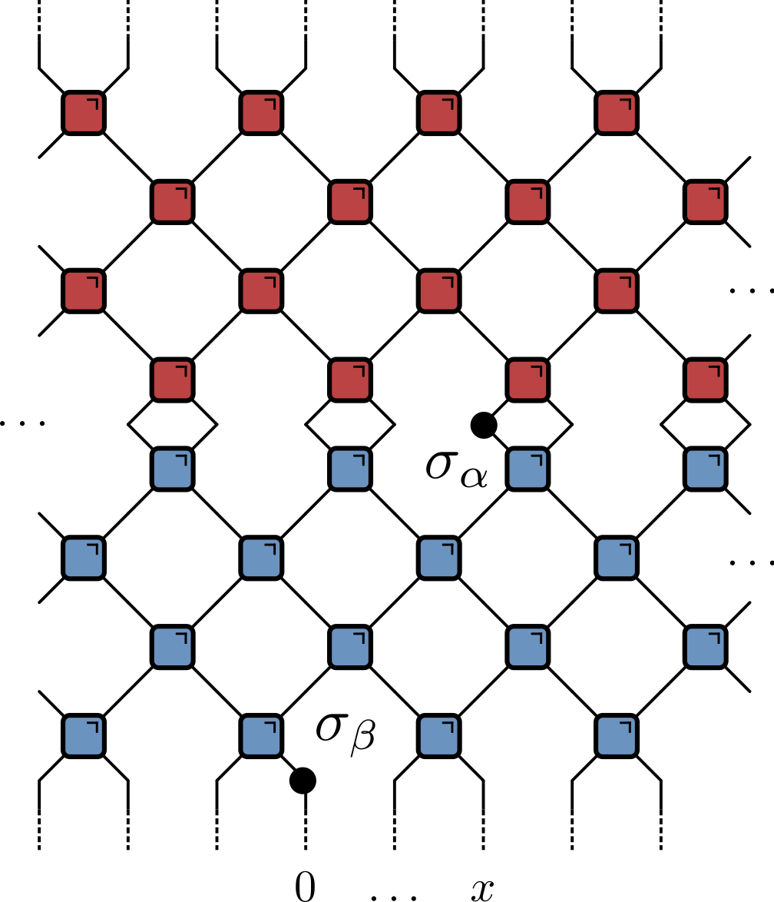
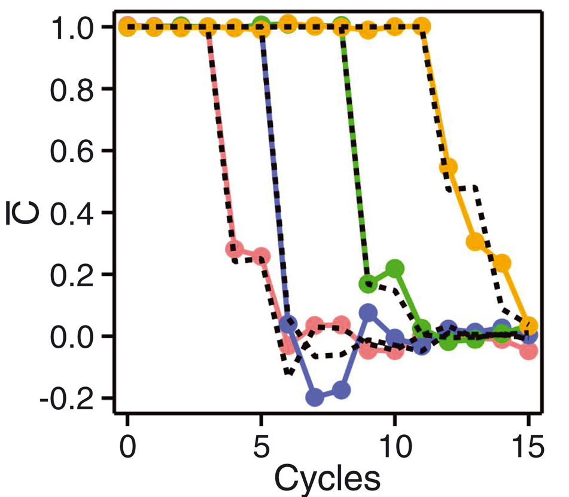

# Quantum Circuits II

- [austen.uk/slides/quantum-circuits-2](https://austen.uk/slides/quantum-circuits-1)

---

## This lecture

- Correlations near the light cone (see [Claeys and Lamacraft](https://journals.aps.org/prresearch/abstract/10.1103/PhysRevResearch.2.033032) for details)

- Operator scrambling and the OTOC

---

## (Infinite temperature) Correlations 

$$
c_{\alpha \beta}(x,t) = \langle \sigma_{\alpha}(x,t) \sigma_{\beta}(0,0) \rangle,\qquad \sigma_\alpha(x,t)=U^\dagger(t)\sigma_\alpha(x)U(t)
$$

- Vanishes when $|x|>t$ (outside light cone)

---

## On the light cone

- Using unitarity (only)

---

---

## Quantum channel

`$$
\begin{align}\label{eq:CorrChannels}
\langle \sigma_{\alpha}(t,t) \sigma_{\beta}(0,0) \rangle &= \tr \left[\sigma_{\beta}\mathcal{M}_{-}^t(\sigma_{\alpha})\right] / q \\
&=  \tr \left[ \sigma_{\alpha}\mathcal{M}_{+}^{t}(\sigma_{\beta})\right] / q
\end{align}
$$`
- Calculating correlator involves repeated application of 

---

## Typical behaviour of correlations

- Surprising that correlations can be found at arbitrary distances!

---

## Correlations for dual unitaries

- [Bertini, Kos, and Prosen](https://journals.aps.org/prl/abstract/10.1103/PhysRevLett.123.210601) introduced above formalism for dual unitaries

- Recall light cone $|x|\leq t$ was implied by _unitarity_

- _Dual unitarity_ implies correlations also vanish for $|x|\geq t$

- Only nonzero correlations are __on the light cone__

---

## Effect of conservation laws

- $SU(2)$ preserving gate

`$$
U_{j,j+1} = \cos\theta \mathbb{1}_{j,j+1} + i\sin\theta \operatorname{P}_{j.j+1}
$$`

`\begin{multline}
\mathcal{O} \longrightarrow U^\dagger_{j,j+1}\mathcal{O}U_{j,j+1} = \cos^2\theta \mathcal{O} + \sin^2\theta \operatorname{P}_{j.j+1}\mathcal{O} \operatorname{P}_{j.j+1} \\
-i\sin\theta\cos\theta \left[\operatorname{P}_{j.j+1}, \mathcal{O}\right]
\end{multline}`

- _Generally useful idea_: consider __random circuit__ and average

- Take distribution $\theta=\pm \theta_0$ with $p(\theta_0)-p(-\theta_0)\equiv \delta > 0$

---

## Average dynamics

\begin{multline}
\overline{U^\dagger_{j,j+1}\mathcal{O}U_{j,j+1}} = \cos^2\theta_0 \\, \mathcal{O} + \sin^2\theta_0 \\, P_{j.j+1}\mathcal{O} P_{j.j+1} \\\\
+i\delta \sin\theta_0\cos\theta_0 \left[P_{j.j+1}, \mathcal{O}\right]
\end{multline}

- Interpretation:
  - Operators on sites $j$ and $j+1$ switch with probability $\sin^2\theta_0$
  - Asymmetry $\delta$ governs strength of "quantum" dynamics

---

## Continuous time limit

$$
\frac{d\bar{\mathcal{O}}}{dt} = \sum_j \left[iJ \left[P_{j,j+1},\bar{\mathcal{O}}\right]+\left(P_{j,j+1}\bar{\mathcal{O}}P_{j,j+1}-\bar{\mathcal{O}}\right)\right].
$$

\begin{align}
i[P,\sigma^a\otimes 1]&=-\epsilon^{abc}\sigma^b\otimes\sigma^c\nonumber\\\\
i[P,1\otimes \sigma^a]&=\epsilon^{abc}\sigma^b\otimes\sigma^c\nonumber\\\\
i[P,\sigma^a\otimes \sigma^b]&=\epsilon^{abc}\left(\sigma^c\otimes 1- 1\otimes \sigma^c\right).
\label{eq:split-merge}
\end{align}

- Sum of first two expressions vanishes by spin conservation

- Describe operator "splitting" ($1\to 2$) and "merging" ($2\to 1$). 

---

## Expansion in Pauli basis

`$$
Z_j(t)= \sum_{\mu_{1:N}=\{0,1,2,3\}^N} \mathcal{C}_{\mu_{1:N}}(t) \sigma_1^{\mu_1}\otimes\cdots \sigma_N^{\mu_N},\qquad \sigma^\mu = (\mathbb{1},X,Y,Z)
$$`

- With initial condition 

$$
\begin{equation}
\mathcal{C}\_{\mu_{1:N}}(0)=\begin{cases}
1 & \mu_j=z, \mu_k=0,\forall k\neq j \\\\
0 & \text{otherwise},
\end{cases}
\end{equation}
$$

- Spin correlations $\langle Z_j(t)Z_k(0)\rangle=C_{jk}(t) = \mathcal{C}_{0\cdots \mu_k=z \cdots 0}(t)$

---

## $J=0$: 1 operator sector 

- Writing $\mathcal{C}^a_{0\cdots \mu_k=a\cdots 0}\equiv C^a_k$ we have equation of motion

$$
\partial_t C^a_k = C^a_{k+1} + C^a_{k-1} - 2 C^a_k\equiv \Delta_k C^a_k
$$

- Diffusion of single $\sigma^a$ ($\Delta_k$ is 1D discrete Laplacian)

---

## Equation of motion

$$
\begin{align}
\partial_t \mathcal{C}\_{\mu_{1:N}} = \sum_j \left[J\epsilon_{\alpha\beta \mu_j \mu_{j+1}} \mathcal{C}\_{\mu_1\cdots \alpha\beta \cdots \mu_N} + \mathcal{C}\_{\mu_1\cdots \mu_{j+1}\mu_j \cdots \mu_N} - \mathcal{C}\_{\mu_1\cdots \mu_{j}\mu_{j+1} \cdots \mu_N}\right].
\end{align}
$$

- See [Claeys, Lamacraft, and Herzog-Arbeitman](https://arxiv.org/abs/2110.06951) for more

---

## Operator spreading

- Correlations (typically) decay exponentially 

- Doesn't mean that operator dynamics is trivial!

- What can we say about $\sigma_\alpha(x,t)=U^\dagger(t)\sigma_\alpha(x) U(t)$ generally?

---

`$$
Z_j(t)= \sum_{\mu_{1:N}=\{0,1,2,3\}^N} \mathcal{C}_{\mu_{1:N}}(t) \sigma_1^{\mu_1}\otimes\cdots \sigma_N^{\mu_N},\qquad \sigma^\mu = (\mathbb{1},X,Y,Z)
$$`

- As time progresses two things (tend to) increase
  - Number of non-identity sites (__operator spreading__)
  - Number of different contributions  (__operator entanglement__)

- How to quantify these?

  - Operator spreading defines "butterfly velocity"
  - [Clifford gates](https://en.wikipedia.org/wiki/Clifford_gates) lead to operator spreading but no entanglement

---

## Out of time order correlator

$$
\operatorname{OTOC}_{jk}(t) =\langle Z_j(t)Z_k(0)Z_j(t)Z_k(0)\rangle
$$

`$$
Z_j(t)= \sum_{\mu_{1:N}=\{0,1,2,3\}^N} \mathcal{C}_{\mu_{1:N}}(t) \sigma_1^{\mu_1}\otimes\cdots \sigma_N^{\mu_N}
$$`

`$$
\operatorname{OTOC}_{jk}(t)\propto \sum_{\mu_{1:N}}\mathcal{C}_{\mu_{1:N}}^2(t)\left[\delta_{\mu_k,0}+\delta_{\mu_k,3}-\delta_{\mu_k,1}-\delta_{\mu_k,2}\right]
$$`

- $\operatorname{OTOC}_{jk}(t)\neq 1$ when operator $Z_j(t)$ spreads from site $j$ to site $k$

- Involves `$\mathcal{C}_{\mu_{1:N}}^2(t)$` so survives averaging

---

## [Google's OTOC experiment](https://www.science.org/doi/full/10.1126/science.abg5029?casa_token=TkmMj95XIYoAAAAA:NP67A_aYhL8lSDWtuG99i8oFfx1c79-Lz-UGKYsW1-bee3hQ7weJSxLLQwpPzfSEPvEqt6SPbB4UYA)

---

- $i\operatorname{SWAP}$: sharp OTOC front

- $\sqrt{i\operatorname{SWAP}}$: broadened OTOC front

---

## $\overline{\operatorname{OTOC}}$: stochastic model

- See [Google's OTOC experiment](https://www.science.org/doi/full/10.1126/science.abg5029?casa_token=TkmMj95XIYoAAAAA:NP67A_aYhL8lSDWtuG99i8oFfx1c79-Lz-UGKYsW1-bee3hQ7weJSxLLQwpPzfSEPvEqt6SPbB4UYA) (supplementary material)

- Continuous time version in [Rowlands and Lamacraft](https://journals.aps.org/prb/abstract/10.1103/PhysRevB.98.195125)

- Main idea: OTOC extracted from 

$$
\hat{\mathcal{O}}^{(2)}(t)=\overline{\hat{O}(t) \otimes \hat{O}(t)} \equiv \overline{\hat{O}(t)^{\otimes 2}}
$$

---

$$
\hat{\mathcal{O}}^{(2)}(t)=\overline{\hat{O}(t) \otimes \hat{O}(t)} \equiv \overline{\hat{O}(t)^{\otimes 2}}
$$

- Invariant subspace that survives averaging built from $\mathsf{O} \equiv\mathbb{1}\otimes\mathbb{1}$ and $\mathsf{1}\equiv\frac{1}{3}\left[X\otimes X + Y\otimes Y+ Z\otimes Z\right]$ on each site

- Basis: $\mathsf{S}_{1:N}\equiv\mathsf{S}_1\otimes \mathsf{S}_2\otimes\cdots \mathsf{S}_N$, with $\mathsf{S}_j=0,1$

`$$
\hat{\mathcal{O}}^{(2)}(t) = \sum_{\mathsf{S}_{1:N}\in\{\mathsf{0},\mathsf{1}\}^N} P_{\mathsf{S}_{1:N}}\mathsf{S}_{1:N}
$$`

---

`$$
\hat{\mathcal{O}}^{(2)}(t) = \sum_{\mathsf{S}_{1:N}\in\{\mathsf{0},\mathsf{1}\}^N} P_{\mathsf{S}_{1:N}}\mathsf{S}_{1:N}
$$`

- (Average of) gate provides update rule for $P_{\mathsf{S}_{1:N}}$
`$$
P_{\mathsf{S}_{1:N}}(t+1) = \sum_{\mathsf{S}'_j, \mathsf{S}'_k}  P_{\mathsf{S}_1\cdots \mathsf{S}_j  \mathsf{S}'_{j+1}\cdots \mathsf{S}'_N}(t)\Omega_{\mathsf{S}'_j \mathsf{S}'_k,\mathsf{S}_j \mathsf{S}_k}
$$`
`$$
\begin{gathered}
\Omega=\left(\begin{array}{cccc}
1 & 0 & 0 & 0 \\
0 & 1-a-b & a & b \\
0 & a & 1-a-b & b \\
0 & \frac{b}{3} & \frac{b}{3} & \left(1-\frac{2}{3} b\right)
\end{array}\right) \\
a=\frac{1}{3}\left(2 \sin ^{2} \theta+\sin ^{4} \theta\right) \qquad b=\frac{1}{3}\left(\frac{1}{2} \sin ^{2} 2 \theta+2\left(\sin ^{2} \theta+\cos ^{2} \theta\right)\right)
\end{gathered}
$$`
- $\theta=\pi/2$ for $i\operatorname{SWAP}$, $\theta=\pi/4$ for $\sqrt{i\operatorname{SWAP}}$

---

## Markov process

`$$
\begin{gathered}
\Omega=\left(\begin{array}{cccc}
1 & 0 & 0 & 0 \\
0 & 1-a-b & a & b \\
0 & a & 1-a-b & b \\
0 & \frac{b}{3} & \frac{b}{3} & \left(1-\frac{2}{3} b\right)
\end{array}\right) \\
\end{gathered}
$$`

- Rows sum to one: [Stochastic matrix](https://en.wikipedia.org/wiki/Stochastic_matrix)

- Possible transitions
  
$$\require{extpfeil} \Newextarrow{\xleftrightharpoon}{5,10}{0x21CB} 
\mathsf{10} \xleftrightharpoon[a]{a} \mathsf{01} \qquad \mathsf{11} \xleftrightharpoon[b/3]{b} \mathsf{10},\mathsf{01}
$$
- $\mathsf{00}$ is "inert"

---

## Fredrickson–Andersen model

- Stationary state: independent sites with $p_1=3/4$, $p_0=1/4$

---

## Butterfly velocity

- Front propagation characterised by finite velocity $v_\text{B}$

---

## Front broadening

- Front broadens unless $v_\text{B}$ maximal as for $i\operatorname{SWAP}$

<figure align="center">

<figcaption> $i\operatorname{SWAP}$ (left) vs. $\sqrt{i\operatorname{SWAP}}$ (right) </figcaption>
</figure>

---

-  _Diffusive_ in 1D $\propto \sqrt{t}$

-   KPZ dynamics in 2D

 - See [Nahum, Vijay, and Haah](https://journals.aps.org/prx/abstract/10.1103/PhysRevX.8.021014) for much more

---

## Classical simulation?

- Efficient simulation of averaged OTOC dynamics via Monte Carlo

- Appearance of Markov process a little surprising

---

## OTOC fluctuations

- Circuit-to-circuit fluctuations of OTOC from 

$$
\hat{\mathcal{O}}^{(4)}(t)=\overline{\hat{O}(t) \otimes \hat{O}(t) \otimes \hat{O}(t) \otimes \hat{O}(t)} \equiv \overline{\hat{O}(t)^{\otimes 4}}
$$

- Go through same procedure of identifying invariant states

- Evolution of average now involves _negative_ matrix elements

- Leads to [sign problem](https://en.wikipedia.org/wiki/Numerical_sign_problem) in Monte Carlo simulation

- Same problem for $\overline{\operatorname{OTOC}}$ in models with number conservation ([Rowlands and Lamacraft](https://journals.aps.org/prb/abstract/10.1103/PhysRevB.98.195125))

