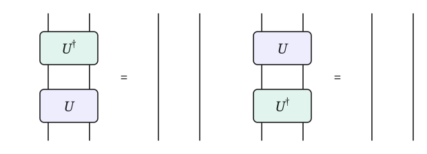
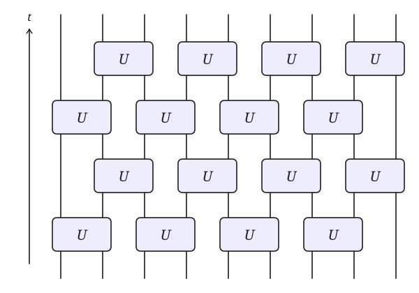

---
# See all reveal options
# https://quarto.org/docs/reference/formats/presentations/revealjs.html
# E to toggle to PDF mode
title: |
    Many Body Dynamics in Quantum Circuits
subtitle: |
  Lecture at "QUANT26: Quantum Dynamics - Fundamentals and Realizations"

  MPIPKS Dresden
author: "Austen Lamacraft"
date: 09/11/2026
date-format: long
# institute: University of Cambridge
format:
  revealjs:
    theme: [default, reveal_custom.scss]
    slide-number: true
    hash: true
    center: true
    auto-stretch: false
    html-math-method: katex
    preview-links: true
    katex: {
      macros: {
        "\\abs" : "\\left|#1\\right|",
        "\\tr" : "\\operatorname{tr}",
        "\\sgn" : "\\operatorname{sgn}",
      },
      throwOnError: false,
    }
---

# Outline

Cite Pieter's review...

- Fundamentals
    - Based on my computational physics notes 
    - Linear algebra background
    - Basics of many body qm (qubits)
    - Bell states
    - Schmidt decomposition
    - Relevance of isometries

- Gates

Based on earlier lectures

- Basic kinds

-  Tensor networks

- Intro to Penrose notation

- Circuits

    - Connection to Floquet physics
    - Appearance of light cone. Connect to folded transfer matrix of Mari-Carmen
    - Folded picture
    - Importance of unitarity (example of measurement induced entanglement)

- Operators spreading. OTOCs

- Representation of correlation functions
- Idea of random circuits and simplest examples of resulting Markov chain

# Fundamentals

## One spin

## Two spins

## Schmidt decomposition

## Entanglement

# Gates

## Penrose tensor notation

## Unitarity

<figure align="center">

</figure>

# Circuits

## Basic circuit

<figure align="center">

</figure>

## Expectation value

Light cone

## Correlation functions

## Entanglement growth

# Some special kinds of circuits

## Random circuits

## Dual unitary circuits

