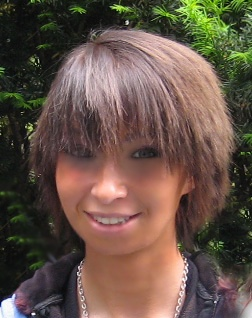
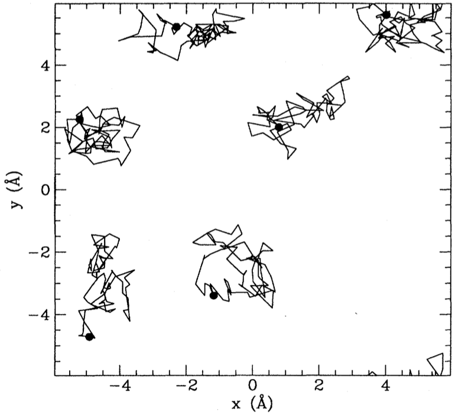
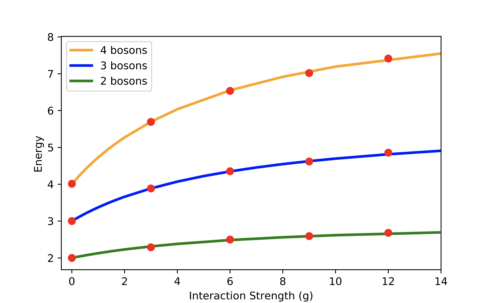
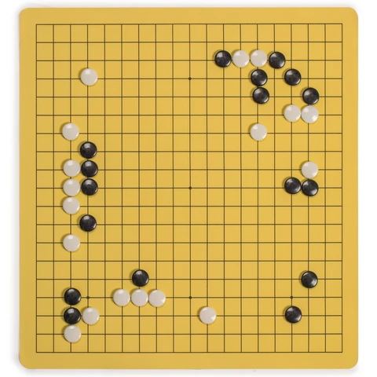

$$
\nonumber
\newcommand{\br}{\mathbf{r}}
\newcommand{\bR}{\mathbf{R}}
\newcommand{\bp}{\mathbf{p}}
\newcommand{\bk}{\mathbf{k}}
\newcommand{\bq}{\mathbf{q}}
\newcommand{\bv}{\mathbf{v}}
\newcommand{\bx}{\mathbf{x}}
\newcommand{\bz}{\mathbf{z}}
\DeclareMathOperator*{\E}{\mathbb{E}}
$$

---

## Quantum Ground States from Reinforcement Learning

Work with Ariel Barr and Willem Gispen

&nbsp;&nbsp;&nbsp;&nbsp;&nbsp;&nbsp;&nbsp;&nbsp;&nbsp;&nbsp;
&nbsp;&nbsp;&nbsp;&nbsp;&nbsp;&nbsp;&nbsp;&nbsp;&nbsp;&nbsp;

---

## Schrödinger Equation: N Particles

- Basic object is _wavefunction_: $\Psi(\br_1,\ldots \br_N)$

`$$
\overbrace{\left[\sum_i\left(-\frac{\nabla_i^2}{2m_i}+V(\br_i)\right)+\sum_{i<j}U(\br_i-\br_j)\right]}^{\equiv H \text{, Hamiltonian}}\Psi(\br_1,\ldots \br_N) = E\Psi(\br_1,\ldots \br_N)
$$`

- Requires grid in $3N$ dimensions of $L^{3N}$ points!
- __Atoms / molecules__ are hard; __matter__ ($N\sim N_\text{A}$) is impossible!

---

## Variational Principle

- For _approximate_ $\Psi$ can upper bound _ground state_ $E_0$

`$$
\begin{align}
E_0 &\leq \inf_{\lVert\Psi\rVert=1} \langle \Psi\lvert H\rvert\Psi\rangle\\
\langle \Psi\lvert H\rvert\Psi\rangle &= \int d\br_1\cdots d\br_N \Psi^*(\br_1,\ldots,\br_N)\left[H \Psi\right](\br_1,\ldots,\br_N)
\end{align}
$$`

Challenges

1. Form of $\Psi$
2. Expectation evaluation
3. Optimization

---

## Form of $\Psi$ ('Feature Engineering')

Wavefunctions of restricted form

- Factorized, leading to __Hartree--Fock__ method

$$
\Psi(\br_1,\ldots,\br_N)=\psi_1(\br_1)\ldots \psi_N(\br_N).
$$

- __Jastrow factors__ include pair correlations

`$$
\Psi(\br_1,\ldots,\br_N)\to \Psi(\br_1,\ldots,\br_N)\exp\left(\sum_{i<j}\phi(\br_i-\br_j)\right)
$$`

- Many more...

---

## Expectation evaluation

$|\Psi(\br_1,\ldots,\br_N)|^2$ a probability distribution, so evaluate

`$$
\frac{\langle \Psi\lvert H\rvert\Psi\rangle}{\langle\Psi \vert\Psi\rangle}
 =\int d\bR\,|\Psi(\bR)|^2\frac{\left[H \Psi\right](\bR)}{\Psi(\bR)}
$$`

by Monte Carlo sampling. This is __Variational Monte Carlo (VMC)__

---

## Neural Approaches

$\Psi(\bR)\sim \textsf{NN}(\bR)$ and optimize!

- Carleo and Troyer (2017): lattice models (more later)

- ...

- Many electrons: Han _et al._, Pfau _et al._, Herman _et al._ (all 2019)

---

## TL;DR

- $\exists$ other formulations of QM including __Feynman's path integral__

- Let's learn the path integral instead!

---

## Outline

- Theory
    - The path integral
    - Loss
    - Training
    - Architectures
- Experiments
- Future directions

---

## Path integral

- For "Imaginary time" Schrödinger
$$
\left[-\frac{\nabla^2}{2m}+V(\br_i)\right]\psi(\br,t) = -\partial_t\psi(\br,t)
$$
- __Feynman–Kac__ formula expresses $\psi(\br,t)$ as expectation...
`$$
  \psi(\br_2,t_2) =  \E_{\br_t}\left[\exp\left(-\int_{t_1}^{t_2}V(\br_t)dt\right)\psi(\br_{t_1},t_1)\right]
$$`

...over Brownian paths with $\br_{t_{2}}=\br_{2}$

- For $t\to\infty$: $\psi(\br,t)\to e^{-E_0 t}\varphi_0(\br)$

---

- Path integral Monte Carlo

<a href="https://journals.aps.org/rmp/abstract/10.1103/RevModPhys.67.279">
Ceperley, RMP (1995)
</a>  

---

## Loss function

- FK formula defines __path measure__ $\mathbb{P}_\text{FK}$

- Jamison (1974): process is __Markovian__
$$
d\br_t = d\mathbf{B}_t + \bv(\br_t,t)dt
$$

- Model drift $\bv(\br,t)$ defines measure $\mathbb{P}_\bv$

- $D_\text{KL}(\mathbb{P}_\bv\lvert\rvert \mathbb{P}_\text{FK})=\E_{\mathbb{P}_\bv}\left[\log\left(\frac{d\mathbb{P}_\bv}{d\mathbb{P}_\text{FK}}\right)\right]$ is our loss function

- RL / Optimal Control formulation of QM (Holland, 1977)

---

## Training

- Relative likelihood (Radon–Nikodym derivative; Girsanov theorem)

`$$
  \log\left(\frac{d\mathbb{P}_{\bv}}{d\mathbb{P}_\text{FK}}\right) =\ell_T - E_0 T+\log\left(\frac{\varphi_0(\br_0)}{\varphi_0(\br_T)}\right)
$$`
$$
   \ell_T\equiv \int_0^T \bv(\br_t)
  \cdot d\mathbf{B}_t+\int_0^T dt\left(\frac{1}{2}|\bv(\br_t)|^2+V(\br_t)\right)
$$

- Monte Carlo estimate of $D_\text{KL}(\mathbb{P}_\bv\lvert\rvert \mathbb{P}_\text{FK})=\E_{\mathbb{P}_\bv}\left[\log\left(\frac{d\mathbb{P}_\bv}{d\mathbb{P}_\text{FK}}\right)\right]$

- $\br^{(b)}_{t}$ from SDE discretization. Analogous to reparameterization trick

- $D_\text{KL}(\mathbb{P}_\bv\lvert\rvert \mathbb{P}_\text{FK})\geq 0$ so $\E_{\mathbb{P}_\bv}\left[\ell_T\right]\geq E_0T$

---

- Suggests strategy:

  1. Represent `$\bv_\theta(\br) = \textsf{NN}_\theta(\br)$`
  2. Integrate batch of SDE trajectories
  3. Backprop through the (MC estimated) cost

---

## Architectures

- For identical particles require _permutation equivariance_

`$$
 \bv_{i,\theta}(\br_1,\ldots,\br_N) = \bv_{P(i),\theta}(\br_{P(1)},\ldots,\br_{P(N)})
$$`

...for any permutation $P$

- Numerous recent proposals e.g. [DeepSets](https://arxiv.org/abs/1703.06114) (Zaheer _et al._, 2017) 

---

## PairDrift

- Single particle and pair features 
`$$
\mathbf{h}_i = \boldsymbol{\sigma}_1(\mathbf{r}_i) + \sum_j \boldsymbol{\pi}_1(\mathbf{r}_i-\mathbf{r}_j)\qquad 
\mathbf{h}_{ij} = \boldsymbol{\Pi}_1(\mathbf{r}_i-\mathbf{r}_j).
$$`
$\boldsymbol{\sigma}, \boldsymbol{\pi}:\mathbb{R}^d\to \mathbb{R}^H$ and $\boldsymbol{\Pi}:\mathbb{R}^d\to \mathbb{R}^{H\times H}$ NNs
`$$
\tilde{\mathbf{h}}_i = \boldsymbol{\sigma}_2(\mathbf{h}_i) + \sum_j \boldsymbol{\pi}_2(\mathbf{h}_{ij})\qquad \tilde{\mathbf{h}}_{ij} = \boldsymbol{\Pi}_2(\mathbf{h}_{ij}).
$$`
- Drift function is then
`$$
\bv_i = \boldsymbol{\sigma}_3(\tilde{\mathbf{h}}_i) + \sum_j \boldsymbol{\pi}_3(\tilde{\mathbf{h}}_{ij}).
$$`

---

## Experiments

1. Hydrogen and Helium atoms
2. Hydrogen molecule
3. 2D Bosons in harmonic potential with Gaussian interactions

- Single hidden layer (width 64 or 256)
- HardTanh activation
- No additional use made of symmetries

PyTorch code at
<a href="https://github.com/AustenLamacraft/QuaRL">
https://github.com/AustenLamacraft/QuaRL
</a>  

---

## Helium: 2 electrons

$$
H = -\frac{\nabla_1^2+\nabla_2^2}{2} - \frac{2}{|\br_1|} - \frac{2}{|\br_2|} + \frac{1}{|\br_1-\br_2|}
$$

- Ground state spins _antisymmetric_; spatial wavefunction _symmetric_

- $\varphi_0(\br_1,\br_2)$ not known exactly but $E_0=-2.903386$

- Kato's cusp condition implemented with skip connections

---

## Hydrogen Molecule

`$$
H = -\frac{\nabla_1^2+\nabla_2^2}{2}+ \frac{1}{|\br_1-\br_2|}- \sum_{i=1,2}\left[\frac{1}{|\br_i-\hat{\mathbf{z}} R/2|} + \frac{1}{|\br_i+\hat{\mathbf{z}}R/2|}\right]
$$`

- Equilibrium proton separation $R=1.401$, $E_0= -1.174476$

---

## Atomic / Molecular results

| Method  |  H atom | He atom | H2 molecule | H2 molecule (R=2.8) |
|:-------:|:-------:|:-------:|:----------------------:|:------------------------------:|
| Numerically exact | -0.5 | -2.903 | -1.173 | -1.071 |
| Hartree–Fock | N/A | -2.862(1.4%) | -1.129(3.8%) | |
| __Ours__ | -0.497(0.6%) | -2.898(0.2%) | -1.169(0.3%) | -1.068(0.3%)

---

## 2D Gaussian Bosons

`$$
\begin{align}
H&=\frac{1}{2}\sum_i \left[-\nabla_i^2 +\br_i^2\right]+\sum_{i<j}U(\br_i-\br_j)\\
U(\br) &=\frac{g}{\pi s^2}e^{-\br^2/s^2}
\end{align}
$$`

- [Mujal _et al._, PRA 2017](https://journals.aps.org/pra/abstract/10.1103/PhysRevA.96.043614) model for ultracold atoms

---

- Drift Visualization ($g=15$, `$s=1/2$`)

---

- Differences <1% even with strong interaction

---

## Outlook

- Excited states; angular momentum &harr; _non-reversible_ drift

- Fermions? Dealing with the __sign problem__

- Lattice models

---

## Next Up: Lattice Models

---

## XY model

- On chain / square / cubic lattice

`$$
\begin{align}
\partial_t \Psi_{\Huge\circ\Huge\bullet\Huge\circ} &= \Psi_{\Huge\bullet\Huge\circ\Huge\circ}+\Psi_{\Huge\circ\Huge\circ\Huge\bullet}\\
&=\overbrace{ \Psi_{\Huge\bullet\Huge\circ\Huge\circ}+\Psi_{\Huge\circ\Huge\circ\Huge\bullet}-2\Psi_{\Huge\circ\Huge\bullet\Huge\circ}}^{\text{master / forward eq.}} +2 \Psi_{\Huge\circ\Huge\bullet\Huge\circ}
\end{align}
$$`

- c.f. imaginary time Schrödinger

$$
  \frac{\partial\psi(\br,t)}{\partial t} = \left[\frac{\nabla^2}{2}-V(\br_i)\right]\psi(\br,t)
$$

- $\exists$ Feynamn–Kac representation!

