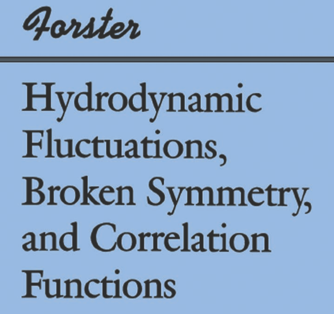
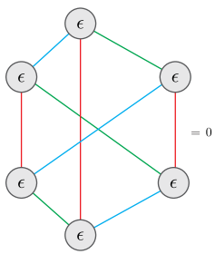

$$
\nonumber
\newcommand{\bra}[1]{\langle{#1}\rvert}
\newcommand{\ket}[1]{\lvert{#1}\rangle}
\newcommand{\braket}[2]{\langle{#1}\vert{#2}\rangle}
\newcommand{\br}{\mathbf{r}}
\newcommand{\bR}{\mathbf{R}}
\newcommand{\bp}{\mathbf{p}}
\newcommand{\bk}{\mathbf{k}}
\newcommand{\bq}{\mathbf{q}}
\newcommand{\bv}{\mathbf{v}}
\newcommand{\bx}{\mathbf{x}}
\newcommand{\bz}{\mathbf{z}}
\DeclareMathOperator*{\E}{\mathbb{E}}
$$

## Absence of superdiffusion in certain random spin models

Work with Pieter Claeys and Jonah Herzog-Arbeitman

<a source="https://austen.uk/slides/superdiffusion-kitp/">
austen.uk/slides/superdiffusion-kitp/
</a>

---

## Embarrassingly simple question

- ___What is nature of spin transport in Heisenberg chain?___
$$
H = \sum_j \left[X_j X_{j+1}+Y_j Y_{j+1}+ Z_j Z_{j+1}\right]
$$

- All 3 components conserved

- (Naive) expectation: diffusion at $T>0$ (including $T=\infty$)

---

## Simple?

- __Except__: nonabelian, low dimension, integrability, ...

---

## Recent predictions

- (Very) good evidence for KPZ(ish) behavior $\ell\sim t^{2/3}$ in __integrable__, __nonabelian__ models, classical and quantum

- Recent review [Bulchandani, Gopalakrishnan, Ilievski (2021)](https://iopscience.iop.org/article/10.1088/1742-5468/ac12c7)

---

- [De Nardis _et al._ (2020)](https://journals.aps.org/prl/abstract/10.1103/PhysRevLett.124.210605) $D(t)\sim (\log t)^{4/3}$ in classical Heisenberg chain
  

---

- [McRoberts _et al._ (2021)](https://arxiv.org/pdf/2108.11964.pdf) on classical FM (blue) and AFM (orange)

- At finite $T$ FM looks anomalous (KPZish); AFM looks normal

---

- [De Nardis _et al._ (2021)](https://journals.aps.org/prl/abstract/10.1103/PhysRevLett.127.057201) $D(t)\sim \log t$ with noisy exchange coupling

---

## Lack of theory tools 

- No integrability; "weak integrability breaking" in its infancy

- Absence of small parameters: exchange coupling $J$ is only scale

---

## This work: noisy exchange coupling

\begin{equation}
H = \sum_{j,a} \left[(J + \xi_j(t))\sigma^a_j \sigma^a_{j+1}\right]
\end{equation}

- Studied numerically in [De Nardis _et al._ (2021)](https://journals.aps.org/prl/abstract/10.1103/PhysRevLett.127.057201) 

- $SU(2)$ invariance but no energy conservation
  
- Expect (nonabelian) hydrodynamics of spin modes to play major role

- ___Can develop perturbation theory in $J$___

---

## Correlation function

- Spin-1/2 chain of $N$ sites with spin $\boldsymbol{\sigma}_j=(X_j, Y_j, Z_j)$ at site $j$

- Infinite temperature spin-spin correlator

$$
C^{ab}_{jk}(t)\equiv\frac{1}{2^N}\mathop{\mathrm{tr}}\left[\sigma^a_j(0) \sigma^b_k(t)\right]\qquad \sigma^b_k(t)=\mathcal{U}^\dagger_t \sigma^b_k \mathcal{U}_t.
$$

- $SU(2)$ invariance: $C^{ab}\_{jk}(t)\equiv\delta_{ab}C_{jk}(t)$ with $\sum_{k=1}^N C_{jk}(t)=1$

- From now on fix $a=b=z$

---

## Expansion in Pauli basis

$$
Z_j(t)= \sum_{\mu_{1:N}=\{0,1,2,3\}^N} \mathcal{C}_{\mu_{1:N}}(t) \sigma_1^{\mu_1}\otimes\cdots \sigma_N^{\mu_N},\qquad \sigma^\mu = (\mathbb{1},X,Y,Z)
$$

- With initial condition 

$$
\begin{equation}
\mathcal{C}\_{\mu_{1:N}}(0)=\begin{cases}
1 & \mu_j=z, \mu_k=0,\forall k\neq j \\\\
0 & \text{otherwise},
\end{cases}
\end{equation}
$$

- Spin correlation function is $C_{jk}(t) = \mathcal{C}_{0\cdots \mu_k=z \cdots 0}(t)$

---

## Model

- Fluctuating exchange coupling gives stochastic Schrödinger equation 

\begin{equation}\label{eq:sse}
d\ket{\psi} = \sum_j \left[-i(J dt + \sqrt{\eta}dW_j)P_{j,j+1}-\frac{\eta}{2}dt\right]\ket{\psi}.
\end{equation}

- $P_{j,j+1}=\frac{1}{2}\left[1+\sum_a \sigma^a_j \sigma^a_{j+1}\right]$ is exchange operator

- $W_j$ independent Brownian motions (white noise $\propto dW_j$)
 
-  __Itô__ stochastic differential equation: last term preserves $\braket{\psi}{\psi}$

---

## Operator dynamics

- Heisenberg equation of motion ($\eta=1$)

\begin{multline}\label{eq:hberg}
d\mathcal{O} = \sum_j \left[i\left(J dt + dW_j\right)\left[P_{j,j+1},\mathcal{O}\right]+dt\left(P_{j,j+1}\mathcal{O}P_{j,j+1}-\mathcal{O}\right)\right].
\end{multline}

- $\bar{\mathcal{O}}\equiv\E \mathcal{O}$ obeys the (adjoint) Lindblad equation

\begin{equation}
\frac{d\bar{\mathcal{O}}}{dt} = \sum_j \left[iJ \left[P_{j,j+1},\bar{\mathcal{O}}\right]+\left(P_{j,j+1}\bar{\mathcal{O}}P_{j,j+1}-\bar{\mathcal{O}}\right)\right].
\label{eq:eom}
\end{equation}

---

## Circuit viewpoint

- $SU(2)$ preserving gate

$$
U_{j,j+1} = \cos\theta \mathbb{1}_{j,j+1} - i\sin\theta P_{j.j+1}
$$

--- 

## Operator Dynamics

$$
U_{j,j+1} = \cos\theta \mathbb{1}_{j,j+1} - i\sin\theta P_{j.j+1}
$$

\begin{multline}
\mathcal{O} \longrightarrow U^\dagger_{j,j+1}\mathcal{O}U_{j,j+1} = \cos^2\theta \\, \mathcal{O} + \sin^2\theta \\, P_{j.j+1}\mathcal{O} P_{j.j+1} \\\\
+i\sin\theta\cos\theta \left[P_{j.j+1}, \mathcal{O}\right]
\end{multline}

- Take distribution $\theta=\pm \theta_0$ with $p(\theta_0)-p(-\theta_0)\equiv \delta > 0$

---

## Average dynamics

\begin{multline}
\overline{U^\dagger_{j,j+1}\mathcal{O}U_{j,j+1}} = \cos^2\theta_0 \\, \mathcal{O} + \sin^2\theta_0 \\, P_{j.j+1}\mathcal{O} P_{j.j+1} \\\\
+i\delta \sin\theta_0\cos\theta_0 \left[P_{j.j+1}, \mathcal{O}\right]
\end{multline}

- Interpretation:
  - Operators on sites $j$ and $j+1$ switch with probability $\sin^2\theta_0$
  - Asymmetry $\delta$ governs strength of "quantum" dynamics

- Taking $\theta_0=\sqrt{dt}$, $\delta= J\sqrt{dt}$ gives continuous time evolution

---

## Back to continuous time

$$
\frac{d\bar{\mathcal{O}}}{dt} = \sum_j \left[iJ \left[P_{j,j+1},\bar{\mathcal{O}}\right]+\left(P_{j,j+1}\bar{\mathcal{O}}P_{j,j+1}-\bar{\mathcal{O}}\right)\right].
$$

- $J=0$: master equation describing __random adjacent transpositions__

- Preserves subspaces corresponding to fixed numbers of each of the $\sigma^\mu$: 1 operator sector, 2 operator sector, ...

---

## $J=0$: 1 operator sector 

- Writing $\mathcal{C}^a_{0\cdots \mu_k=a\cdots 0}\equiv C^a_k$ we have equation of motion

$$
\partial_t C^a_k = C^a_{k+1} + C^a_{k-1} - 2 C^a_k\equiv \Delta_k C^a_k
$$

- Diffusion of single $\sigma^a$ ($\Delta_k$ is 1D discrete Laplacian)

---

## $J=0$: 2 operator sector 

- $C^{bc}\_{j,k}\equiv \mathcal{C}\_{0\cdots \mu\_j=b\cdots \mu\_k=c\cdots 0}$ 

$$
\partial_t C^{xy}\_{m,n}= \Delta_m C^{xy}\_{m,n}+ \Delta_n C^{xy}\_{m,n} + \delta_{|m-n|-1}C^{xy}_{m,n}
$$  

- Last term plus condition $C^{xy}_{m,m}=0$ from hardcore condition 

---

## Perturbation theory

$$
\frac{d\bar{\mathcal{O}}}{dt} = \sum_j \left[iJ \left[P_{j,j+1},\bar{\mathcal{O}}\right]+\left(P_{j,j+1}\bar{\mathcal{O}}P_{j,j+1}-\bar{\mathcal{O}}\right)\right].
$$

\begin{align}
i[P,\sigma^a\otimes 1]&=-\epsilon^{abc}\sigma^b\otimes\sigma^c\nonumber\\\\
i[P,1\otimes \sigma^a]&=\epsilon^{abc}\sigma^b\otimes\sigma^c\nonumber\\\\
i[P,\sigma^a\otimes \sigma^b]&=\epsilon^{abc}\left(\sigma^c\otimes 1- 1\otimes \sigma^c\right).
\label{eq:split-merge}
\end{align}

- Sum of first two expressions vanishes by spin conservation

- Describe operator "splitting" ($1\to 2$) and "merging" ($2\to 1$). 

---

## Equation of motion

- In component form 

$$
\begin{align}
\partial_t \mathcal{C}\_{\mu_{1:N}} = \sum_j \left[J\epsilon_{\alpha\beta \mu_j \mu_{j+1}} \mathcal{C}\_{\mu_1\cdots \alpha\beta \cdots \mu_N} + \mathcal{C}\_{\mu_1\cdots \mu_{j+1}\mu_j \cdots \mu_N} - \mathcal{C}\_{\mu_1\cdots \mu_{j}\mu_{j+1} \cdots \mu_N}\right].
\end{align}
$$

---

## Simple approximation

- 1 and 2 operator sectors, dropping coupling to higher sectors

$$
\begin{align}
  \partial_t C^z_n = J\left[C^{xy}\_{n-1,n}-C^{xy}\_{n,n-1}-C^{xy}\_{n,n+1}+C^{xy}\_{n+1,n}\right]  +\Delta_n C^z_n,
  \end{align}
$$

$$
  \begin{align}
  \partial_t C^{xy}\_{m,n}& = J \left[\delta_{m+1,n}\left(C^z_m-C^z_{m+1}\right)+\delta_{m,n+1}\left(C^z_{n+1}-C^z_n\right)\right] \nonumber\\\\
  &\qquad+\Delta_m C^{xy}\_{m,n}+ \Delta_n C^{xy}\_{m,n} + \delta_{|m-n|-1}C^{xy}\_{m,n}
  \end{align}
$$

---

## Result for correlator

- $C^z(\eta,\omega)=\left[i\omega - \Omega(\eta)-\Sigma(\eta,\omega)\right]^{-1}$ in terms of self-energy 

\begin{equation}
  \Sigma(\eta,\omega) =  \frac{4J^2}{N} \sum_{\eta_1+\eta_2=\eta} \frac{\left[\cos(\eta_1)-\cos(\eta_2)\right]^2}{\Omega(\eta_1)+\Omega(\eta_2)-i\omega},\qquad \Omega(\eta)\equiv 4\sin^2(\eta/2)
\end{equation}

- Hardcore constraint plays no role due to antisymmetry of vertex

---

## Hydrodynamic limit: 

- For $\Omega(\eta)\to \eta^2$ and $\omega=O(\eta^2)$
 

\begin{equation}
  \Sigma(\eta, \omega) = J^2\eta^2\left[1+\frac{1}{2}\sqrt{\eta^2-2i\omega}\right].
  \label{eq:se-final-low}
\end{equation}

- The diffusion pole at $\omega=-i\eta^2$ becomes a pair

  \begin{equation}
    \omega_\pm = -i(1+J^2)\eta^2 \pm |\eta|^3\frac{J^2}{2}\sqrt{1+2J^2} + O(\eta^4).
    \label{eq:poles}
  \end{equation}

- Branch point $\omega=-i\eta^2/2$: min. $\omega(\eta_1)+\omega(\eta_2)$ when $\eta_{1,2}\to\eta/2$.

---

## Analytic structure

- c.f. [Xinyi Chen-Lin, Luca V. Delacrétaz, and Sean A. Hartnoll (2019)](https://journals.aps.org/prl/abstract/10.1103/PhysRevLett.122.091602)

---

## Enhanced diffusion

\begin{equation}
    \omega = -i(1+J^2)\eta^2 \pm |\eta|^3\frac{J^2}{2}\sqrt{1+2J^2} + O(\eta^4).
\end{equation}

- $J$ enhances __ordinary__ diffusion
 
- Find transient diffusion constant using $D(t) = -\frac{1}{2} \left. \partial_t\partial^2_\eta C^z(\eta;t) \right\vert_{\eta=0}$

\begin{align}
  D(t) = 1 + J^2 - J^2 e^{-4t}\left[I_0(4t)+I_1(4t)\right]\\ \underset{t\to\infty}{\longrightarrow}  1 + J^2 - \frac{J^2}{\sqrt{2\pi t}} 
  \end{align}

---

## Numerics

- Represent $Z_j(t)$ using MPO and evolve using TEBD (based on [TeNPy](https://tenpy.github.io/))

- \$\chi = 400$, truncation error $\epsilon = 10^{−12}$, $\delta t = 10^{-2}$

- Exact for $J=0$ ($\chi=2$)

---

## Diffusion constant 

- 100 spins

- Analytic calculation (dashed) upper bounds $D(t)$ 

---

## Profile

\begin{equation}
    \omega = -i(1+J^2)\eta^2 \pm |\eta|^3\frac{J^2}{2}\sqrt{1+2J^2} + O(\eta^4).
\end{equation}

- Assuming poles dominate profile saddle point analysis yields

\begin{align}\label{eq:saddlepointprofile}
  C(x;t) \propto \exp\left(-\frac{x^2}{2Dt}\right)\exp\left(-\frac{J^2 \sqrt{2J^2+1}}{2 D^3}\frac{|x|^3}{t^2}\right)
  \end{align}

- 2nd factor hints at $\ell\sim t^{2/3}$ for KPZ!

---

\begin{align}
  C(x;t) \propto \exp\left(-\frac{x^2}{2Dt}\right)\exp\left(-\frac{J^2 \sqrt{2J^2+1}}{2 D^3}\frac{|x|^3}{t^2}\right)
  \end{align}

---

## Nonabelian hydrodynamics

- [Glorioso _et al._ (2020)](https://www.scipost.org/10.21468/SciPostPhys.10.1.015): corrections to current

$$
J^a = -D\nabla s^a + \lambda \epsilon_{abc} s^b \nabla s^c
$$

- Implies $\sim \lambda^2/\sqrt{t}$ corrections to diffusion constant

- Consistent with $D(t) \underset{t\to\infty}{\longrightarrow}  1 + J^2 - \frac{J^2}{\sqrt{2\pi t}}$

---

## Higher orders?

- Recall 2nd order result

\begin{equation}
  \Sigma(\eta, \omega) = J^2\eta^2\left[1+\frac{1}{2}\sqrt{\eta^2-2i\omega}\right]
\end{equation}

- Branch point $\omega=-i\eta^2/2$: min. $\omega(\eta_1)+\omega(\eta_2)$ when $\eta_{1,2}\to\eta/2$.

- On kinematic grounds: at order $J^{2n}$ branch point at $\omega=-i\eta^2/n$: minimum $\omega(\eta_1)+\omega(\eta_2)+\cdots +\omega(\eta_n)$ for $\eta_{1,2,\ldots n}\to\eta/n$.

---

## Diffuson cascade? 

- [Luca V. Delacrétaz (2020) ](https://www.scipost.org/10.21468/SciPostPhys.9.3.034)

- Contribution of $n$-diffusons is $\sim n! (k\ell_\text{th})^{nd}\exp\left(-\frac{Dk^2t}{n}\right)$

- Optimal $n$ gives contribution $\sim \exp\left(-\alpha\sqrt{Dk^2|t|}\right)$

- Would be interesting to see this in a microscopic model!

 
---

## Penrose colouring 

- Recall each vertex has $\epsilon\_{abc}$. For planar graph this counts __3-colorings__

<a source="https://arxiv.org/abs/1708.00006">
Biamonte and Bergholm (2017)
</a>

---

- Some graphs can't be 3-colored

---

- Some non-planar graphs give zero

