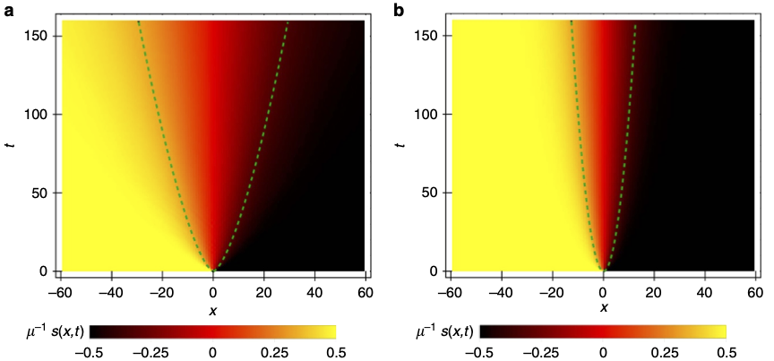
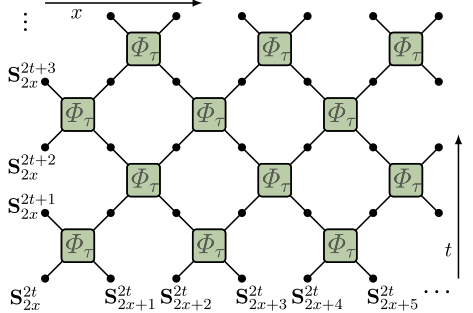
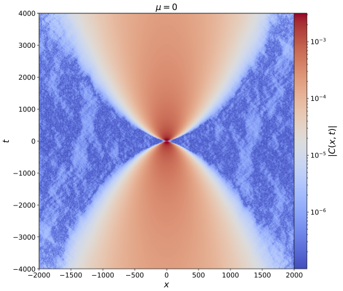
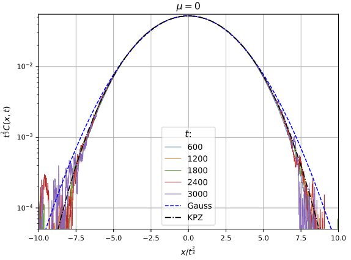
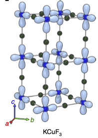
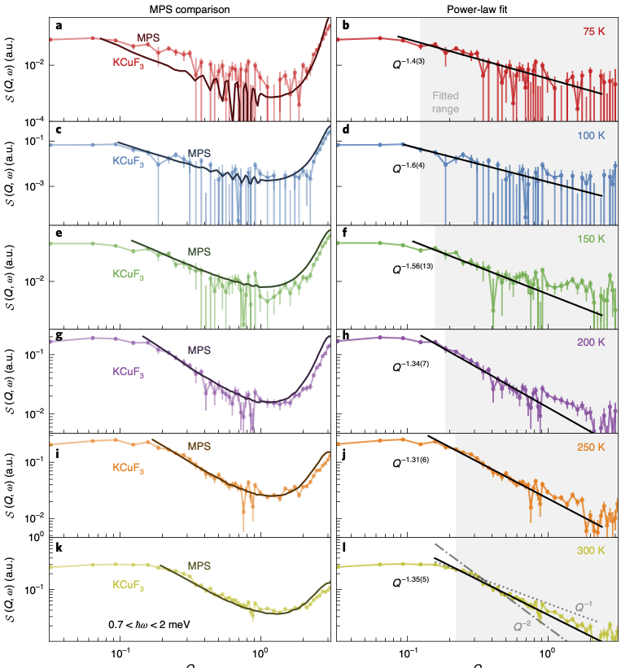
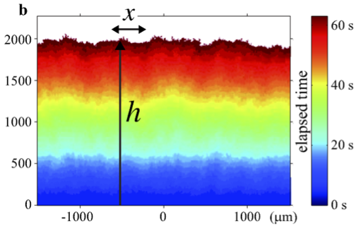
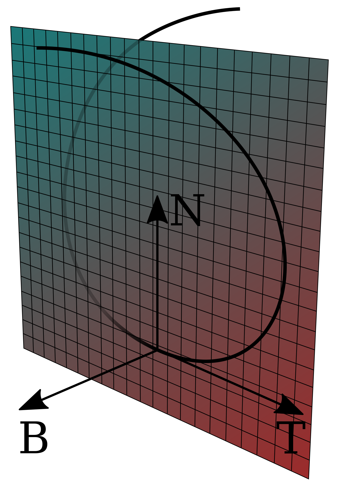
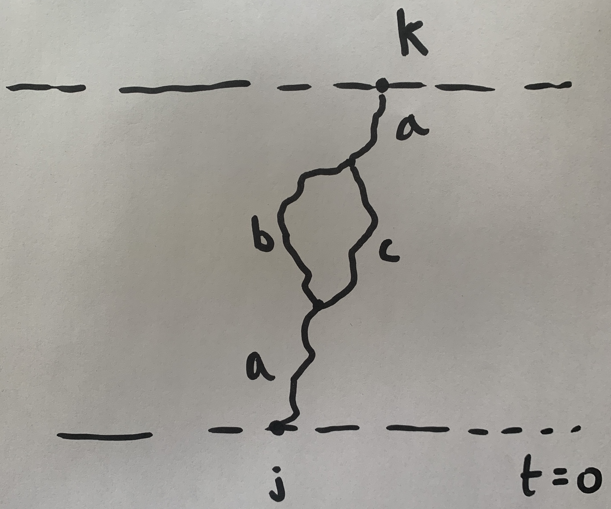

---
slides:
  # Choose a theme from https://github.com/hakimel/reveal.js#theming
  theme: white
  math_renderer: mathjax3
  reveal_options:
    hash: true
scripts: []

---

$$
\nonumber
\newcommand{\bra}[1]{\langle{#1}\rvert}
\newcommand{\ket}[1]{\lvert{#1}\rangle}
\newcommand{\br}{\mathbf{r}}
\newcommand{\bR}{\mathbf{R}}
\newcommand{\bp}{\mathbf{p}}
\newcommand{\bk}{\mathbf{k}}
\newcommand{\bq}{\mathbf{q}}
\newcommand{\bv}{\mathbf{v}}
\newcommand{\bx}{\mathbf{x}}
\newcommand{\bz}{\mathbf{z}}
\DeclareMathOperator*{\E}{\mathbb{E}}
$$

## Superdiffusion in spin chains

Review: [arXiv:2103.01976](https://arxiv.org/abs/2103.01976) Bulchandani, Gopalakrishnan, Ilievski

- What?

- Where?

- How?

---

## Diffusion

$$
\frac{\partial u}{\partial t} = D \frac{\partial^2 u}{\partial x^2}
$$
- Fundamental solution of heat equation
$$
u(x,t) = \frac{1}{\sqrt{4\pi Dt}}\exp\left[-\frac{(x-x_0)^2}{4Dt}\right]
$$
- More generally have scaling solutions $u(x,t)\to \frac{1}{\sqrt{t}}f\left(\frac{x-x_0}{\sqrt{Dt}}\right)$
- **Dynamical critical exponent** $x\sim t^{1/z}$ with $z=2$
- $u(x,t)$ is *conserved*: $\int u(x,t) dx=\text{const.}$
---

## Spin diffusion

- Relaxation of inhomogeneity (e.g. domain wall)

- Spin correlations $\langle Z(x,t)Z(x',t')\rangle$ as measured in neutron diffraction (say)

---

## Models

- Heisenberg spin-1/2 chain
$$
H = \sum_j \left[X_j X_{j+1}+Y_j Y_{j+1}+ \Delta Z_j Z_{j+1}\right]
$$

- $\Delta=1$ is *isotropic* (XXX model). All 3 components conserved
- $\Delta\neq 1$: Only $Z$ conserved 

- (Naive) expectation: $Z$ diffuses. In fact: *something's up at $\Delta=1$!*

---

## Numerics: steady state

-  [Žnidarič (2011)](https://doi.org/10.1103/PhysRevLett.106.220601) tDMRG with ends coupled to reservoirs with fixed chemical potentials

- Steady state current $j\sim L^{-1/2}$. $j= D\frac{\partial s}{\partial x}$ suggests $D\sim L^{1/2}$

- $\omega = Dk^2$ implies $\omega\sim k^{3/2}$ or $z=3/2$. **Superdiffusion**

---

## Numerics: relaxation

- [Ljubotina, Žnidarič, Prosen (2017)](https://www.nature.com/articles/ncomms16117) studied *weak domain wall* initial conditions

- Again, superdiffusion with $z=3/2$
- [In 2019](https://journals.aps.org/prl/abstract/10.1103/PhysRevLett.122.210602), same authors improved accuracy and identified scaling behaviour with *KPZ universality class* (more later)
---

## Numerics: classical 

- [Krajnik and Prosen (2020)](https://link.springer.com/article/10.1007%2Fs10955-020-02523-1) introduced classical circuit

$$
\begin{align}
\Phi_\tau(\mathbf{S}_1,\mathbf{S}_2) = \frac{1}{\sigma^2+\tau^2}&\left[\sigma^2 \mathbf{S}_1+\tau^2 \mathbf{S}_2 + \tau \mathbf{S}_1\times \mathbf{S}_2,\\\\
 \sigma^2 \mathbf{S}_2+\tau^2 \mathbf{S}_1 + \tau \mathbf{S}_2\times \mathbf{S}_1\right]
\end{align}
$$

- $\sigma^2=\frac{1}{2}\left(1+\mathbf{S}_1\cdot \mathbf{S}_2\right)$

---

---

---

## Features in common?

1. Non-abelian symmetry e.g. $SU(2)$ not $U(1)$

2. *Integrability* (extensive number of conservation laws)

---

## Experiment

- [Scheie *et al*](https://www.nature.com/articles/s41567-021-01191-6) observe KPZ scaling in 1D Heisenberg antiferromagnet KCuF3 with neutron scattering

---

---

## KPZ equation

$$
\partial_t h = \partial_x^2 h + \frac{\lambda}{2}(\partial_x h)^2 + \overbrace{\xi(x,t)}^{\text{noise}}
$$

---

## Origin of $z=3/2$

- KPZ is related to *Burgers equation* via $v=-\partial_x h$ (set $\lambda=1$)
$$
\partial_t v + v\partial_x v = \partial_x^2 h + \partial_x\xi(x,t)
$$
- Scale $x\to \lambda x$, $t\to \lambda^z t$

- Preserves *Galilean invariance*: $\partial_t v+v\partial_x v$ preserved

- Steady state $v$ is white noise ($h$ is Brownian): $v\to \lambda^{-1/2}v$

- Must have $z=1+\frac{1}{2}=\frac{3}{2}$ ([Forster, Nelson, and Stephen (1977)](https://journals.aps.org/pra/abstract/10.1103/PhysRevA.16.732))

- Much recent progress on scaling functions in 1+1 dimensions

---

## Why KPZ?

- [Bulchandani (2020)](https://journals.aps.org/prb/abstract/10.1103/PhysRevB.101.041411) suggests following (classical) picture

- Landau--Lifshitz equation for magnetization density $\mathbf{s}(x,t)$
$$
\partial_t\mathbf{s} = \mathbf{s}\times \partial_x^2\mathbf{s}
$$

- Regard $\mathbf{s}(x)=\mathbf{T}(x)$ as tangent vector of space curve, with $x$ as arc length

---

$$
\begin{align}
\frac{d\mathbf{T}}{ds}=\kappa\mathbf{N},\qquad {\frac {d\mathbf {B} }{ds}}=-\tau \mathbf {N}\\
{\frac {d\mathbf {N} }{ds}}=-\kappa \mathbf {T} +\tau \mathbf {B} ,\\
\end{align}
$$

---

- With $\mathcal{E}\equiv \kappa^2/2$ LLE takes form (dropping higher derivative terms)

$$
\begin{align}
\partial_t \mathcal{E} +2\partial_x\left(\mathcal{E}\tau\right)&=0\\\\
\partial_t \tau +\partial_x\left(\tau^2-\mathcal{E}\right)&=0
\end{align}
$$

- Linear instability!

- **If** we can set $\mathcal{E}=0$ at long scales **and** coarse graining introduces noise and damping, **then**

$$
\partial_t \tau +\partial_x\left(\tau^2-D\partial_x\tau+\xi(x,t\right)=0
$$

- Noisy Burgers, hence KPZ

---

## What's missing?

- A straight-through calculation starting from a microscopic model

---

## A model with a small parameter

- *Fluctuating exchange interaction*
$$
d\ket{\psi} = \sum_j \left[-i(J dt + dW_j)P_{j,j+1}-\frac{1}{2}dt\right]\ket{\psi}.
$$
(last term is there to ensure that the norm  is preserved)

- Heisenberg equation of motion
$$
d\mathcal{O} = \sum_j i\left[\left(J dt + dW_j\right)P_{j,j+1},\mathcal{O}\right]+dt\left(P_{j,j+1}\mathcal{O}P_{j,j+1}-\mathcal{O}\right).
$$

---

- $\bar{\mathcal{O}}\equiv\E \mathcal{O}$ obeys Lindblad equation

$$
\begin{equation}
\frac{d\bar{\mathcal{O}}}{dt} = \sum_j iJ \left[P_{j,j+1},\bar{\mathcal{O}}\right]+\left(P_{j,j+1}\bar{\mathcal{O}}P_{j,j+1}-\bar{\mathcal{O}}\right)
\end{equation}
$$

- Expand in components

`$$
\mathcal{O}= \sum_{\mu_{1:N}=\{0,1,2,3\}^N} \mathcal{C}^a_{\mu_{1:N}}(t) \sigma_1^{\mu_1}\otimes\cdots \sigma_N^{\mu_N},
$$`
`$$
\partial_t \mathcal{C}_{\mu_{1:N}} = \sum_j \left[J\sum_{\alpha\beta} \epsilon_{\alpha\beta \mu_j \mu_{j+1}} \mathcal{C}_{\mu_1\cdots \alpha\beta \cdots \mu_N} + \mathcal{C}_{\mu_1\cdots \mu_{j+1}\mu_j \cdots \mu_N} - \mathcal{C}_{\mu_1\cdots \mu_{j}\mu_{j+1} \cdots \mu_N}\right]
$$`

---

`$$
\partial_t \mathcal{C}_{\mu_{1:N}} = \sum_j \left[J\sum_{\alpha\beta} \epsilon_{\alpha\beta \mu_j \mu_{j+1}} \mathcal{C}_{\mu_1\cdots \alpha\beta \cdots \mu_N} + \mathcal{C}_{\mu_1\cdots \mu_{j+1}\mu_j \cdots \mu_N} - \mathcal{C}_{\mu_1\cdots \mu_{j}\mu_{j+1} \cdots \mu_N}\right]
$$`

- $J=0$ describes *operator diffusion*

- $J\neq 0$ describes *splitting* and *merging* e.g. $Z_j\leftrightarrow X_jY_{j+1}$ 

