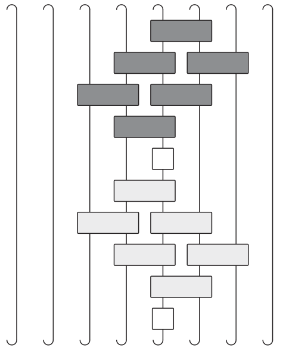

---
slides:
  # Choose a theme from https://github.com/hakimel/reveal.js#theming
  theme: white
  math_renderer: mathjax3
  reveal_options:
    hash: true
scripts: []
---

# Circuit Models of Many Body Quantum Dynamics

## Austen Lamacraft
### [earlier work with Sarang Gopalakrishnan]
---

### Questions?

- Physics question:

  - How does time evolution couple independent subsystems?

- Mathematical question:

  - How does many-body unitary evolution cause deviation from an
  initial product state?

      [Unitary normally has structure e.g. from local Hamiltonian]

---

### Unitary Circuits

- Unitary transformation composed of unitaries on subsets.
- Introduced as model of quantum computation.

---

### Many Body States = Tensors

 - State of a single spin-1/2 $\psi_{s}$ $s=\uparrow,\downarrow$.
 - State of two spins `$\Psi_{s_1s_2}$`.
 - __Product states__ `$\Psi_{s_1s_2}=\psi^{(1)}_{s_1}\psi^{(2)}_{s_2}$` are special case.
 - State of $N$ spins `$\Psi_{s_1s_2\cdots s_N}$` is rank $N$ tensor.
 - $2^N$ components: "curse of dimensionality".

---

### Notation: Tensor Digrams

See [Pan Zhang's tutorial](http://lib.itp.ac.cn/html/panzhang/mps/tutorial/)

---

### Not (Just) Pictures

- Every diagram corresponds to a unique expression

`$$
\sum_{p,q,r,s} A_{pqr} B_{rqsu} C_{pts}
$$`

---

### Brick Pattern Circuits

- Some notion of locality built in!
- Gates operate on neighbouring pairs, triplets, etc.
- [Often] start from product state `$\Psi_{s_1,s_2,\ldots s_N}=\psi_{s_1}\psi_{s_2}\cdots \psi_{s_N}$`

---

### Model for Hamiltonian Dynamics

- Interested in $U(t)|\psi_0\rangle$ with $U(t) = e^{-iHt}$, where (say)

`$$
H = \sum_j \mathbf{s}_j\cdot \mathbf{s}_{j+1}
$$`

- For small $t$ can approximate `$U(t)\sim U_1(t)U_2(t)$` with `$U_{a}=e^{-iH_a t}$`

`$$
H_1 = \sum_j \mathbf{s}_{2j}\cdot \mathbf{s}_{2j+1},\qquad
H_2 = \sum_j \mathbf{s}_{2j}\cdot \mathbf{s}_{2j-1}
$$`

---

- Time evolution for $T=Nt$ is approximately

$$
U(T)\sim \left[U_1(t)U_2(t)\right]^N
$$

---

### Another Example: Kicked Ising Model

- Time dependent Hamiltonian with kicks at $t=0,1,2,\ldots$.

`$$
\begin{aligned}
H_{\text{KIM}}(t) = H_\text{I}[\mathbf{h}] + \sum_{m}\delta(t-n)H_\text{K}\\
H_\text{I}[\mathbf{h}]=\sum_{j=1}^L\left[J Z_j Z_{j+1} + h_j Z_j\right],\qquad H_\text{K} &= b\sum_{j=1}^L X_j,
\end{aligned}
$$`

- "Stroboscopic" form of $U(t)=\mathcal{T}\exp\left[-i\int^t H_{\text{KIM}}(t') dt'\right]$

`$$
\begin{aligned}
  U(n_+) = \left[U(1_+)\right]^n,\qquad U(1_-) = K I_\mathbf{h}\\
  I_\mathbf{h} = e^{-iH_\text{I}[\mathbf{h}]}, \qquad K &= e^{-iH_\text{K}},
\end{aligned}
$$`

---

### KIM as a Unitary Circuit

`$$
\begin{aligned}
  \mathcal{K} &= \exp\left[-i b X\right]\\
  \mathcal{I} &= \exp\left[-iJ Z_1 Z_2 -i \left(h_1 Z_1 + h_2 Z_2\right)/2\right].
\end{aligned}
$$`

---

### Generally

- Static disorder, or fully random

- Floquet

- __Motivation:__ "general" quantum dynamics (no Hamiltonian) with only constraint of locality.

---

### Unitarity

- Has the graphical representation

---

### (Infinite Temperature) Correlation Functions

`$$
\begin{aligned}
C(x,y,t)=\mathop{\text{tr}}\left[O(x,t)O(y,0)\right]\\
O(x,t) = U(t)^\dagger O(x) U(t)
\end{aligned}
$$`

- Keep track of $U$ and $U^\dagger$

---

### Graphical Representation  

[Chan, De Luca, Chalker (2018)]

`$$
C(x,y,t)=\mathop{\text{tr}}\left[U(t)^\dagger O(x)U(t) O(y)\right]
$$`

---

### Using Unitarity

---

### "Folded" picture

- Later point must be in "future light cone" of earlier

---

### On the Light Cone

 - [Bertini, Kos, Prosen (2019)] for special models (see later)

 - In fact consequence of unitarity __only__

---

### Light Cone Quantum Channel

`$$
\begin{align}
C_\nu^{\alpha\beta}(\nu t,t) = \frac{1}{d} {\rm tr}\left[\mathcal M_{\nu}^{2t}(a^\beta)a^\alpha\right]\\
\mathcal M_{+}(a) = \frac{1}{d} {\rm tr}_1\left[U^\dagger (a\otimes\mathbb{1}) U\right]
\end{align}
$$`

- Unitarity means map is __trace preserving__, __completely positive__ and __unital__ (identity is fixed point)

---

### Dual Unitarity
[Gopalakrishnan & Lamacraft (2019)]

- Arises when the reshuffled unitary $\tilde U$ is unitary too

`$$
(\tilde U)_{ab,cd}=(U)_{ac,bd}
$$
`

 &emsp;    &emsp;  

- 14 parameters for qubits! [Bertini, Kos, Prosen (2019)]

---

### Example: Self Dual Kicked Ising

`$$
\begin{aligned}
  \mathcal{K} &= \exp\left[-i b X\right]\\
  \mathcal{I} &= \exp\left[-iJ Z_1 Z_2 -i \left(h_1 Z_1 + h_2 Z_2\right)/2\right].
\end{aligned}
$$`

- $\tilde U$ unitary ("self dual") for $|J|=|b|=\frac{\pi}{4}$

---

### Folded Notation

- Unitarity and dual unitarity

&emsp;    &emsp;  

---

### Correlations on Light Cone Only

[Bertini, Kos, Prosen (2019)]

- Proof by words:
  - Unitarity fixes correlations to lie in "past" or "future"
  - Dual unitarity fiex correlations to be outside the light cone
  - __Therefore:__ only nonzero on light cone

---

### Reduced Density Matrix

`$$
\rho^{(A)}_{s_1\cdots s_N,s_1'\cdots s'_{N}} = \sum_{s_{N+1}\cdots s_L} \Psi_{s_1\cdots s_N s_{N+1}\cdots s_L}\bar \Psi_{s'_1\cdots s'_{N}s_{N+1}\cdots s_{L}}
$$`

- Everything we want is contained in $\rho^{(A)}$!

---

### Measures of Entanglement

- Since `$\text{tr}\left[|\Psi\rangle\langle\Psi|\right]^2=1$` define __purity__

`$$
\gamma = \text{tr}\left[\rho_A^2\right]
$$`

- (von Neumann) Entanglement entropy

`$$
S = -\text{tr}\left[\rho_A \log \rho_A\right]
$$`

- Rényi entropies

`$$
  S^{(n)}_A = \frac{1}{1-n}\log \text{tr}\left[\rho^n\right]
$$`

- $S^{(n)}\to S$ as $n\to 1$ and $S^{(2)} = -\log\gamma$

---

### Entanglement Spectrum

- Rényi entropies depend on eigenvalues of RDM

`$$
  S^{(n)}_A = \frac{1}{1-n}\sum_\alpha \lambda_\alpha^n
$$`

- `$\epsilon_\alpha = -\log \lambda_\alpha$` known as __entanglement spectrum__.

---

### Graphical Representation of $\rho^{(A)}$

---

### Entanglement Growth for Self-Dual KIM

[Bertini, Kos, Prosen (2018)]

$$
\lim_{L\to\infty} S^{(n)}_A(t) =\min(2t-2,N)\log 2,
$$

- __Any $h_j$__; inital $Z_j$ product state

---

### Entanglement _alla_ [Calabrese & Cardy (2005)]

---

### Quasiparticle Picture

---

### Other Directions

- "Static" disorder or full randomness
- Projective Measurements
- Conserved quantities
- Classical circuits [Krajnik & Prosen (2019)]
